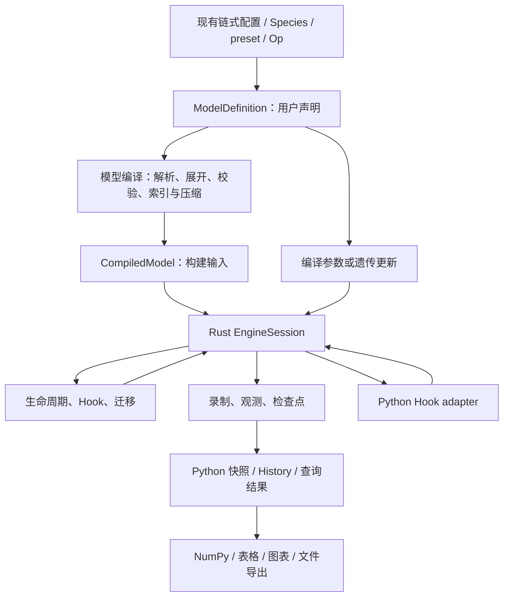

# NATAL：Rust 唯一执行后端重构方案

日期：2026-09-06。分析基线：`feat/rust-engine-backend-clean@5afd0ee0b2cc14416b2d7967379076ed8a832e38`，审查比较起点：`main@624cfb7`。

状态：供评审的完整实施方案；本文的完成不表示生产代码已经修改、缺陷已经修复或实施已经获批。

## 1. 目标与依据

Python 保存用户的模型声明，负责链式配置、物种结构、模式解析和用户定义的 preset 配方；统一的配置编译过程将声明转为执行数据。Rust 是唯一模拟后端，独立持有运行状态、生态参数、遗传数据、程序、随机流、历史记录和检查点，完成推进、观测和恢复。Python 在查询时取得结果，不再在每个 tick 或每次 run 前后维护另一份运行数据。

本方案综合了：

- [原六切片计划](/Users/pointless/Desktop/work/NATAL-Project/natal-core/.zcode/plans/plan-sess_23495f73-68d4-4576-87b3-620e8ffb14a6.md)及其中明确记录的实施调整。
- 当前分支审查：两个数值错误、三个目标合同缺口、两个测试与类型规范问题。
- [issue #43](https://github.com/jyzhu-pointless/natal-core/issues/43) 的配子重组修复及数值验收。
- 用户允许激进修改内部架构、考虑彻底删除 Reference，同时冻结四类用户表达方式的要求。

设计采用 codebase-design 的 module（隐藏完整职责的模块）、interface（调用方式及行为合同）、seam（替换实现的位置）和 adapter（跨语言连接）概念。目标是 depth：用较小的 interface 提供完整能力，使错误、验证和修改集中在同一处，即 locality；单次修复覆盖普通、离散和空间模型，即 leverage。不会为了目录整齐而增加只转发调用的 module。

## 2. 保留什么，允许改变什么

### 2.1 四项硬约束

| 必须保留 | 验收含义 |
|---|---|
| 面向用户的链式 API 语法 | 现有模型配置方法名、参数名、链式组合和构建表达保持可用。删除后端选择是下面列出的明确例外，不据此改写领域配置方法 |
| 物种遗传结构注册语法 | `Species.from_dict`、染色体/位点/等位基因、性染色体、标签及重组率的现有声明方式保持可用 |
| preset 规则 | 物种绑定、注册幂等、priority、modifier 次序、适应度组合及重配置语义保持；不能只保留类名却改变数值含义 |
| 声明式 Hook 格式 | `Op.*`、`.hooks(...)`、选择器、条件表达式、事件、priority、调度和 deme 选择格式保持；操作次序及已承诺的生物学含义保持 |

保留语法并不要求保留内部类、继承层次、缓存、NamedTuple、数组布局或旧模块导入路径。需要为上述四类表达建立可执行的合同样例，避免无意中把大量旧内部符号也冻结下来。

### 2.2 明确提出的行为变化

1. 删除 Reference 和后端选择机制；缺少 Rust 扩展时给出明确错误，不静默执行 Python 模拟。`backend=` 选择参数、enable/disable 门面和相关旧导入不保留兼容垫片。
2. `Population.state`、配置查询和遗传张量读取返回独立快照或安全只读对象；通过长期数组引用直接修改运行状态的旧做法退出。状态修改走明确的导入/更新入口。
3. `restore_checkpoint()` 恢复生态参数和随机流，补齐原计划；遗传参数不随读档回滚。
4. Python Hook 的合法参数修改在当前事件提交后对后续阶段可见，结束“Rust 回调写入要等下一次 run”的临时语义。
5. 内部统一随机流后，不承诺与旧错误路径生成相同的随机轨迹；承诺新版本自身的种子复现、分段运行一致、读档重放和正确分布。
6. 内部运行数组带统一的 deme 轴；非空间用户的结果仍可省略长度为 1 的 deme 轴。不会为了统一内存而要求用户重写输入。

以上是本方案要评审的变化，不把它们描述成已获批准或已经实现的事实。

### 2.3 范围限制

本轮不增加新的生物学模型或曲线，不改变 preset 的适应度覆盖规则，不重做 UI，不建立通用插件平台、通用 IDL 或跨语言对象序列化框架。磁盘检查点、用户自写 Rust Hook 的 cargo 动态编译链另行交付；它们在原计划中出现过，不能再把本轮完成写成“原计划所有扩展能力均已完成”。

## 3. 审查问题与本方案的对应关系

| 编号 | 已验证问题 | 根因与处置 | 验收位置 |
|---|---|---|---|
| R1 | 空间 Rust 每 tick 重建 `seed ^ deme_id` RNG；相同输入四次输出逐位重复 | RNG 属于会话中的每个 deme，生命周期、Hook、迁移均持续消费 | S2、S3；随机流测试 |
| R2 | 离散空间以 `HookProgram=None` 构建后端；K 减半操作被跳过 | 统一 Program 安装、事件调度与 deme 选择，不再单建无 Hook 后端 | S3；空间 × 离散 × Op 测试 |
| R3 | 公开读档只恢复计数/tick；K 和 RNG 未恢复 | Rust CheckpointStore 是唯一检查点拥有者，公开入口直达同一恢复操作 | S2、S4 |
| R4 | Blueprint 的八个 ndarray 仍可写 | Blueprint 在 Rust 内部冻结；外部查询不暴露可写内部缓冲 | S1、S2 |
| R5 | `pop.state` 返回真实 `_state`，外部清零会清空种群 | 长期对象统一返回快照，临时 Hook 写入另有受控通道 | S2、S3 |
| R6 | 标为 Reference/Rust 的测试实际比较同一路径 | 删除误导的对拍框架；保留独立数值预期和领域不变量 | S0、S6 |
| R7 | 新代码有无理由的 `Any`/`object`/类型抑制 | 删除旧桥接代码，并为剩余声明、查询、回调提供具体类型 | 全阶段、S6 |
| T1 | 两个 skipped 的 modifier 测试只有 `...` | 用无 preset 编译、重复刷新幂等及概率表数值测试替代，不能只去掉 skip | S0、S1 |
| T2 | 二维 observation 输入触发 xfail；辅助函数无生产调用 | 删除旧辅助函数和孤立测试；在正式 Observation 路径验证支持的轴格式 | S4、S6 |
| G43 | issue #43 已修复双同源起点和概率累加 | 保留独立 Mendelian 数值测试，迁移遗传计算时持续执行 | S0、S1、S6 |

R3、R5 是旧计划新增要求未落实，不能称为相对 main 的新回归。当前审查的 2776 passed、2 skipped、1 xfailed 及 Rust 50 个单测通过，只是基线记录，不代表上述问题不存在。

## 4. 目标结构与数据所有权

| 数据 | 唯一权威来源 | Python 可保留的内容 |
|---|---|---|
| 用户模型声明 | Python ModelDefinition | 原始规则、声明顺序、Species、preset 对象及用户配方 |
| 符号与执行索引 | 编译产物中的同一份布局 | 由该布局产生的只读名称目录，不再自行重建活动轴 |
| Blueprint | Rust 会话 | 独立描述快照 |
| 当前生态参数、custom 槽位 | Rust 会话 | 按需查询；无持续同步的草稿副本 |
| 遗传 TensorSet 与 deme 索引 | Rust 会话的变体库 | 查询副本及重新编译所需的声明 |
| 当前计数、精子储存、tick、执行状态 | Rust 会话 | StateSnapshot，不保存另一份可变运行状态 |
| 随机流 | Rust 会话 | 受控采样入口，不能复制成独立 Python RNG 后自行推进 |
| Hook、密度调节、录制程序 | Rust Program | 用户声明与可读化描述 |
| 历史数据、参数日志、检查点 | Rust 存储 | 查询结果、导出对象及可失效的只读缓存 |

ModelDefinition 不是实时配置镜像。比如 Hook 将 K 从 1000 改为 800，声明仍可以记录“初始 K=1000”；`pop.params.K` 必须读到 Rust 的 800。编译一次运行时更新时，编译器从当前会话取得该更新需要的数值快照，仅提交明确改变的字段，不能用旧声明覆盖没有修改的实时参数。

Rust 内部拆成有明确职责的源文件，但不建立 `Backend` 抽象、后端注册表或新的多实现工厂。Python/Rust seam 只有一套具体 adapter。

## 5. 统一模型编译

### 5.1 同一份声明贯穿构建和重配置

建议新增内部 ModelDefinition，替代 ModelDraft 同时充当草稿、运行配置和同步缓存的角色。它保存生态声明、初态、遗传规则、手动 fitness、preset/modifier、Hook、Observation 和空间设置，以及影响语义的声明顺序。

Configurator 保留用户方法，内部只负责形成或修改声明。构建和重配置进入同一个编译 module：

1. 解析领域参数、别名和模式，展开 batch_setting。
2. 在隔离的候选声明上应用 preset、modifier 和 fitness 规则。
3. 推导遗传类型、原始索引与最终活动索引，编译 Hook 和 Observation 的选择器。
4. 生成 Rust 可消费的明确类型数据，进行形状、范围、概率及相互约束检查。
5. 创建会话，或一次提交更新；失败时不改变当前会话和已经提交的声明。

不再让 ConfigContext 冒充 Population，不再先克隆真实 Population 验证、随后在真实对象上重复执行同一个配方。用户 Python 配方在候选编译过程中执行一次，其产物直接用于提交。不能承诺撤销用户 callable 对文件或外部全局变量的副作用；这里保证的是 NATAL 声明和会话不被失败污染。

### 5.2 遗传编译的统一职责

遗传编译拥有以下整条链：Species 结构 → 基础减数分裂与受精映射 → preset/modifier 展开 → 后代概率张量 → 活动轴压缩 → Hook/Observation 整数索引。

Python 继续负责用户对象和字符串规则。Rust 承担用于执行的数值映射装配、概率张量计算、校验和运行期投影。Species 的配子查询等现有 interface 保留，可以调用同一遗传数值实现并包装结果；不能在 Python 再保留一套生产数值算法。

IndexRegistry 的领域角色保留，但由同一份编译布局构造。特别处理压缩后活动的 `(genotype, slab)`、`(haplotype, glab)` 不再是完整笛卡尔积的情况：不能通过乘法推断索引。构建、更新、Hook、Observation 必须共同使用显式映射。

达到不了当前压缩布局之外类型的参数修改可以就地提交；需要增加新类型、改变年龄结构或拓扑的操作必须明确重建，不允许静默把运行状态重新编号。动态新增类型及其状态迁移不属于本轮。

### 5.3 保留 preset 语义

先用实际结果固定物种绑定、同一对象幂等、priority、手动 modifier 次序、剂量效应、标签、性别及压缩轴语义。现有“preset 重配置重建 fitness，覆盖某些手动 fitness 写入”的行为虽可讨论，但本轮不得偷偷改成新的优先级规则。声明日志需要表达这个重建行为，而不是简单重放所有历史 fitness 写入。

### 5.4 参数定义的单一来源

沿用并整理 `parameters.jsonc`：统一名称、别名、类型、范围、目标节、形状、可写阶段和派生依赖。Python 解析和 Rust 校验消费同一份受限参数定义；允许项目内的简单构建期表生成，不引入通用 IDL。Kind 的执行逻辑保留在各语言适当位置，参数清单及 bounds 不能手写多份。

Rust 必须自行验证来自 Python 的输入，不能把 Python 预检查当成可信保证。`apply` 批量更新先全检查后全提交；`tensor_write` 检查整张候选张量后替换。每次公开方法调用是一个事务；链式多个方法之间不凭空承诺整体原子性。一次 preset 重配置则是一个完整编译事务。

custom 保留当前 `bool/int/float/ndarray` 输入语法，编译为带类型和形状信息的 Rust 槽位。不得退化成只能提取 f64 的字典；标量、数组、错误类型和 shape 更新都要测试。

## 6. Rust 会话：运行过程中的唯一拥有者

### 6.1 会话内容与内部 interface

EngineSession 拥有 Blueprint、Ecology、GeneticsBank、SimState、Program、RngBank、HistoryStore、CheckpointStore 和参数变更日志。下列名字仅描述内部能力，不要求用户学习新语法：

| 能力 | 输入与结果 | 必须隐藏的工作 |
|---|---|---|
| 构建 | CompiledModel → Session | 验证、内存接管/必要复制、初始化各 deme RNG |
| 推进 | 步数 → 状态摘要 | 生命周期、Hook、迁移、tick、录制、停止 |
| 提交更新 | 类型化候选更新 → 成功/错误 | 原子校验、变体分离、派生重算、日志 |
| 查询 | 状态/参数/历史查询 → 快照 | 轴投影、观测计算、所有权隔离 |
| 恢复 | 检查点标识 → 恢复结果 | 形状/程序兼容检查、状态/生态/RNG/游标恢复 |

`run()` 不再接收 Python 的 state、tick、完整 config，不再全量哈希或拷贝模型。构建交接一次并不禁止后续传输参数补丁或用户查询结果；禁止的是正常推进时反复交接整套运行数据。

### 6.2 普通、离散、空间共享调度

内部个体数组统一为 `(D,S,A,Z)`；年龄结构模型需要的精子储存按现有合子型配对语义保存，不能误按配子轴解释。离散模型保留其规范化的两年龄结构；不需要的精子状态使用明确的无值变体，不塞一张假数组供所有路径猜测。

普通模型是 D=1；空间模型是 D>1 加迁移程序。年龄结构、离散代和 Wright-Fisher 可以保留不同的数学计算函数，但必须共享会话、事件分发、RNG、记录和恢复流程。使用具体模型枚举选择算法，不为每个组合复制整套引擎。

SoA 和遗传变体库保留：生态差异写 deme 列，遗传差异建立 TensorSet 变体。某个 deme 修改遗传参数时，在候选变体上校验，再替换其索引；其余 deme 不受影响。不能按遗传变体数量分配 RNG：两个共享同一变体的 deme 仍有两条独立随机流。

### 6.3 随机流

在创建会话或显式重置随机源时，每个稳定的 deme ID 初始化一次 `seed ^ deme_id` 流；初始化算法固定在版本合同中。之后每次采样推进状态，绝不在 tick、阶段、迁移或 `ctx.rng` 属性访问时重新创建。

每 deme 的阶段顺序明确，生命周期、声明式 Hook、Python Hook 和源 deme 的迁移抽样依次消费该流。迁移采用各源 deme 的独立输出缓冲，按稳定次序归并；并行线程数、遗传变体分组和任务完成顺序不能改变随机数分配。

必须证明 `run(a+b)` 与 `run(a); run(b)` 逐位相同，保存后恢复重跑也相同。不同 seed 下做统计验证；不能把“不同运行结果不相等”当成分布正确的证明，也不能把旧错误随机轨迹当金标准。

## 7. Hook 闭环与 Python 回调

### 7.1 一个 Program，一套事件顺序

所有 `.hooks(...)` 声明编译进同一 Program。普通、离散、空间和 Wright-Fisher 的适用事件都通过同一调度入口执行，操作之间的参数写入对后续操作与阶段可见。保留 `first/early/late/finish`、priority、every/start、条件和 deme 选择规则；声明式默认 early 和非空间 `deme_id=0` 均作为合同测试。

统一调度不等于把不同生命周期强行改成同一数学顺序。S0 先固定现有已接受的事件顺序及停止行为；迁移阶段也要明确置于相同的空间时间边界。不能为了合并循环把 early 移到繁殖之前，或在 late 请求停止后仍执行 aging。

### 7.2 Python 回调是宿主能力，不是第二后端

保留单参数 Python Hook。Rust 到达事件时暂停相关执行，调用 Python adapter，返回后继续 Rust；不存在回调触发 Reference 回退的路径。

Python 回调中的 params/update 通过当前事件的事务上下文写入，不能递归获取被 run 占用的会话锁。需要配方编译的更新在同一上下文取得候选数据并提交，不允许通过长期 Population 再进入 run。跨 deme 回调按稳定 deme ID 次序执行，不能从 rayon 工作线程同时争抢 Python。

### 7.3 不向 Python 暴露可逃逸的可写 Rust 内存

Rust 原生 Hook 使用短期 `&mut` 借用。Python 无法强制用户不保存 ndarray 引用，因此不能仅靠“请勿保留视图”的文档保证安全。

本轮默认采用事件范围的临时数组：首次访问 `ctx.state` 时复制当前 deme 的必要状态，回调内读写同一临时对象；返回时验证并提交，保留的 Python 引用与真实引擎内存脱离。`ctx.metrics` 在回调内读取这个临时状态，确保用户刚写入的数值立即可见。参数候选更新也参与同一回调提交。没有 Python 回调或没有访问 state 时，不承担这项数组复制。

上下文失效后，params/update/rng 操作必须报明确错误；不能保留一个以后还能修改会话的句柄。`ctx.rng` 返回同一受控采样器，实际推进 Rust RNG；相同上下文连续取样不能重复初始化。

### 7.4 停止、错误与运行阶段

内部显式记录 Ready、Running、Stopped、Failed 以及 tick 内阶段游标，避免 Python 的 `_finished` 与 Rust 的时间状态分叉。

- 保留已接受的 first/early/late 停止短路行为，以及 stop 后需要 reset 才能再次 run 的规则。停止时保留截至该边界已经生效的合法修改，不伪造已完成的下一 tick。
- finish 的触发次数、快照可见性和参数日志由统一调度负责；用 S0 固定的公开行为样例验收。
- 参数事务失败不得改变任何目标值；Python 回调失败不提交该回调候选状态和参数，回滚该回调消费的 RNG。
- 发生运行错误后标记 Failed 并保留已完成阶段的信息；不承诺把任意 run 自动回滚到起点。恢复到有效检查点或 reset 后方可继续。
- 嵌套 run、运行期间外部写入和使用过期 Hook 上下文均明确拒绝。Python 异常保留原异常信息；Rust 验证错误映射到具体的 ValueError/TypeError 等，不把所有错误揉成 RuntimeError。

## 8. 原始数据、观测、History 与导出

### 8.1 将“转换”拆成明确职责

| 过程 | 执行位置 | 说明 |
|---|---|---|
| 用户声明 → 执行计划 | Python 编译 + Rust 数值构建/校验 | 处理名字、规则、类型和索引；发生在构建或明确重配置时 |
| 当前/历史状态 → 数值观测 | Rust | 选择、按轴求和、deme 聚合、频率投影；当前查询和历史查询使用同一数值实现 |
| 数值结果 → Python/表格/文件 | Rust 查询返回 + Python 展示 adapter | 只处理形状包装、标签展示和文件格式，不再重算生物学数值 |

这不要求把 pandas、绘图或任意 Python 配方搬到 Rust。闭环指 Rust 能独立完成“推进 → 保留数值 → 计算观测 → 恢复运行”，不依赖 Python 将输出加工完再送回引擎。

### 8.2 原始历史按需保留

Rust 可以保存原始数据，但不能无条件保存所有 deme、所有 tick、全部精子张量。RecordingPlan 明确控制记录频率、raw/observation 模式、字段、deme 选择及 max_rows。

- raw 模式保存选定边界的完整可恢复原始状态，同时关联恢复所需的生态、RNG 和执行元数据。
- observation 模式保存预编译观测结果；不偷偷额外保存全量 raw，不承诺事后恢复未保留的信息。
- 对已保留的 raw 数据可在 Rust 重新应用 Observation；对只有 observation 的历史，只允许基于已保存信息的查询。
- 查询未录制或已经淘汰的字段/tick 必须明确报错，不返回补零或伪造的完整历史。

单帧个体数据量约 `8*D*S*A*Z` 字节，精子数据还可能包含 `8*D*A*Z*Z`；RNG、生态及日志另计。使用分块或环形缓冲，不按总模拟时长预分配。max_rows 淘汰历史时，同步淘汰关联检查点。S4 的性能验收必须包含较大 Z 和较大 D 下的峰值内存。

### 8.3 History 只负责读

Python History 保留查询、标签和导出表面，背后的数值与 schema 由 Rust HistoryStore 拥有。查询优先在 Rust 切片、聚合后返回，避免为取一列搬出全部历史。

默认返回独立数组；若以后采用零拷贝，只能指向生命周期独立的不可变快照缓冲，不能借出仍在追加/覆盖的环形缓冲。此前取得的数组在 run、clear、restore、环形淘汰后都不能改变或悬空。

参数日志只在成功提交且值实际变化时追加，统一包含 tick、事件/阶段、deme、参数名、旧值和新值。直改、update、preset 重编译、声明式 Hook 和 Python Hook 全部走同一提交机制；不再通过 drain 后写回 Python draft 才使参数可见。

`clear_history()` 只清历史及关联保留检查点，不重置当前状态、参数或 RNG；后续 record 必须正常工作。`record_snapshot()` 可以在停止后取得当前状态；如果停止在未完成的 tick 中，保存明确阶段元数据，不把该快照误当正常完整 tick 的行。历史行同 tick 的去重/覆盖规则必须沿用或明确列出变化，不能由 Python 和 Rust 各自决定。

## 9. 检查点、恢复和初始化

Checkpoint 是 Rust 内部的独立记录，包含 tick、阶段游标、运行状态、个体/精子数组、生态参数（含 migration/custom）、每 deme RNG、日志位置及结构/程序兼容信息。

遗传 TensorSet 不回滚。这意味着恢复后若遗传规则已经改变，后续轨迹可以不同；逐位重放的前提是遗传规则和程序保持相同。不能同时承诺“不回滚遗传数据”和“无条件恢复旧轨迹”。

`restore_checkpoint(tick)` 在 raw 历史的可恢复边界查找对应记录，先验证全部输入及结构兼容性，再原子替换状态/生态/RNG/游标，截断未来历史与有效时间线的参数日志。恢复一个正常可运行边界时，也恢复其 Ready 状态，不残留后来产生的 Stopped/Failed 标记。

不同 Blueprint 或不兼容 Program 的检查点明确拒绝，失败不得改变当前会话。仅导入计数数组不等于恢复检查点；保留状态导入能力，但明确它不携带历史 RNG，不能宣称具有读档重放能力。

reset 与 restore 分开。本方案建议 reset 恢复构建初态、tick=0、可运行状态和初始随机源，并清空历史及其检查点；保留当前生态参数、遗传参数和已安装程序，不顺手回滚 preset。初始随机源是最近一次显式设置的 seed，设置 seed 不等于恢复个体状态。S0 将此规则与现有行为逐项核对，任何差异必须列入 breaking changes，不能隐式调整。检查点不捕获用户 Python 闭包、外部文件和全局状态；有这类外部依赖的 Hook 不获得无条件重放保证。

## 10. 源码组织与删除范围

建议按职责整理现有位置，避免先做全仓改名再做实际重构：

| 位置/职责 | 目标处置 |
|---|---|
| `frontend/configurator` | 用户链式表面 + 声明编辑，移出 Population 模拟、回滚和运行镜像同步 |
| 新内部模型编译 module | 汇集遗传编译、配方展开、布局、Hook/Observation 编译和候选更新 |
| `frontend/genetics/patterns/presets/modifiers` | 保留用户领域表达；纯数值计算归 Rust，规则展开的领域角色保留 |
| `frontend/population`、`frontend/spatial` | 薄的会话句柄和领域查询；Deme 句柄由 session + deme ID 构成 |
| `frontend/output` | 查询包装、标签、文件导出；移出数值计算和可变历史存储 |
| `contracts` | 收缩为构建/更新输入与查询结果类型；删除 Python 运行期 Blueprint/Params/State 权威副本 |
| Rust core | 遗传数值、参数事务、会话、各数学生命周期、事件、迁移、观测、记录、恢复 |
| Rust Python bindings | 具体 adapter、异常映射、快照包装和 Python 回调，不含另一套模型规则 |

核心运行不需要 Python 对象，因此将计算 core 与 PyO3 adapter 在 Rust module 中隔离。是否拆成两个 crate 以实际构建/测试需要决定；不为目录形式先引入 crate workspace。

最终 must-not-exist 清单：

1. 生产 `backends/reference`、Python 生命周期/迁移/CSR 解释执行器、任何静默回退。
2. 后端选择器、enable/disable 门面、假 backend 矩阵和对应旧导出/stub。
3. 正常运行中使用的 Python `_state/_tick/_config` 权威副本、`_rust_dirty`、参数刷新镜像、生态 journal 回灌 draft。
4. ConfigContext 的 Population 模拟、构建/运行两套 modifier-map 重建、克隆真实 Population 后重复执行 preset 的事务实现。
5. 每 run 重建会话、全量状态跨语言往返，以及单独的离散空间 Hook 安装路径。
6. Python History 的运行期 append 数值主存、废弃 observation row encoder、无生产调用的旧转换函数。
7. 两个空 skipped 测试、旧二维 xfail、仅对同一后端自比较的“parity”测试。
8. 按目录自动发现内部符号并无意重新导出的机制：改为显式公开导出清单，保留四类冻结表面所需名称。`__init__.pyi` 从该清单及真实类型生成。

删除以职责为单位，不以字符串为唯一标准。例如快照对象可以有 `_state` 字段，但不能成为另一份引擎状态；测试中的短小数学公式可以用 NumPy，但不能把 Reference 改名后完整藏进 tests。负向合同必须同时检查静态引用和动态可访问性。

## 11. 分阶段实施

不发布中间兼容版本。允许在开发分支中短期存在新旧入口，以便迁移消费者，但每阶段必须列出退出条件；S6 后不得留运行时双后端。每阶段是可验证的交付，不以“新类已创建”代表完成。

### S0：固定用户合同，建立可信测试起点

工作：提取四项冻结表面的可执行样例；记录事件/停止/reset/导入/preset 的实际规则；把 R1–R5 复现收进正常 pytest；补齐 issue #43 的独立预期；清点所有错误的后端选择测试、空 skip、xfail；冻结性能场景和构建标识。

测试初期应能真实失败，不能标 xfail 让它们变绿。旧错误随机结果、已经发现失效的 Hook 结果不进入金标准。收集可对拍的确定性数据并注明来源；小模型用手算和独立公式校验，不能仅相信另一套实现。

退出：形成 must-exist、must-not-exist、invariants 三份机器可检查的清单，并能区分预期暴露的旧缺陷与新增回归。S0 的红灯复现属于施工准备，不是可申请 APPROVED 的代码交付；失败测试与对应修复一起形成最终通过的交付，不用 skip/xfail 包装阶段完成。若当前分支要在大重构前发布，另行先修 R1/R2；本方案不假定已获发布要求。

### S1：统一声明、遗传编译和候选更新

工作：ModelDefinition、统一编译过程、布局所有者、参数定义单源、custom 类型化；从 Reference 中剥离遗传/均衡等仍被前端调用的数值职责并迁入 Rust；删除重复配方展开和双份遗传构建逻辑。

退出：构建和重配置用同一编译实现；无 preset 重复编译保持表值；preset 组合及 issue #43 数值正确；压缩轴映射正确；失败不污染会话；新类型/越界更新明确拒绝。

### S2：Rust 持有普通模型全部运行状态

工作：会话拥有计数、tick、生态、遗传、RNG、执行状态和内存检查点；正常 run 只传控制参数；Python 长期查询返回快照；公开 restore 接入同一恢复能力。先覆盖年龄结构和离散模型。

删除：普通模型的 dirty 同步、运行配置镜像、反复 state 交接和私有完整 checkpoint/公开残缺 restore 的双轨实现。

退出：R3/R4/R5 对应测试通过；分段 run 与一次 run 逐位一致；恢复重跑精确；非法写入/恢复不改变状态。

### S3：统一空间、事件和随机流

工作：D 轴统一调度；每 deme RNG；遗传变体库；迁移并行与稳定归并；所有模型共用 Program；Python Hook adapter 和事件事务。

删除：离散空间无 Hook backend、按 config bank 分配执行会话/RNG、Python 空间 tick 编排和另一份 CSR 执行器。

退出：R1/R2 通过；Hook × 模型 × 空间组合完整覆盖；共享遗传变体不共享 RNG；不同线程数结果一致；迁移质量守恒；保留的 Hook ndarray 不能事后修改真实状态；stop 短路符合冻结样例。

### S4：Rust 完成原始记录、观测与历史恢复

工作：RecordingPlan、HistoryStore、CheckpointStore 关联、参数日志、当前/历史 Observation 共用数值实现、批量切片查询。

删除：Python 数值录制与聚合、旧 row encoder、双份历史缓冲和 journal 回灌逻辑。

退出：raw→Rust 重算观测与直接 observation 记录一致；记录频率/max_rows/clear/停止后快照/恢复截断正确；旧查询结果不受存储复用影响；内存有界。

### S5：收口 Python 表面与所有消费者

工作：Population/Deme/History 句柄、具体类型及 stub、显式导出；修改 demos、benchmark、UI 和其他消费者，使其只读取正式查询结果，不依赖内部 config/state 引用。

注意：另一工作树的 Vue WebUI 计划仍假设 rust/python 指示器及“恢复不恢复 RNG”的旧语义。若合并该工作，必须同步这两项合同；本轮不擅自修改另一工作树。

退出：四类用户语法样例保持；状态/参数/观测查询无内部缓冲泄漏；公开签名、示例和 stub 一致；Python Hook 不引入后端回退。

### S6：删除 Reference，完成独立验收和发布准备

工作：删除 Reference 及选择器、失效对拍框架、全部遗留桥接；确认 wheel 必含匹配的扩展；同步 `CONTEXT.md`、双语文档和 breaking changes；执行完整审查。

退出：本文件第 10、12、13 节全部满足，evaluator 给出 APPROVED。不得以测试数量、默认 Rust 可用或四项门禁通过代替架构与数值合同验收。

依赖顺序为 S0 → S1 → S2 → S3 → S4 → S5 → S6。实际提交可以小于一个阶段，但不把“先修每个旧分支、然后再重写”作为默认前置条件。R1/R2 在新执行路径落地时必须被对应失败测试证明已消除。

## 12. 测试与独立审查方案

### 12.1 保留正确性依据，删除错误的测试方法

Reference 退出后，正确性依靠手算结果、独立代数表达式、统计分布、守恒关系及状态机合同。测试中的独立 `einsum` 后代张量表达可以保留，因为它是一条数学预期；完整 Reference 生命周期不保留为影子实现。

| 验证面 | 必须证明的内容 |
|---|---|
| issue #43 | r=0.01：0.495/0.495/0.005/0.005；r=0.5：四个 0.25；父母交换不变；纯合重复累加；概率和为 1 |
| 后代张量 | 独立验证 `P[i,j,k] = sum(meiosis_f[i,a] * meiosis_m[j,b] * fusion[a,b,k])`，包含非对称遗传与致死质量损失 |
| preset/fitness | 固定配方的精确剂量、性别、标签、priority 和重配置结果；手动覆盖语义不变 |
| 密度曲线 | g(1)=1、单调不增、范围及补偿型 g(0)=r；K 的年龄结构/离散含义分开 |
| RNG | 流状态持续前进；分段/单次 run 一致；同 seed 重现；恢复重放；线程数和变体分组不改变分配；多种子统计检验 |
| 迁移 | 无外部出生死亡时个体与精子相关计数守恒；空邻居、边缘及零率行为正确 |
| 事务 | 批量值、张量、preset、custom、恢复失败后计数/参数/RNG/日志均无不该发生的变化 |
| 所有权 | 修改返回 ndarray/list/dict、延迟使用 Hook 引用、clear 后使用旧结果均不能改变或破坏真实运行状态 |
| 生命周期 | restore→run、finish→snapshot、import→run、clear→record、stop→reset→run、失败→restore→run |
| 观测 | 同一原始状态的当前查询、历史重算和直接记录数值相同；轴顺序和空选择规则一致 |

### 12.2 必须显式枚举的组合

模型轴：年龄结构、离散、Wright-Fisher；空间轴：单 deme、同质、生态异质、遗传异质；执行轴：确定性/随机；Hook 轴：无、声明式、Python、混合及各事件；记录轴：raw/observation、有限/无限 max_rows；遗传轴：压缩/未压缩、性染色体/无、标签/无。

将适用性明确写进测试数据。完整枚举核心适用组合，特别覆盖“离散 × 空间 × 声明式 Hook”，不能用 skip 隐藏不支持的组合。无意义组合必须说明理由；随机高成本分布检验可按数学算法分别组织，不用每个界面组合都做数千次采样。

负向合同明确断言已删除的后端接口、导入、顶层重导出和 stub 符号不可访问。不得为了“每条断言数值化”把 `assert-not-exists` 和异常类型检查删除；这些由 AGENTS.md 明确要求，数值操作再附带状态不变/概率守恒断言。

### 12.3 门禁与审查顺序

每个代码交付按现行 AGENTS.md 执行：tester 先补严格测试，公开 interface 改动后生成 stub，独立 evaluator 做对抗审查和门禁，再由 docs 同步双语说明；文档同步完成后，evaluator 必须对最终树复核示例及受影响门禁，不能复用同步前的 APPROVED。

必须执行 `pytest`、`pyright`、`ruff check src demos`、要求的 lint 修复及修复后复查、`python scripts/check_rust.py`；公开 API 变更执行 `python scripts/generate_init_pyi.py`。Python 新模块/新增行覆盖率达到 95%；Rust 新增计算和会话代码也需要覆盖率证据，不能以 cargo test 数量代替。

实际执行全部 demo 和文档示例，GUI 用受控启动/交互/退出方式验收，长 benchmark 明确执行参数与资源预算；不能将未运行改写为已通过。记录源码 SHA、Rust 构建标识、扩展版本、完整测试命令和输出，保证测试的是本次源码对应的二进制。

当前 `adversarial-review` skill 资源未找到。实施开始前应定位或补齐项目认可的检查说明；找到前只能如实报告缺失，并按 AGENTS.md 已列出的对抗规则工作，不能声称已加载该技能或完成该项流程。

## 13. 性能、打包与完成定义

### 13.1 性能验证

S0 固定同机器、同构建设置的以下场景：单 deme 长 run；大量同质 deme；少量遗传变体的大空间；频繁生态更新；preset 重配置；raw 大历史；observation 小历史；Python Hook。

除运行时间外测峰值内存、每 run 的完整 state 传输次数、无 Python Hook 路径的每 tick Python 调用次数、遗传变体数及查询搬运量。目标：无回调运行每 tick Python 调用为 0、run 前后完整状态往返为 0；生态差异不增加遗传变体数；查询搬运量由所请求切片决定。

默认建议：多次基准的中位运行时间/峰值内存若回退超过 10%，作为需要解释和解决的阻断项；新增完整检查点的额外内存与无检查点场景分开比较，不能拿功能不同的场景伪装提速或退化。阈值在 S0 固定，不能看到结果后再放宽。

### 13.2 打包

wheel 必须包含匹配的 Rust 扩展及必要元数据。CI 至少覆盖项目承诺的平台/Python 版本，在干净环境安装 wheel 后运行冻结语法与短模拟。没有扩展、扩展不匹配、无法加载时明确报错；不能通过 fallback 掩盖打包错误。迁移类型声明时也要检查项目声明的 Python 最低版本，而非只在当前解释器验证。

### 13.3 最终完成条件

必须同时成立：

1. 四类用户语法和既定领域规则有可执行证据，issue #43 回归保持正确。
2. Rust 独立完成运行、观测、记录和内存恢复；Python 不持有第二份权威运行状态。
3. R1–R7、T1/T2 有明确处置及通过的验证，R3/R5 不再停留在底层实现或文档承诺。
4. Reference、后端选择器、旧桥接及误导测试物理删除；全仓静态搜索和动态负向合同通过。
5. 所有权、事务、生命周期、随机流及轴组合测试通过；新增覆盖率达标。
6. 最终源码对应扩展通过独立门禁，全部 demo/文档样例有运行记录，性能满足已固定阈值。
7. 双语用户文档、stub、显式导出和 `CONTEXT.md` 与实现一致。尤其更新 CONTEXT 现有“两后端”“PopulationConfig”等过期描述。
8. evaluator 对最终树给出零 hard-blocker 的 APPROVED；未交付的磁盘检查点和用户 Rust Hook 编译链明确列为后续，不能被计入完成项。

执行优先级：先固定可信的语法与数值合同，再统一声明编译和 Rust 会话，随后贯通空间/Hook/记录，最后删除 Reference 和遗留桥接。这样每次删除都对应一个已经接管完整职责的实现，而不是把旧复杂度搬到新的文件名下面。
