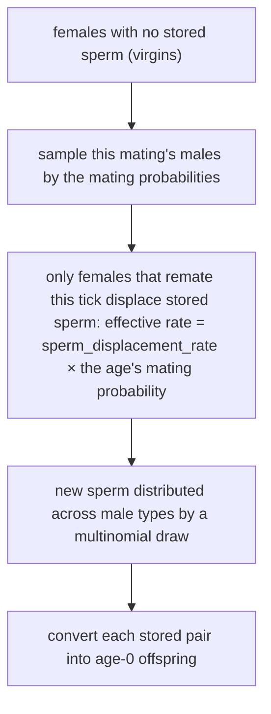

# Age structure and long-term sperm storage

The model in [survival and generation replacement](survival.md) has two age slots and replaces one generation with the next in a single step. Real populations overlap: two- and three-year-old females breed at the same time, and they still carry sperm from an earlier mating. This chapter explains how the project expresses that, and where it differs from the discrete model.

## Model conditions

```python
AgeStructuredPopulation.setup(species=sp, stochastic=False) \
    .age_structure(n_ages=4, new_adult_age=1) \
    .initial_state(individual_count={"female": {"A|a": [0, 100, 0, 0]}, ...}) \
    .survival(female_age_based_survival=[1.0, 1.0, 1.0, 0.0], ...)
```

| Parameter | Meaning |
| --- | --- |
| `n_ages` | number of age slots; `age 0` holds newborns and the rest increase in order |
| `new_adult_age` | the first breeding age slot; younger individuals compete but do not reproduce |
| `age_based_survival_rates` | `(sex, age)`, one survival rate per age |
| `reproduction_rates` / `fertility` | `(age,)`, per-age participation and relative fertility |
| `sperm_displacement_rate` | probability that a remating replaces already stored sperm |

The essential difference from the discrete model is not "more slots" but that **the lifecycle no longer completes in one replacement**: each age survives at its own rate and then shifts one slot at the end of every tick.

## How stored sperm joins reproduction

The [age-structured reproduction stage](https://github.com/jyzhu-pointless/natal-core/blob/main/rust/src/kernels/age_structured.rs) has four steps:



The sperm-storage tensor is shaped `(age, female ZType, male ZType)`, and each cell counts the mated females of that age and genotype whose partner was that male genotype. Three checkable consequences follow:

- Storage is not "a total amount of sperm" but a count of females partitioned by partner type.
- Empty cells contribute nothing; a female that never mated produces no offspring.
- A female keeps using stored sperm until a remating displaces it, so "this generation only mates with itself" does not hold.

The fertilisation step converts each stored pair into age-0 individuals using female and male fecundity, female fertility, the reproduction rate, the offspring tensor (P), and sex assignment; in stochastic mode each pair's clutch is drawn from a binomial or Poisson distribution.

## Age advancement

`aging(bp, ind, sperm)` moves counts and sperm storage together:

1. Walk from the oldest age downward one slot at a time, so no slot is overwritten before it has been read.
2. The oldest age's individuals and sperm simply disappear (they fall out of the model).
3. Age 0 is cleared for both counts and sperm.

Verified (four age slots, 100 A|a adults at age 1 initially, with five females placed in the oldest age 3 before the tick):

| Position | After one tick |
| --- | --- |
| age 0 | 0 (cleared; the new newborns now sit at age 1) |
| age 1 | this tick's newborns |
| age 2 | 100 (the previous age 1 shifted down) |
| age 3 | 0 (the previous age 3 fell out) |

## Differences from the discrete model

| Aspect | Discrete generation | Age structured |
| --- | --- | --- |
| Age slots | fixed at two | `n_ages` from the declaration |
| Old adults | replaced directly by the next generation | survive at their own rates and shift one slot |
| Sperm storage | no cross-tick sperm store | kept as (age, female type, male type) |
| Breeding participation | internal adult value 1 | per-age participation and fertility |
| Stochastic fertilisation | drawn directly through zygote fitness and P | matings and sperm are sampled first, then fertilised |

The last row explains why sharing a field name does not mean sharing behaviour: flags such as `fixed_egg_count` may be read at different stages on the two paths, so a claim about one path must be checked against the actual call chain.

## What a change affects

| Agent proposal | Test to apply |
| --- | --- |
| Model overlapping generations with the discrete engine | The discrete engine replaces adults during aging; two ages cannot breed at once |
| Keep the oldest age alive | The oldest slot falls out during aging; add an age or raise that age's survival rate |
| Treat sperm storage as one pooled amount | It is partitioned by partner type; a pooled reading misstates offspring genotype distributions |
| Assume females only mate with this tick's males | Stored sperm keeps being used until displaced |
| Move parameters between the two paths | Check the parameter is read at the same stage; a shared name is not shared semantics |

## Implementation and verification entry points

| Entry point | Responsibility in this chapter |
| --- | --- |
| [kernels/age_structured.rs](https://github.com/jyzhu-pointless/natal-core/blob/main/rust/src/kernels/age_structured.rs): `reproduction()`, `survival()`, `aging()`, `run_tick()` | The four stages and age advancement |
| same file: the sperm helpers (sample matings, displace, fertilise) | Long-term sperm storage |
| [population/age_structured.py](https://github.com/jyzhu-pointless/natal-core/blob/main/src/natal/frontend/population/age_structured.py) | User-facing parameters and state container |
| [data/state.py](https://github.com/jyzhu-pointless/natal-core/blob/main/src/natal/frontend/data/state.py): `PopulationState` | `(sex, age, ZType)` counts and `(age, ♀ZType, ♂ZType)` sperm |

The four-slot advancement, the oldest class falling out, newborns appearing at age 1, and the sperm tensor shape were all verified from one set of inputs. Among the existing tests, [test_age_structured_population.py](https://github.com/jyzhu-pointless/natal-core/blob/main/tests/test_age_structured_population.py) and [test_sex_chromosome_age_structure.py](https://github.com/jyzhu-pointless/natal-core/blob/main/tests/test_sex_chromosome_age_structure.py) protect the pre-existing age-structured behaviour.

Next, read [How density regulation and equilibrium are computed](density_regulation.md).
