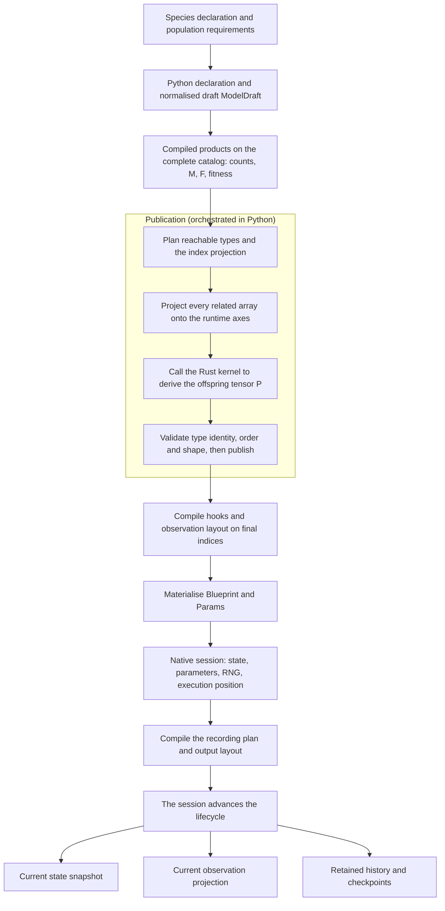
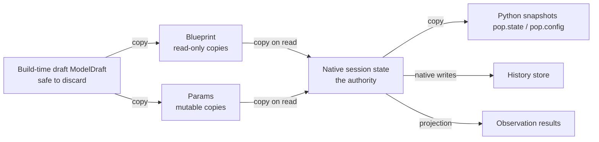

# Architecture and responsibility boundaries

A model travels through three different kinds of things on its way from declaration to result: Python objects that describe it, arrays that cross the language boundary, and a native session that holds the running state. This chapter explains who owns what, which data belongs to which layer, and where construction hands over to execution. A concrete trip through one model is in [A model’s complete journey from declaration to results](model_journey.md); this chapter does not repeat its numbers, only explains why the layering is necessary.

If only one sentence sticks: **Python turns biological declarations into arrays of a fixed layout, Rust executes on those arrays and owns the running state, and the two sides exchange copies rather than shared mutable data.**

## Two different things named "frontend"

`src/natal/frontend/` is the model frontend inside the Python package: species structures, population declarations, genetic compilation, hook compilation, and output layout live there. The repository-root `frontend/` is the browser interface. The two share a name and nothing else; confirm which one a discussion means. This chapter covers only the former.

## Overall data flow

The diagram below is a responsibility and artifact flow, not a line-by-line call stack. Arrows mean "produces or initializes the next object", never "shares the same array".

Three things are worth noticing. First, compilation happens on the **complete catalog** and projection happens at publication, so "a type with zero initial count" and "a removed type" are different states. Second, deriving P (`offspring_tensor`) already calls a Rust kernel during publication: build time is not purely Python. Third, the session only exists after step I; everything before that is still an unpublished candidate.

## Responsibility by layer

| Layer | Main objects or modules | Responsible for | Not responsible for |
| --- | --- | --- | --- |
| Declaration | `Species`, `PopulationBuilder`, `ModelDefinition` | Retaining rebuildable declarations and their order | Holding runtime state |
| Construction | `ModelDraft`, `CompiledProducts`, `IndexRegistry` | Candidate arrays, indices, and modifiers on complete axes | Being the authority for live state |
| Publication | `IndexProjection`, published `IndexRegistry` | Fixing runtime coordinates and projecting all related axes together | Changing model semantics |
| Transfer contract | `Blueprint`, `Params` | Fields, dimensions, and numerical representation across the boundary | Any scientific computation |
| Execution | Rust `sessions/`, `kernels/` | Current counts, tick, execution status, RNG, runtime parameters | Rewriting Python-side declarations |
| Output | Rust `output/` and Python wrappers | History rows, observation projections, parameter log, checkpoints | Replacing the current state |

[PopulationBuilder](https://github.com/jyzhu-pointless/natal-core/blob/main/src/natal/frontend/builder/_base.py) splits its entry point into `_compile_products()`, `_publish_and_build()`, and `_build_published()`. That split establishes every later boundary: hook selectors, observation groups, and history dimensions must bind to **final** indices, never to pre-compression coordinates.

## Who owns the data and the execution right

This is the part to remember, and the part agent proposals are usually vague about.

| Question | Answer | Evidence |
| --- | --- | --- |
| Who owns the current counts and tick? | The native session | `pop.state` and `pop.config` are point-in-time snapshots |
| Does mutating a snapshot change the engine? | No | Snapshots are copies; writes never reach the session |
| How do runtime parameters change? | Through parameter channels or updaters | The backend forwards them to the native session |
| What are the retained Python declarations for? | Rebuilding and interpretation | They do not reflect the latest native values |
| How many execution authorities exist in a spatial population? | One stacked session | Deme objects are local data access points only |

The copying relationships, concretely:

- `materialize()` splits the draft into `Blueprint` and `Params`, re-copying every array as C-contiguous float64; the draft may be discarded after the build.
- `Blueprint` arrays are read-only copies; `Params` carries every runtime-mutable value.
- Rust's `from_python()` contract readers take slices and copy them into Rust-owned storage, so the native session holds no view into any Python array.
- The reverse holds too: `state_snapshot()` returns flat copies that callers reshape with their own dimensions; writing them does not affect the session.

Every arrow in this diagram is a copy; none of them shares a mutable array between Python and Rust. That property underpins many later behaviours: snapshot writes do nothing, rebuilding a session does not mutate old objects, and spatial variants can share read-only genetic tables.

Note that **runtime updates do not always copy everything**. `materialize_params()` skips the Blueprint, `contract_field_source()` rebuilds only the requested fields, and its contiguous-array conversion does not copy when the array is already contiguous. Those optimisations change how often a copy happens, not the conclusion that Python arrays and native state never alias. To judge whether a code path is safe, check whether it hands a Python array to a channel that writes.

## Where construction hands over to execution

- The declaration stage collects requirements; `_compile_products()` produces genetic maps, fitness, and initialisation inputs on the complete catalog.
- `_publish_and_build()` plans and publishes the final layout, then creates the session and the recording plan. The compression switch affects only this step, never the declaration.
- `_build_published()` creates the population object and initialises the native session; only now can the model run.
- Spatial populations merge the execution right of several demes into one stacked session at this step; see [spatial execution](spatial.md).

So "build only constructs, run is what touches Rust" is inaccurate: publication already calls the Rust numeric kernel to derive P. The accurate split is that Python orchestrates the model and its interfaces while Rust performs native numeric computation and owns the running session. That boundary is not the same as the build/run boundary.

## Reads and writes take different routes

With a session present, `pop.state` and `pop.config` are query snapshots; mutating their arrays is not a mechanism for changing the engine. `RustDiscreteLifecycleBackend.state_snapshot()` and `config_snapshot_from_session()` are the entry points for seeing how snapshots are rebuilt.

Runtime writes enter the native session through parameter channels or updaters; writes inside callbacks also follow transaction rules, see [Hooks and controlled updates](hooks.md). Retained Python declarations support rebuilding and interpretation, but cannot establish the latest native values — which is why parameter reads must go through the backend instead of reading an old draft unconditionally.

## What a change affects

| Agent proposal | Question to ask |
| --- | --- |
| Mutate `pop.state` arrays to intervene in the population | That is a snapshot; use a controlled write channel and state when it takes effect |
| Compute everything in Python at build time and leave Rust only the loop | P is already derived by a Rust kernel; changing that requires a numerical-equivalence and ownership argument |
| Treat `Blueprint` as mutable runtime configuration | It is a read-only copy; runtime-mutable values live in `Params` |
| Let each deme advance its own timeline | Execution is concentrated in one stacked session; a deme does not own a container timeline |
| Copy a population object to run two simulations in parallel | State which read-only tables are shared and which mutable state is copied |

The test is not which layer feels more natural, but **which copy becomes the authority** after the change and whether the old path stays read-only.

## Source and verification entry points

- [rust_backend.py](https://github.com/jyzhu-pointless/natal-core/blob/main/src/natal/backends/rust/rust_backend.py): contract conversion, session calls, snapshots, and parameter writes.
- [materialize.py](https://github.com/jyzhu-pointless/natal-core/blob/main/src/natal/contracts/materialize.py): the draft-to-`Blueprint`/`Params` copy rules.
- [Rust model](https://github.com/jyzhu-pointless/natal-core/blob/main/rust/src/model/mod.rs): native data organisation; read alongside the Python contracts.
- [test_contracts_materialize.py](https://github.com/jyzhu-pointless/natal-core/blob/main/tests/test_contracts_materialize.py): field mappings, name directories, custom values, array isolation, parameter-only materialisation.
- [test_hook_transaction_contract.py](https://github.com/jyzhu-pointless/natal-core/blob/main/tests/test_hook_transaction_contract.py): current native values, callback channels, and spatial execution ownership.

When changing the owner of a piece of data, follow construction, transfer, execution, snapshots, and restoration. One successful run producing identical numbers cannot establish that sharing and restoration still behave correctly.
