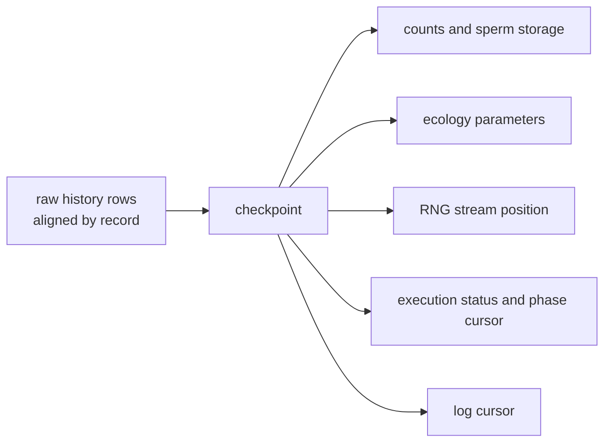

# Checkpoint restoration and experiment replay

History makes the past readable; checkpoints make it a place to **start again**. This chapter explains what one restore contains, why the next stretch of trajectory matches the original, and how "importing state" differs from "restoring a checkpoint".

## What one restore contains

Verified in one complete comparison:

| Item | After the restore |
| --- | --- |
| tick | back at the exact recorded tick (3) |
| counts | equal to what that tick recorded |
| later history rows | truncated to that tick: `ticks == (0, 1, 2, 3)` |
| parameter edits | a `carrying_capacity` change made after recording is undone, back to the recorded value |
| RNG | continues from the recorded stream position instead of reseeding |
| execution status | restored to the recorded status (`Ready`/`Stopped`/`Failed`) |

**The "continue" semantics of the RNG deserves its own check**: a population seeded with 17 runs to tick 4 and its last row is recorded; returning to tick 2 and running to tick 4 again yields a bit-identical last row. That shows the restore did not rewind the random stream to its start — otherwise the second stretch would differ from the first.

## Export/import state versus restoring a checkpoint

| Dimension | `restore_checkpoint(tick)` | `import_state(...)` |
| --- | --- | --- |
| Data source | a checkpoint inside the session, aligned with history rows | state supplied by the caller |
| Timeline | truncated to that tick, earlier history kept | **cleared**, starting from zero |
| Ecology parameters | restored to the recorded values | not involved |
| RNG | restored to the recorded stream position | re-initialised |
| Use | replay, branching experiments | externally constructed state, moving state between objects |

Verified: after `export_state()` the population runs on to tick 4, and `import_state(exported)` leaves `history.ticks` empty — the timeline starts over rather than returning to tick 3. Both can "go back", but they mean different things, and mixing them up makes "why is the next stretch different" hard to explain.

## Genetic tables are not rolled back

A checkpoint stores **running state** (counts, sperm, ecology parameters, RNG, execution position) and no genetic tensors. Verified: after recording a checkpoint, one row of the M table is replaced with a valid but different distribution; restoring that checkpoint leaves the edited row **edited** — genetic tables are outside the rollback scope.

That is the natural consequence of the runtime layout not following checkpoints: type identity, M, F, and P belong to the published layout, and changing them requires a recompile (see [how runtime parameters are read and updated](runtime_updates.md)). If a restore also reverted the M table, the session's structure and its derived tensors would disagree.

## Boundaries and limits

| Case | Behaviour |
| --- | --- |
| No history at all | `ValueError: No history available for checkpoint restore.` |
| Observation-mode history | `ValueError` stating that this mode cannot restore |
| A tick that is not in the history | `ValueError: Tick n not found in history.` |
| Rows already evicted by `max_rows` | the matching checkpoint is unrestorable |
| Running forward after a restore | continues from the recording boundary; committed genetic updates are unaffected |
| Checkpoint retention | controlled through `retain_checkpoints_from` / `truncate_checkpoints` |

## What a change affects

| Agent proposal | Test to apply |
| --- | --- |
| Roll back a genetic rule change with a checkpoint | Genetic tables are not in the checkpoint; the model must be rebuilt |
| Reproduce an experimental branch with `import_state` | It clears the timeline; branch replay uses `restore_checkpoint` |
| Assume a restore reseeds | A restore continues the stream; reseeding would change the following trajectory |
| Run checkpoint experiments in observation mode | That mode cannot restore; switch to raw first |
| Depend on a checkpoint whose row was evicted | Eviction invalidates the checkpoint too |

## Implementation and verification entry points

| Entry point | Responsibility in this chapter |
| --- | --- |
| [population/base.py](https://github.com/jyzhu-pointless/natal-core/blob/main/src/natal/frontend/population/base.py): `restore_checkpoint()`, `export_state()` | The restore entry point, state export, timeline truncation |
| [population/discrete_generation.py](https://github.com/jyzhu-pointless/natal-core/blob/main/src/natal/frontend/population/discrete_generation.py): `import_state()` | State import and timeline reset |
| [backends/rust/rust_backend.py](https://github.com/jyzhu-pointless/natal-core/blob/main/src/natal/backends/rust/rust_backend.py): `restore_from_checkpoint()`, `retain_checkpoints_from()`, `truncate_checkpoints()` | The native checkpoint channel |
| [rust/src/sessions/discrete_generation.rs](https://github.com/jyzhu-pointless/natal-core/blob/main/rust/src/sessions/discrete_generation.rs) | What a checkpoint holds: state, ecology, RNG, execution status |

Exact-tick restoration, history truncation, the parameter rollback, the continuing RNG, the cleared timeline on import, and the untouched genetic tables were all verified from one set of inputs. Among the existing tests, [test_run_state_and_recording_lifecycle.py](https://github.com/jyzhu-pointless/natal-core/blob/main/tests/test_run_state_and_recording_lifecycle.py) and [test_native_session_contracts.py](https://github.com/jyzhu-pointless/natal-core/blob/main/tests/test_native_session_contracts.py) protect the checkpoint and restore paths.

Next comes the later chapter *From a development need to an acceptable change*.
