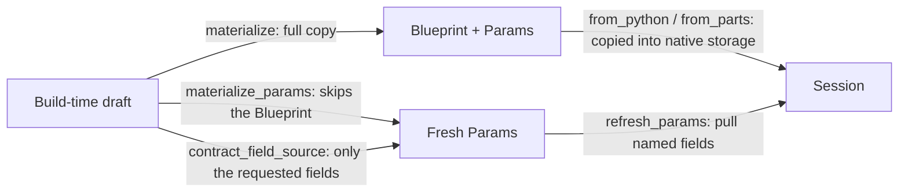

# How Python and Rust exchange model data

After [publication](publication.md) the model is still a set of Python-side arrays; running it means handing those arrays to the native session. This chapter explains that handover: what is passed, in what format, who validates it, and why "build-time transfer" and "runtime update" are not the same path.

## The two contract objects

| Contract | Contents | Change frequency |
| --- | --- | --- |
| `Blueprint` | dimensions, execution flags, the type name directories, initial counts and sperm, deme count and migration CSR | fixed at build time; changing it needs a rebuild |
| `Params` | every runtime-mutable value: ecology scalars, rate and fitness tensors, genetic tables, custom slots, the migration rate column | changeable at run time |

The split is direct: anything that must be changeable at run time needs a mutable channel, so it lives in `Params`; anything whose change forces a rebuild lives in the read-only `Blueprint`. Treating dimensions or initial counts as runtime parameters would let a running session lose its own consistency.

Three native structures correspond to this: `Blueprint` (the frozen specification), `EcologyParams` (runtime ecology columns, per deme), and `GeneticsTensors` (genetic tensors that several demes may share).

## Field conversion (extract)

Field names are not always identical on the two sides; the conversion happens in one place, `materialize()`:

| Draft field | Contract field | Shape |
| --- | --- | --- |
| `carrying_capacity` | `carrying_capacity` | scalar |
| `juvenile_growth_mode` | `growth_mode` | scalar (integer enum) |
| `age_based_survival_rates` | `survival_rates` | `(sex, age)` |
| `age_based_mating_rates` | `mating_rates` | `(sex, age)` |
| `female_age_based_fertility` | `fertility` | `(age,)` |
| `zygotes_to_gametes_map` | `meiosis_map` | `(2, Z, G)` |
| `gametes_to_zygotes_map` | no contract field — it stays Python-side and feeds the build-time offspring-tensor kernel that derives `offspring_tensor` | `(G, G, Z)` |
| `offspring_tensor` | `offspring_tensor` | `(Z, Z, Z)` |
| `initial_individual_count` | `initial_individual_count` (Blueprint) | `(2, A, Z)` |

`external_expected_eggs` and `equilibrium_individual_distribution` use sentinel values for "not declared": a negative number, and an empty `(0, 0)` matrix. They are not alternative spellings of "zero eggs" or "no equilibrium"; the reader must test the sentinel first.

## dtype, contiguity, and ownership

- Every array handed to the kernel is re-copied as **float64 and C-contiguous**; integer and boolean arrays use int64 and bool.
- The Rust side reads through helpers such as `extract_f64_vec()`: the input must be a C-contiguous float64 array, and **a non-contiguous or strided view is refused** rather than silently reordered.
- Copies travel one way: `materialize()` copies into the contract, and Rust copies again into its own storage, so the native session never holds a view into a Python array.
- `Blueprint` arrays are marked read-only when constructed; `Params` arrays are writable copies, but writing a Python-side copy does not affect the session.

## Who validates what

| Check | Location | Example |
| --- | --- | --- |
| Shapes and semantics | Python, build time | every axis-bearing field must agree with the runtime layout after projection |
| Probability-table legality | Python, `validate_meiosis_table()` | a row that does not sum to 1, or a negative entry, is refused |
| Value domains | Rust, `validate_state_values()` / `validate_scalar_value()` | NaN or negative counts, a negative tick |
| Parameter-channel writes | the parameter write path | a shape mismatch reports `expected 6 elements, got 9`; an unknown field name reports `AttributeError` |

Validation cannot be pushed entirely to one side: Python knows the model semantics (which field means what, and with which shape), while Rust knows the runtime invariants (state cannot be negative). Both refuse illegal input with a locatable error instead of falling back to a default.

## Build transfer versus runtime update

The three entry points differ only in **how much is copied**, never in semantics:

- `materialize()`: the build-time full transfer, producing `Blueprint` and `Params`.
- `materialize_params()`: a runtime parameter refresh that skips the Blueprint, for changes that do not touch the layout.
- `contract_field_source()`: rebuilds only the requested fields and, when an array is already C-contiguous float64, **does not copy at all**, handing it straight to the parameter channel (Rust still copies when it reads).

The migration rate column is a special case: it has its own column-write channel and does not appear in the generic field-source table. Writing it as an ordinary tensor is refused.

## What a change affects

| Agent proposal | Test to apply |
| --- | --- |
| Make dimensions or initial counts runtime-mutable | They live in the Blueprint; that requires rebuilding the session rather than writing parameters |
| Edit `Params` arrays in Python to influence the session | Those are copies; use a parameter channel or an updater |
| Pass a slice as a tensor | The Rust reader refuses non-contiguous arrays; use `np.ascontiguousarray` first |
| Use 0 to mean "not declared" | External expected eggs and the equilibrium distribution use sentinels; 0 has a real meaning |
| Rebuild the Blueprint when refreshing parameters | `materialize_params()` and the field-source channel exist; rebuilding is wasted work |

## Implementation and verification entry points

| Entry point | Responsibility in this chapter |
| --- | --- |
| [contracts/blueprint.py](https://github.com/jyzhu-pointless/natal-core/blob/main/src/natal/contracts/blueprint.py) | Fields of the frozen contract and `frozen()` |
| [contracts/params.py](https://github.com/jyzhu-pointless/natal-core/blob/main/src/natal/contracts/params.py) | Fields of the runtime-mutable contract |
| [contracts/materialize.py](https://github.com/jyzhu-pointless/natal-core/blob/main/src/natal/contracts/materialize.py) | Field conversion, copying, sentinels, the field-source table |
| [rust/src/model/python.rs](https://github.com/jyzhu-pointless/natal-core/blob/main/rust/src/model/python.rs) | Native readers and the contiguity requirement |
| [rust/src/model/validation.rs](https://github.com/jyzhu-pointless/natal-core/blob/main/rust/src/model/validation.rs) | State and value-domain validation |
| [backends/rust/rust_backend.py](https://github.com/jyzhu-pointless/natal-core/blob/main/src/natal/backends/rust/rust_backend.py) | Session creation and parameter refresh adaptation |

The copy isolation, read-only freezing, contiguity requirement, no-copy field source, and sentinel shapes were all verified from one set of inputs. Among the existing tests, [test_contracts_materialize.py](https://github.com/jyzhu-pointless/natal-core/blob/main/tests/test_contracts_materialize.py) and [test_native_session_contracts.py](https://github.com/jyzhu-pointless/natal-core/blob/main/tests/test_native_session_contracts.py) protect the contract mapping and native session behaviour.

Next, read [How a session advances one simulation](runtime.md) to see how this data is advanced inside the native session.
