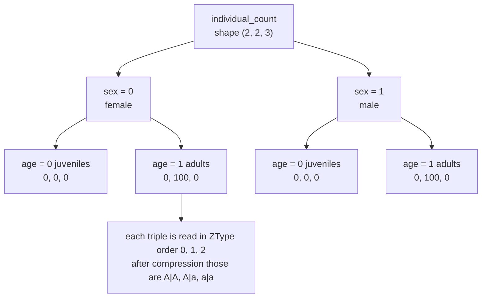

# Type catalog, indices, and array coordinates

[The previous chapter](genetic_objects.md) turned biological concepts into objects; this one turns objects into array subscripts, and answers a more concrete question: where does one individual land, and under which name, in the count tensor, the genetic tables, an observation result, and a history record.

It reuses the sample model: one locus on `chr1` with alleles A, a, X, starting from 100 heterozygous females and 100 heterozygous males. Every number below was verified locally, including indices, names, flat offsets, and error types.

## Two numbering spaces

Objects are good for comparison and derivation; arrays only understand integers. Two numbering spaces connect them:

| Space | Element | Assigned by | Consumed by |
| --- | --- | --- | --- |
| ZType | diploid genotype × somatic label | `IndexRegistry.register_ztype()` | counts, fitness, M, F, P, observation, history |
| GType | haploid genotype × gamete label | `IndexRegistry.register_gtype()` | the gamete axes of the M and F tables |

[IndexRegistry](https://github.com/jyzhu-pointless/natal-core/blob/main/src/natal/frontend/registry/index.py) is the single authority for both spaces. It has three invariants:

1. **Registration order is the index**: new entries append at the end and existing indices stay stable until compression.
2. **Mutable before publication, read-only after**: once `mark_published()` runs, any registration raises `RuntimeError: published registry is immutable`, and compression is refused too.
3. **A pair that was never registered does not exist**: querying an unregistered `(genotype, label)` combination raises `KeyError` instead of returning a "probably zero" position.

The third one matters most. It separates "this slot holds zero individuals" from "this slot does not exist in this model". Confusing the two is how a program finishes cleanly while writing counts into the wrong genotype.

## What the complete catalog looks like

Declaring A, a, X yields a complete catalog of 6 ZTypes and 3 GTypes:

| Complete ZType index | Genotype | Label | Complete GType index | Haploid | Label |
| --- | --- | --- | --- | --- | --- |
| 0 | A\|A | default | 0 | A | default |
| 1 | A\|a | default | 1 | a | default |
| 2 | A\|X | default | 2 | X | default |
| 3 | a\|a | default | | | |
| 4 | a\|X | default | | | |
| 5 | X\|X | default | | | |

The order comes from species enumeration (previous chapter), and labels of one genotype are adjacent: a species with two labels produces `A|A@default`, `A|A@wolbachia`, `A|a@default`, and so on.

"Complete" is the key word: this catalog holds **every type the model permits**, not only those with a non-zero count. The X types have count zero from the start yet occupy positions 2, 4, and 5. Publication removes unreachable types and renumbers everything, see [Reachability, index compression, and publication](publication.md). The rest of this chapter explains why that is dangerous.

## The axes of an array

The count tensor has axes `(sex, age, ZType)`:

- **sex**: `Sex.FEMALE = 0`, `Sex.MALE = 1`, used directly as array subscripts.
- **age**: age slots. A plain discrete model fixes two: age 0 is the juveniles produced in this step and age 1 is the breeding adults. They represent lifecycle roles, not two arbitrary real age intervals; age-structured models may declare more slots.
- **ZType**: the type index from the previous section, always last.



The triples are read in ZType order and show the state at the end of construction, before any run. After one step the same age-1 slots hold `12.5, 25, 12.5`: the old adults are replaced, not added to their offspring.

After compression the sample model is `(2, 2, 3)`; before compression it is `(2, 2, 6)` with three permanently empty slots. The two layouts **share axis meanings but not axis lengths**, which is exactly the coordinate problem the next section deals with.

`natal.frontend.data.state.state_axes()` is the single entry point for reading axis lengths: given a rank-2 `(sex, ZType)` tensor it interprets it as having one age slot, so projection inputs and state inputs share one code path.

## Flat offsets

What travels between the session and history is not a multidimensional array but a flat row. Understanding that layout is the only way to judge whether the subscripts an agent reports are right.

The count tensor is flattened in C order over `(sex, age, ZType)`, preceded by the tick:

```text
offset(0)                                        = tick
offset(1 + (sex * n_ages + age) * n_ztypes + z)  = the count in that slot
```

On the sample model (`n_ages = 2`, `n_ztypes = 3`) the whole row is `1 + 2×2×3 = 13` values long:

| Offset | Contents | Offset | Contents |
| --- | --- | --- | --- |
| 0 | tick | 7 | male age-0, ZType 0 |
| 1 | female age-0, ZType 0 | 8 | male age-0, ZType 1 |
| 2 | female age-0, ZType 1 | 9 | male age-0, ZType 2 |
| 3 | female age-0, ZType 2 | 10 | male age-1, ZType 0 |
| 4 | female age-1, ZType 0 | 11 | male age-1, ZType 1 |
| 5 | female age-1, ZType 1 (initially 100) | 12 | male age-1, ZType 2 |
| 6 | female age-1, ZType 2 | | |

Age-structured models append a sperm-storage block shaped `(age, female ZType, male ZType)` after the counts, making the row `1 + n_sexes×n_ages×n_ztypes + n_ages×n_ztypes²` long. With `2×2×3` plus `2×3×3`, the first 12 values are counts and the next 18 are sperm; `sperm[age=1, female=2, male=1]` sits at offset `13 + (1×3 + 2)×3 + 1 = 29`. Note that the sperm block puts age first and the two sex roles on either side of the type axis, unlike the count block's `(sex, age, ztype)`.

History rows, checkpoints, and snapshots share this layout; spatial models add a deme axis on the outside, see [Spatial execution and migration](spatial.md).

## Name directories: making integers interpretable

Integer indices alone cannot be checked, so every layer carries a name directory:

| Location | Shape of the value | Value for the sample model |
| --- | --- | --- |
| `Blueprint.ztype_names` / `gtype_names` | tuple, indexed by position | `('A|A@default', 'A|a@default', 'a|a@default')` |
| Observation `labels["group"]` | one name per observation group | same |
| Observation `axes` | axis names | `('group', 'sex', 'age')` |
| History `axes` | axis names | `('record', 'sex', 'age', 'ztype')` |

Three rules that can be checked immediately:

- Names always carry the `@label` suffix, including the default label (`@default`), so names stay unique inside one directory.
- The count tensor's `(sex, age, ztype)` and the observation's `(group, sex, age)` do not agree on axis order: observation moves ZType to the outermost group axis, and `obs.values` equals `state.individual_count.transpose(2, 0, 1)`. Pairing the two requires an explicit transpose, never "the shapes look about the same".
- History adds a `record` axis, shaped `(record, sex, age, ztype)` — `(2, 2, 2, 3)` on the sample model.

One verified behaviour sits outside what the name directory guarantees: the **spelling** of an unordered genotype depends on which construction happened first. Parse `"a|A"` on a species first and the runtime directory reads `a|A@default`, while indices and numbers are unchanged (the heterozygote stays at index 1 and the initial counts stay `[0, 200, 0]`). A name is a parseable symbol, not an identity across instances.

## Same shape, different meaning

This is the section to take away, and the most common crack between "the program ran" and "the result is right".

The sample model contains all of the following arrays. Look only at shape and meaning, not at field names:

| Shape | Field | What one element means |
| --- | --- | --- |
| `(2, 2, 3)` | `initial_individual_count` | individuals in that slot |
| `(2, 2, 3)` | `viability_fitness` | multiplier applied to that slot's individuals during survival |
| `(2, 3)` | `fecundity_fitness` | how much that sex·ZType contributes as a mother to egg production |
| `(2, 3)` | `zygote_viability_fitness` | survival multiplier of the **offspring** of that sex·ZType, applied after sex assignment |
| `(2, 2)` | `age_based_mating_rates`, `age_based_survival_rates` | per sex·age rates |
| `(3, 3)` | `sexual_selection_fitness` | pairing weight for female ZType × male ZType |
| `(2, 3, 2)` | `zygotes_to_gametes_map` (M) | probability that sex·ZType produces each GType |
| `(2, 2, 3)` | `gametes_to_zygotes_map` (F) | which ZType two gametes form |
| `(3, 3, 3)` | `offspring_tensor` (P) | expected number of each ZType from a female and a male ZType |

Note that M is `(2, 3, 2)` while F is `(2, 2, 3)`: their shapes mirror each other, and a single misread axis swaps the gamete axis with the type axis while the arithmetic still completes.

Two verified consequences:

1. Writing the same `(2, 3)` array `[[0.5, 0.5, 0.5], [1, 1, 1]]` into two different channels gives different results. As `fecundity_fitness` it halves the female parents' egg output, so offspring of both sexes become `12.5 / 25 / 12.5` (100 instead of 200 in total). As `zygote_viability_fitness` it halves only the female **offspring**, giving females `12.5 / 25 / 12.5` and males `25 / 50 / 25` (150 in total).
2. Writing `initial_individual_count` (counts) wholesale into `viability_fitness` (multipliers) raises nothing: both are `(2, 2, 3)`. The age-0 multipliers become 0, the juvenile cohort disappears, and the population is zero one step later.

Shape validation draws a clear line. Writing a `(3, 3)` array into `fecundity_fitness` is rejected with `expected 6 elements, got 9`; a shape-correct semantic error is not rejected, because **equal axis lengths do not imply equal axis meanings**.

Evidence that distinguishes the two implementations must be equally specific: instead of checking the total, inspect the early and late stage counts (after reproduction, after survival) and perturb a single type — set one ZType's coefficient to 0.5 and see whether "the mother lays fewer eggs" or "one class of offspring is reduced". Implementations that are wrong in the same way totals agree will separate here.

## Publication changes index meanings

Publication removes genetically unreachable types and renumbers everything. For the sample model:

| Type | Complete index | Runtime index |
| --- | --- | --- |
| A\|A | 0 | 0 |
| A\|a | 1 | 1 |
| a\|a | 3 | 2 |
| A\|X, a\|X, X\|X | 2, 4, 5 | removed |

So "index 2" names different genotypes before and after publication: A|X beforehand, a|a afterwards. Every coordinate that is stored or used at runtime must therefore be resolved on the final indices before it is persisted:

- hook selectors and observation groups (compiled at build time against the final indices);
- history dimension names and the name directory;
- state arrays inside checkpoints.

This is why matching shapes cannot prove that two model layouts are compatible: type identity, order, and the name directory must agree as well.

## Boundaries and errors

| Case | Result |
| --- | --- |
| Querying an unregistered `(genotype, label)` | `KeyError` |
| Registering a new type on a published registry | `RuntimeError: published registry is immutable` |
| Writing a tensor whose axis length disagrees with the channel | `ValueError` naming the expected and actual element counts |
| A rank-2 count tensor | Interpreted as having one age slot, not treated as an error |
| An unknown field name | Rejected with `AttributeError` naming the missing field; it never silently lands on another field |

## What a change affects

| Agent proposal | Test to apply |
| --- | --- |
| Write count arrays directly by index | Indices change with compression; use type names or selectors and state which layout is running |
| Append an array column to carry new state | The axis length propagates into fitness, genetic tables, observation, and history names |
| Reuse an existing `(2, 2, 3)` array for a new meaning | Shape validation will not stop it; a new field or an explicit semantic statement is required |
| Match two runs by name | The spelling can change with construction order; compare indices and the type identities behind them |
| Use build-time indices on a compressed model | Complete and runtime indices differ; resolve again |

## Implementation and verification entry points

| Entry point | Responsibility in this chapter |
| --- | --- |
| [registry/index.py](https://github.com/jyzhu-pointless/natal-core/blob/main/src/natal/frontend/registry/index.py) | ZType/GType registration, queries, compression, publication locking |
| [builder/_registry_builder.py](https://github.com/jyzhu-pointless/natal-core/blob/main/src/natal/frontend/builder/_registry_builder.py) | The construction order of the complete catalog |
| [data/state.py](https://github.com/jyzhu-pointless/natal-core/blob/main/src/natal/frontend/data/state.py) | `state_axes()`, `flatten_all()`, flat-row round trips |
| [contracts/blueprint.py](https://github.com/jyzhu-pointless/natal-core/blob/main/src/natal/contracts/blueprint.py): `format_type_name()` | The `@label` format of the name directory |
| [contracts/materialize.py](https://github.com/jyzhu-pointless/natal-core/blob/main/src/natal/contracts/materialize.py) | Field names to draft attributes and shapes |
| [output/observation.py](https://github.com/jyzhu-pointless/natal-core/blob/main/src/natal/frontend/output/observation.py) | Observation group labels and axis order |

The complete catalog, the pre/post-compression indices, the flat offsets (including the values at offsets 5 and 11), the history and observation shapes, and the two same-shape/different-meaning experiments were all verified from one set of inputs. Among the existing tests, [test_index_registry.py](https://github.com/jyzhu-pointless/natal-core/blob/main/tests/test_index_registry.py), [test_tick_metrics_index_alignment.py](https://github.com/jyzhu-pointless/natal-core/blob/main/tests/test_tick_metrics_index_alignment.py), and [test_observation_age_axis_contract.py](https://github.com/jyzhu-pointless/natal-core/blob/main/tests/test_observation_age_axis_contract.py) protect indices, axis alignment, and the observation axis contract.

Next, read [From declaration to compiled products](model.md) to see how this catalog is generated from a declaration and renumbered at publication.
