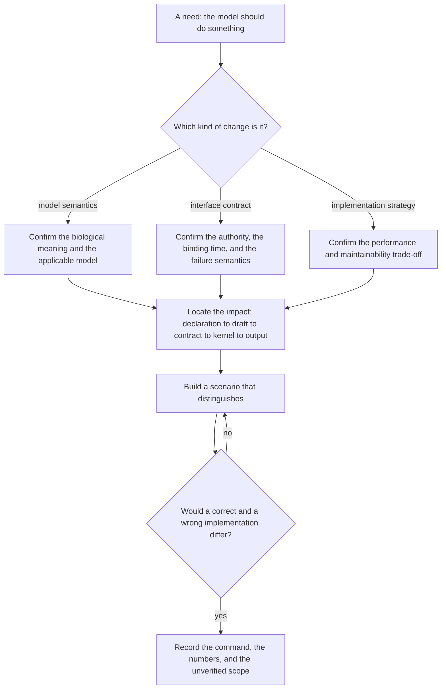

# From a development need to an acceptable change

The previous chapters explained the mechanisms. This one assembles them into a way of working: how to clarify a request, how to locate the affected area, how to compare proposals, and what evidence to deliver. One judgement standard runs through all of it: **which copy becomes the authority after the change, and what evidence separates a correct implementation from a wrong one**.

Quality gates, risk classification, and approval flow live in the repository's [AGENTS.md](https://github.com/jyzhu-pointless/natal-core/blob/main/AGENTS.md) and [quality_checks_spec.md](https://github.com/jyzhu-pointless/natal-core/blob/main/quality_checks_spec.md); this chapter does not duplicate them.

## Separate three kinds of change first

| Kind | Example | Who can say whether it is right |
| --- | --- | --- |
| Model semantics | whether generations overlap, which stage loses mass, how sex is determined | biology and the study design |
| Interface contract | snapshots versus writes, transaction boundaries, when coordinates bind | the repository's rules and existing tests |
| Implementation strategy | whether to compress, whether to reuse a cache, how arrays are laid out | performance and maintainability |

One request usually touches all three. Take "add a parameter that affects mortality": is it a new biological process (semantics), does it belong in `Params` or `Blueprint` (contract), and which column does the stage read (implementation)? Keeping the three apart is what keeps the discussion from circling.

## One diagram: from a need to a set of evidence

## Four worked cases

### Case A: a new ecology parameter

**Ask first**: units and dimension, default value, legal range, whether it varies per deme, at which stage it takes effect, whether it is restored with a checkpoint, and whether it must appear in the parameter log.

**Then locate the impact**: declaration entry → `ModelDraft` → contract field → native ecology column → stage read point → snapshot/log/restore. The checklists are in [how runtime parameters are read and updated](runtime_updates.md) and [how Python and Rust exchange model data](contracts.md).

**Acceptance evidence**: a small model that distinguishes the new behaviour from the old (for example one population giving different results at two values), plus a scenario showing that an illegal value produces no partial write. If the parameter is available in spatial models, additionally check that updating one deme leaves the others and their shared genetics untouched.

### Case B: an algorithm change (reordering density regulation, say)

**Ask first**: is this a semantic change or an implementation adjustment? If it changes conclusions, every result that depends on it must be re-verified.

**Then locate the impact**: the order propagates into stage-boundary counts, hook-visible state, and any check that depends on "after reproduction, before survival" values.

**Acceptance evidence**: build an order-sensitive parameter combination (a fixed carrying capacity plus a specific base survival rate, for example) where the two orders differ; a test that only compares totals cannot identify the order.

### Case C: a new hook operation

**Ask first**: which selection does it touch, at which event, how does it order against existing operations, and what survives a failure?

**Then locate the impact**: compile time (de-duplication, priority, selector binding), the native interpreter (opcodes, boundary commits), the transaction (candidate and commit), and the retention set (a type a hook references stays in the runtime layout).

**Acceptance evidence**: coordinate-level assertions about scope (which slots changed and which did not), the execution order when mixed with callbacks, and a compile-time error for an empty selection.

### Case D: extending observation or history

**Ask first**: is the addition a group, an axis, or a recording mode? Does it change the meaning of existing history?

**Then locate the impact**: group definitions → masks → recording plan → history row layout → name directory.

**Acceptance evidence**: axis and name assertions before and after projection, totals and per-group values for an aggregate group, and whether the recording mode still supports restoration.

## Four questions for comparing proposals

Ask them in order:

1. **Who is the authority**: after the change, which copy is the authority for the current state — the session, the draft, or a Python-side cache?
2. **When does binding happen**: at which step is a name resolved to an index? At build time, after publication, or at run time?
3. **What does failure leave**: illegal input, a raising callback, a stop — what survives each? Is any of them equivalent to rolling back the whole step?
4. **What evidence distinguishes**: is there a scenario where a correct and a wrong implementation give different results? If both behave identically under those inputs, they are not evidence.

## What to deliver

| Item | Contents |
| --- | --- |
| Change scope | which files and which layers (declaration/contract/kernel/output) changed |
| Behaviour change | what it was, what it is now, and which existing results are affected |
| Verification evidence | the commands actually run and their results; where the expected values come from (hand calculation, invariants, existing tests) |
| Unverified parts | combinations not covered, checks not run, and why |
| Residual risk | known approximations, bit-level differences, performance effects |

The concrete practices for numeric and state verification are in [how to verify numerical, state, and cross-language behaviour](verification.md).

## Common traps

| Claim | Problem |
| --- | --- |
| "The tests pass, so the behaviour is correct" | Tests cover what they assert; unasserted paths remain unknown |
| "The totals match" | Order, grouping, and index errors all preserve totals |
| "It only edits a query snapshot, so there is no side effect" | Snapshot writes do nothing, but decisions already made from those values can be wrong |
| "That is an implementation detail" | If it changes observable results, it is not |
| "The documentation says so" | The documentation may describe older behaviour; the code and tests decide, and a conflict calls for clarification |

## Maintaining this guide

- Keep both languages in sync; the English specification wins on conflict (see the repository `AGENTS.md`).
- When a public API changes, update `docs/zh/`, `docs/en/`, and the affected examples.
- After moving or renaming source files, check that this guide's GitHub links still point at existing paths.
- Adding an axis-bearing field means updating the layout tables; changing staging or restoration means updating the execution-boundary text.
- Update diagrams with the text: when a flow, ownership, or stage changes, the arrows change too.
- Watch the pipe character in genotype tables: inside backticks write `A|a` plainly (do not escape it — the escape would show a stray backslash on the page); outside backticks, escape the pipe instead, or the row splits into an extra column. Both behaviours were measured on this site.

The browser interface has its own code at [the repository-root frontend/](https://github.com/jyzhu-pointless/natal-core/tree/main/frontend), with the Python service entry at [frontend/webui/](https://github.com/jyzhu-pointless/natal-core/tree/main/src/natal/frontend/webui). The core simulation guide ends here; interface work continues into the data path from session through serialisation and REST/WebSocket protocols to the display components.

Next, read [how to verify numerical, state, and cross-language behaviour](verification.md), or return to the [reading route](index.md) to pick another entry point.
