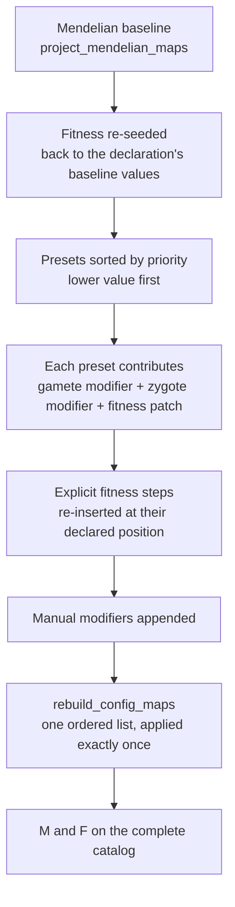

# How genetic presets and conversion rules compile

[The previous chapter](model.md) said that compilation rebuilds the genetic maps on the complete catalog. This one opens that pipeline: how the Mendelian baseline is produced, in what order presets and manual modifiers stack, why a recompile does not apply the same conversion twice, and which rules would break a probability distribution.

## Compilation order

Two ordering sources work together: presets are ordered by `priority`, while the relative order of "presets" and "explicit fitness steps" comes from **where they were declared** — every fitness step records how many presets had been applied at that moment, and recompilation re-inserts it at that count. Writing `fitness(...)` before `presets(...)` can therefore give a different result from writing them the other way round.

The repeated-application behaviour verified in this batch is the item to remember:

| Declaration | Heterozygote A\|A gamete row (A, a, X) | Note |
| --- | --- | --- |
| No rule | 1.00, 0, 0 | baseline |
| One A→X mutation rule at rate 0.1 | 0.90, 0, 0.10 | mass is lost at the declared rate |
| The same rule object declared twice | 0.90, 0, 0.10 | the same object is de-duplicated and applied once |
| Two rules with identical parameters but distinct objects | 0.81, 0, 0.19 | each is applied once, so the effects compound |

The conclusion is concrete: **"declared twice" is not the same as "applied twice"**. De-duplication is by object identity, while two equivalent but distinct rule objects stack. When an agent says "declaring this conversion again is harmless", ask whether the repeat is the same object or two equivalent declarations.

## The baseline: Mendelian maps

`project_mendelian_maps()` produces M and F on the complete catalog:

- Each row of M is the probability that one sex and ZType produces each GType, and every row sums to 1. The heterozygote A|a has the row `(0.5, 0.5, 0)`.
- F's first two axes are the gamete sources and its last axis is the offspring type. An A gamete and an a gamete point at A|a; because genotypes are unordered, both directions count: `F[0, 1]` and `F[1, 0]` both point at the same type, and dropping one would halve the heterozygote's probability.
- Recombination changes M. Verified case: the two-locus double heterozygote `A/B|a/b` with recombination rate 0.5 produces the four gametes `A/B`, `A/b`, `a/B`, `a/b` at 0.25 each; at rate 0 only the two parental gametes appear, at 0.5 each.

`rebuild_config_maps()` applies the collected modifiers once, in order, and resets the offspring tensor to the `(0, 0, 0)` placeholder — new maps mean P must be derived again.

## Presets versus manual modifiers

| Entry point | Expands into | Order |
| --- | --- | --- |
| `presets(HomingDrive(...))` | a gamete modifier, a zygote modifier when needed, and a set of fitness patches | by preset `priority` |
| `modifiers(gamete_modifiers=[...], zygote_modifiers=[...])` | callables or rule objects given directly | after all presets |
| `fitness(...)` | explicit steps written straight into the fitness arrays | re-inserted at the declared position |

A preset is a packaged set of rules: it may rewrite the gamete map (drives, mutation), the zygote map (conversion rules), or both, and may patch fitness at the same time (for example lowering a carrier's viability). A manual modifier is the same thing without the packaging, useful for one-off experiments.

Both kinds act on the **complete catalog**, so they may reference types whose current count is zero — as long as those types are inside the closure. This also means "a rule targets a type" and "the type survives into the runtime layout" are separate facts: rule references are recorded as retention evidence, and reachability decides the rest.

## Preset binding and failure rollback

A preset instance binds to a species on its first compilation. Reusing that instance for another species raises `ValueError: Preset '...' is already bound to species '...' and cannot be applied to population species '...'`. The constraint protects the species-resolved selectors and indices inside the preset.

On failure, `compile_definition()` restores each preset's species binding to its pre-compilation value and re-raises. A failed compilation therefore leaves no half-bound state and publishes nothing.

## Rules must stay probability distributions

Verified: an A→X mutation rule acting on A|A turns the row from `(1, 0, 0)` into `(0.9, 0, 0.1)` with the row still summing to 1. The check lives in `validate_meiosis_table()`: any (sex, ZType) row that is not non-negative and summing to 1 is refused rather than silently renormalised.

This constraint explains a common mistake: subtracting mass directly from M to make a type "rarer" leaves the row summing to less than 1. The correct places for loss are fitness (`viability_fitness`, `fecundity_fitness`, `zygote_viability_fitness`) or density regulation, never the gamete probability table. Conversely, deriving P does allow probability loss: multiplying F by 0.5 in the verification leaves rows that no longer sum to 1 and reduces offspring accordingly, which is an allowed model statement — see [How one reproduction stage is calculated](reproduction.md).

## What a change affects

| Agent proposal | Test to apply |
| --- | --- |
| Declare the same conversion rule twice | The same object is de-duplicated; two equivalent objects stack — decide which you want |
| Edit one rule and recompile | Compilation restarts from the baseline and never stacks on the already-modified table |
| Reorder presets | Order comes from `priority` together with declaration position; moving one can move the other too |
| Subtract probability directly from M | Rows must sum to 1; express loss in fitness or a density curve |
| Reuse a preset instance on another species | Presets bind to one species; create a new instance |

## Implementation and verification entry points

| Entry point | Responsibility in this chapter |
| --- | --- |
| [genetics/compile.py](https://github.com/jyzhu-pointless/natal-core/blob/main/src/natal/frontend/genetics/compile.py): `project_mendelian_maps()`, `compile_modifier_maps()` | Baseline and modifier application |
| [builder/_registry_builder.py](https://github.com/jyzhu-pointless/natal-core/blob/main/src/natal/frontend/builder/_registry_builder.py): `rebuild_config_maps()` | Assembling the ordered modifier list and applying it once |
| [model/definition_compiler.py](https://github.com/jyzhu-pointless/natal-core/blob/main/src/natal/frontend/model/definition_compiler.py): `compile_definition()` | Preset ordering, fitness insertion, manual modifiers, failure rollback |
| [presets/](https://github.com/jyzhu-pointless/natal-core/tree/main/src/natal/frontend/presets) | Packaged rule sets (drives, mutation, cytoplasmic) |
| [modifiers/](https://github.com/jyzhu-pointless/natal-core/tree/main/src/natal/frontend/modifiers) | Conditions and callables of individual conversion rules |
| [genetics/matrices.py](https://github.com/jyzhu-pointless/natal-core/blob/main/src/natal/frontend/genetics/matrices.py): `validate_meiosis_table()` | The row-sums-to-one check |

The mutation values (0.9 versus 0.81), the recombinant gamete distribution (0.25 each), the row-sum constraint, and the preset binding error were all verified from one set of inputs. Among the existing tests, [test_point_mutation_dynamics.py](https://github.com/jyzhu-pointless/natal-core/blob/main/tests/test_point_mutation_dynamics.py) and [test_complex_genetics_e2e.py](https://github.com/jyzhu-pointless/natal-core/blob/main/tests/test_complex_genetics_e2e.py) protect end-to-end behaviour of existing rules.

Next, read [Reachability, index compression, and publication](publication.md) to see how this complete catalog becomes the final runtime layout.
