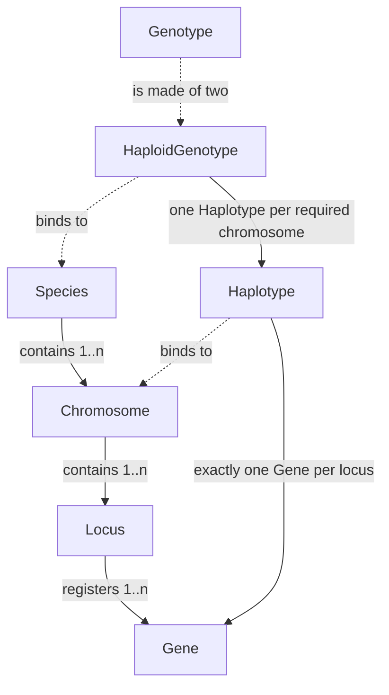

# From biological concepts to genetic objects

The previous chapter explained the layering; this one drops into its lowest layer: how a species declaration becomes objects that can be enumerated, compared, and indexed. After reading it you should be able to answer three questions: why the project has both `Species` and `Genotype`; why "unordered" and "labels" — two concepts that look redundant — have to exist; and what actually moves when an agent says "it is only one more allele".

The chapter reuses the sample species: one autosome `chr1`, one locus `marker`, three alleles A, a, X. Every number below was verified locally; the commands are listed at the end.

## Structural layer and entity layer

The project splits "the declaration" from "the objects generated from the declaration". That split is the basis for everything that follows.

| Biological concept | Structural object (declaration) | Entity object (generated) |
| --- | --- | --- |
| Species | `Species` | `HaploidGenotype`, `Genotype` (diploid) |
| Chromosome | `Chromosome` | `Haplotype` (alleles along one chromosome) |
| Locus | `Locus` | none; a locus holds its allele set |
| Allele | none; `Gene` registers onto a `Locus` | `Gene` (also exported as `Allele`) |

The structural layer says what the species permits and is the only place that may be edited: adding chromosomes, adding loci, and registering alleles all happen there. The entity layer says which of those permitted combinations is currently being discussed; structures generate and cache entities on demand. [Species](https://github.com/jyzhu-pointless/natal-core/blob/main/src/natal/frontend/genetics/structures/species.py), [Chromosome](https://github.com/jyzhu-pointless/natal-core/blob/main/src/natal/frontend/genetics/structures/chromosome.py), and [Locus](https://github.com/jyzhu-pointless/natal-core/blob/main/src/natal/frontend/genetics/structures/locus.py) belong to the former; [Gene](https://github.com/jyzhu-pointless/natal-core/blob/main/src/natal/frontend/genetics/entities/gene.py), [Haplotype](https://github.com/jyzhu-pointless/natal-core/blob/main/src/natal/frontend/genetics/entities/haplotype.py), and [Genotype](https://github.com/jyzhu-pointless/natal-core/blob/main/src/natal/frontend/genetics/entities/genotype.py) to the latter.

## Object relationships

The diagram shows only "contains" and "binds to" relations, not inheritance. Solid edges are containment between structures; dashed edges show which structure an entity binds to.



Two easy-to-misremember rules follow. First, a `Gene` binds to a **locus**, not to a chromosome: the chromosome only says which loci are linked together, while an allele always belongs to a locus. Second, `Locus` has no entity of its own: inside one haploid genome, a locus is represented by "which gene was chosen there", and that is what `Haplotype` expresses. A complete haploid genome is a `HaploidGenotype`; a diploid genotype pairs two of them into a `Genotype`.

The entity type bound to `Species` is exactly `HaploidGenotype`, which is why one species object can enumerate haploid genomes and build diploid genotypes.

## Declaration order determines enumeration order

Declaring A, a, X yields six unordered genotypes:

```text
A|A, A|a, A|X, a|a, a|X, X|X
```

The order is not alphabetical; it comes from the declaration order and the enumeration strategy: haploid genomes are enumerated first (one per allele) and then combined with the earlier one on the maternal side. `A|X` precedes `a|a` precisely because X was registered before a.

A locus `position` also comes from the declaration: when omitted it becomes the highest existing position on that chromosome plus one. It only affects the adjacency used by the recombination map, not the ordering of genotypes. Changing the declaration order shifts the whole catalog numbering, and that has concrete consequences described in [Type catalog, indices and array coordinates](data_layout.md): an index is a position, not an identity.

## Object identity: one instance per name per structure

Entities have three invariants: an entity must be bound to a structure, it registers itself on creation, and the same name under the same structure in the same species returns the same instance.

```text
Gene("A", locus=locus) is locus.alleles[0]      → True: same name, same locus
Species.get_gene("A") is locus.alleles[0]       → True: species-level name index
```

The cache key is `(species identity, structure type, structure name, entity class, name)`, so both spellings of "A|a" return the same object inside one `Species`, while different `Species` instances never share. `Species.clear_entity_cache()` and `clear_all_caches()` clear the caches.

This property is not a micro-optimisation; downstream code depends on it:

- `Genotype.is_homozygous_at(locus)` compares the two gene objects with `is`, not by string.
- The index registry uses `(Genotype, slab_label)` tuples as keys, relying on stable `Genotype` identity.
- Enumerated objects are cache hits, so they are not rebuilt per call.

The price is that **any edit to the declaration must invalidate the caches**. The project handles this through species-level invalidation entry points (registering a gene invalidates the gene-name index, for example) rather than asking callers to clear manually.

## Where names come from

Entity names are assembled from their parts, by fixed rules that can be parsed back:

| Layer | Rule | This example | Multi-locus example |
| --- | --- | --- | --- |
| `Haplotype` | gene names joined with `/` | `A` | `A/B` |
| `HaploidGenotype` | haplotype names joined with `;` | `A` | `A/B;C` |
| `Genotype` | one "maternal \| paternal" segment per chromosome, segments joined with `;` | `A | a` | `A/B | a/B;C | C` |

So `A|a` is a round-trippable string: `Species.get_genotype_from_str()` restores the object using the same grammar. Pattern matching extends the grammar with `::` (unordered pair), `*` (any), and `{A,B}` (set); see [How patterns and selectors locate data](selectors.md).

### Unordered: `A|a` and `a|A` are one object

A diploid genotype records two haploid genomes, maternal and paternal, but many models do not care which parent contributed which. With `Species(unordered=True)` (the default), construction compares allele registration indices locus by locus and puts the smaller one on the maternal side:

```text
get_genotype_from_str("a|A") is get_genotype_from_str("A|a")   # True
```

An unordered species therefore has six genotypes; switching to `unordered=False` yields nine, with `A|a` and `a|A` as separate objects. The gap widens with more loci: a species with two loci on one chromosome has 64 ordered genotypes and only 27 unordered ones (each locus collapses independently).

Collapsing is **per locus**, not by sorting the string: when the sex-chromosome types differ (X|Y, Z|W), parental order is preserved because "the father contributed Y" carries information.

One verified but unintuitive behaviour belongs here: identity is canonical, while the **rendered spelling depends on which construction happened first**. Parse `"a|A"` on a species before enumerating, and enumeration returns that same object — but its name is `a|A`, and the runtime catalog reads `a|A@default`. Indices and numbers are unaffected; only the symbol changes.

Names are therefore good for display and parsing, and unsuitable as identity across instances. To decide whether two models describe the same genotype, compare objects or indices, not strings.

## Labels: separating states of one genotype

Labels are species-level catalogs orthogonal to genotypes:

- `somatic_labels` cross-products with genotypes to form **ZType**: an individual's identity is "genotype + somatic label".
- `gamete_labels` cross-products with haploid genotypes to form **GType**: a gamete's identity is "haploid genotype + gamete label".

Declaring `somatic_labels=["default", "wolbachia"]` and `gamete_labels=["default", "drive"]` on this example takes the catalog from 6 ZTypes / 3 GTypes to 12 ZTypes / 6 GTypes:

```text
ZType 0: A|A@default      ZType 1: A|A@wolbachia      …        ZType 11: X|X@wolbachia
GType 0: A@default        GType 1: A@drive            …
```

Note the expansion order: earlier labels come first, and all labels of one genotype are adjacent. When no labels are declared the species adds a single `default` entry — that is where `A|a@default` in the sample chapters comes from.

Labels exist so that infection status, transgenic background, and similar "same genotype, separately counted" information does not have to be expressed by adding alleles. The price is equally direct: each label duplicates a whole type axis, so counts, fitness, genetic tables, and outputs all grow wider.

## Sex chromosomes and the origin of sex

A chromosome may declare a `sex_type`: `X`, `Y`, `Z`, `W`, or none (autosome). Afterwards:

- `Species.sex_system` infers `"XY"` or `"ZW"`; mixing two systems raises.
- Valid pairings come from the structure: `(X, X)` and `(X, Y)` for XY, `(Z, Z)` and `(W, Z)` for ZW.
- Transmission is constrained: Y can only come from the father and W only from the mother. In the verification, maternal-transmissible haploid genomes are 4 (`A;X1`, `A;X2`, `a;X1`, `a;X2`) while paternal ones are 8 (four more carrying Y).
- Sex is determined by the structure, never inferred from gamete row sums: `Species.classify_genotype_sex()` returns `female`/`male`/`None`, and publication writes the `female_only_by_sex_chrom` and `male_only_by_sex_chrom` masks. In the verification those two masks are disjoint and align one-to-one with the types.

One directly observable consequence: starting from 100 females `A|A;X1|X1` and 100 males `A|A;X1|Y1`, two eggs per female, and full juvenile survival, one step still leaves 100 of each sex. Offspring sex follows entirely from whether the father contributed X or Y — the observable form of "the structure decides sex".

## Boundaries and errors

| Case | Result | Why |
| --- | --- | --- |
| Registering the same gene name on the same locus | Cache hit; the original object is returned | Same name and structure means the same entity |
| Same gene name on a different locus | `ValueError: Duplicate gene name …` | String lookups must be unique |
| A chromosome with no loci | Computation entry point raises and names the species and chromosome | `validate_structure()` |
| A locus with no alleles | Computation entry point raises and names the locus | Same check |
| A haplotype missing a locus | `ValueError: Incomplete haplotype …` | All loci of that chromosome must be covered |
| A haplotype with two genes at one locus | `ValueError: Duplicate locus …` | One allele per locus per haplotype |

Completeness is only checked at computation entry points, so a species may be assembled step by step. This is the same design as "a type with zero initial count is still retained": a declaration may be temporarily incomplete, but the moment computation starts it must be self-consistent.

Gene names are limited to letters, digits, and underscores; label names use the same validation. Genes and loci may carry custom attributes (`**kwargs` become instance attributes); those attributes take no part in enumeration and exist for readers.

## What a change affects

| Agent proposal | Test to apply |
| --- | --- |
| Keep an allele that is "currently unused" | It still enters the complete catalog; whether it survives into the runtime model depends on reachability, see [Reachability, index compression, and publication](publication.md) |
| Delete an allele whose count is currently zero | Deleting changes enumeration, indices, and history names; zero count and unreachable are different things |
| Represent infection status by a new allele | If infection does not change the genotype, `somatic_labels` is smaller; otherwise explain how genetic rules change per type |
| Turn on `unordered=False` to track parental origin exactly | The type count doubles (6 → 9 here) and fitness, observation, and history axes all widen |
| Rename an allele | The name directory and every string-based declaration change; object identity survives but observation and history names do not |

The first two are not indexing details but decisions about which biological states can be represented; the third is model semantics; the last two are implementation and interface concerns. State which class a change belongs to before discussing how to implement it.

## Implementation and verification entry points

| Entry point | Responsibility in this chapter |
| --- | --- |
| [structures/_base.py](https://github.com/jyzhu-pointless/natal-core/blob/main/src/natal/frontend/genetics/structures/_base.py) | Parent/child registration and lookup for structures |
| [structures/_enumeration.py](https://github.com/jyzhu-pointless/natal-core/blob/main/src/natal/frontend/genetics/structures/_enumeration.py) | Haploid and genotype enumeration, ordered versus unordered counts |
| [structures/_helpers.py](https://github.com/jyzhu-pointless/natal-core/blob/main/src/natal/frontend/genetics/structures/_helpers.py): `canonical_haploid_pair()` | Where per-locus canonicalisation happens |
| [entities/_base.py](https://github.com/jyzhu-pointless/natal-core/blob/main/src/natal/frontend/genetics/entities/_base.py) | Entity cache and auto-registration |
| [entities/genotype.py](https://github.com/jyzhu-pointless/natal-core/blob/main/src/natal/frontend/genetics/entities/genotype.py): `to_string()` | Genotype strings and cache keys |
| [builder/_registry_builder.py](https://github.com/jyzhu-pointless/natal-core/blob/main/src/natal/frontend/builder/_registry_builder.py): `build_registry()` | Expanding labels into the complete catalog |

The six-type catalog, the 9-versus-6 and 27-versus-64 comparisons, the 12/6 label catalog, and the XY system's 4/8 haploid genomes with the 100/100 result were all verified locally from one set of inputs; the script and results travel with this batch's delivery record rather than being turned into executable prose. Among the existing tests, [test_genetic_structures.py](https://github.com/jyzhu-pointless/natal-core/blob/main/tests/test_genetic_structures.py), [test_genetic_entities.py](https://github.com/jyzhu-pointless/natal-core/blob/main/tests/test_genetic_entities.py), and [test_species_structure_validation.py](https://github.com/jyzhu-pointless/natal-core/blob/main/tests/test_species_structure_validation.py) cover the pre-existing behaviour of enumeration, entity caching, and structure validation; they do not replace the multi-locus and label cases added here.

Next, read [Type catalog, indices and array coordinates](data_layout.md) to turn these objects into array subscripts.
