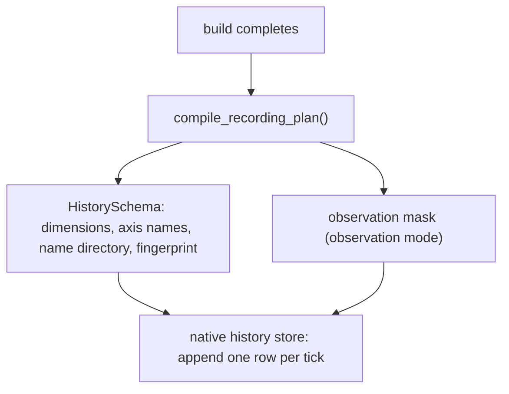

# History recording and the parameter timeline

[Observation](observation.md) answers "what is there now"; history answers "what happened along the way". This chapter covers what the recording plan compiles into, what each mode stores, when rows are evicted, and how the parameter timeline lines up with the history.

## The recording plan compiles once, at build time

The plan freezes at build time and never changes afterwards. The native session writes rows by it, so recording never needs to cross into Python per tick.

| Component | Contents |
| --- | --- |
| `PopulationLayout` | type, sex, and age axis lengths, labels, and a fingerprint derived from those fields |
| Row layout | `1 + n_sexes×n_ages×n_ztypes` without sperm, plus `n_ages×n_ztypes²` with it |
| Observation mask | used for projection in `observation` mode; `None` in `raw` mode |

`PopulationLayout` checks the registry's type count against the declared `n_ztypes` while building, so a row layout can never silently disagree with the catalog.

## Two recording modes

| Mode | Stores | Afterwards |
| --- | --- | --- |
| `raw` | the tick plus original counts (and sperm when present) | can be projected later, and can restore checkpoints |
| `observation` | the observation projection taken at the time | only that grouping; no checkpoint restoration |

Verified: an `observation` history has `schema.mode == "observation"`, and calling `restore_checkpoint(1)` is refused with a message naming observation mode. The restriction is a design choice: the projection already aggregated the information, so rolling state back through it would mean rebuilding state from a lossy representation.

A raw row's axes are `('record', 'sex', 'age', 'ztype')`; after three steps on the sample model `ticks == (0, 1, 2, 3)` with shape `(4, 2, 2, 3)`.

### A name-format difference

History layouts label types as `genotype[label]` (for example `A|A[default]`), while the configuration name directory uses `A|A@default`. Verified: `history.schema.population.ztype_labels == ("A|A[default]", "A|a[default]", "a|a[default]")`.

The two formats are deliberately different: `@` is also the label suffix in the selector grammar, so history labels use brackets to avoid confusion with selector strings. Comparing names across sources (history against configuration, for example) must account for the format rather than string-equality.

## Recording interval and eviction

| Declaration | Behaviour |
| --- | --- |
| `record_every=1` | one row per tick |
| `record_every=2` | one row every second boundary: verified ticks `(0, 2, 4)` |
| `record_every=0` | record nothing while the clock keeps advancing |
| `max_rows=k` | keep only the newest k rows: verified ticks `(3, 4, 5)` for `max_rows=3` over five steps |

Eviction removes the oldest rows first, and an evicted row also makes its checkpoint unrestorable — checkpoints are aligned with history rows.

Consecutive `run()` calls continue one timeline (verified: two `run(1)` calls leave ticks `(0, 1, 2)`) instead of restarting it, while `reset()` clears the history and returns to the initial state.

## The parameter timeline

Parameter writes committed at a boundary append a `(tick, name, old, new)` row to `pop.params_log`:

- a row is only written when the value **actually changed**, so re-writing the same value adds no noise;
- spatial models record per deme;
- restoring a checkpoint truncates the log to that tick, in step with the history rows.

The timeline shares tick semantics with the history, so questions such as "what was the carrying capacity before step 3" are answerable; it does not record uncommitted callback edits (see [callback transactions](transactions.md)).

## What a change affects

| Agent proposal | Test to apply |
| --- | --- |
| Use observation history for checkpoint restoration | It is refused; switch to raw mode |
| Apply a new grouping to old data | Observation history is already aggregated; raw history can be re-projected |
| Expect history to save every stage | History saves recording boundaries, not a tick's internal stages |
| Compare history and configuration by name string | The formats differ (`[...]` versus `@...`) |
| Depend on rows older than `max_rows` | Evicted rows are gone, and so are their checkpoints |

## Implementation and verification entry points

| Entry point | Responsibility in this chapter |
| --- | --- |
| [output/_recording.py](https://github.com/jyzhu-pointless/natal-core/blob/main/src/natal/frontend/output/_recording.py) | `RecordingPlan` and plan compilation |
| [output/history.py](https://github.com/jyzhu-pointless/natal-core/blob/main/src/natal/frontend/output/history.py): `PopulationLayout`, `HistorySchema`, `History` | Layout, modes, row access, truncation |
| [rust/src/output/history.rs](https://github.com/jyzhu-pointless/natal-core/blob/main/rust/src/output/history.rs) | The native row store |
| [rust/src/output/parameter_log.rs](https://github.com/jyzhu-pointless/natal-core/blob/main/rust/src/output/parameter_log.rs) | The parameter-log store |

Both modes, the axis names and shapes, the recording intervals, the eviction window, the continuing timeline, the label format, and the parameter log were all verified from one set of inputs. Among the existing tests, [test_history_observation_contract.py](https://github.com/jyzhu-pointless/natal-core/blob/main/tests/test_history_observation_contract.py) and [test_single_history_contract.py](https://github.com/jyzhu-pointless/natal-core/blob/main/tests/test_single_history_contract.py) protect the recording plan and history contract.

Next, read [Checkpoint restoration and experiment replay](checkpoints.md).
