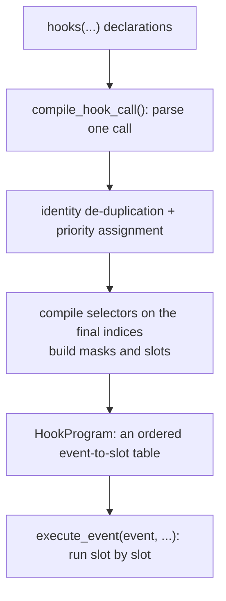

# How hooks compile and are scheduled

Hooks are how a model is intervened in during a run. The project offers two spellings: declarative operations (`Op.*`) and Python callbacks. Both enter one event schedule and are ordered together by priority, but their access model and transaction boundaries differ.

## Two spellings

| Spelling | Example | Property |
| --- | --- | --- |
| Declarative operation | `Op.scale(genotypes="A|A", ages=0, sex="female", factor=0.5, event="early")` | runs natively, needs no cross-language callback, its selection is compiled statically |
| Python callback | `def hook(ctx): ctx.params.carrying_capacity = 300; return 0` | arbitrary logic, but requires controlled access and a transaction |

A declarative operation selects by `(genotypes, ages, sex)` plus an optional `when` condition, resolved into a mask at compile time. A callback receives a `ctx` exposing state, parameters, `rng`, and `stop()`; its boundaries are described in [callback transactions](transactions.md).

## From declaration to execution slot

Details worth remembering:

- **Selectors compile after publication**, so type names inside a hook resolve against the final catalog; a referenced type is also retained in the runtime layout (verified: declaring a hook that targets `a|a` on a two-allele model whose only individuals are `A|A` keeps `a|a@default` in the catalog).
- **The priority assignment model**: a call-level `priority=` assigns the whole group of operations in that call; operations packed into one list share the value; when omitted, the operations' own priorities are used and must agree. With the `Op.*` spelling the priority can also be written inside the operation.
- **Identity de-duplication**: the same operation object declared twice is recorded once. Verified: declaring one `Op.scale` object twice applies the scaling once (adult total 50, not 12.5).

## Events and execution order

| Event | Position |
| --- | --- |
| `first` | before reproduction |
| `early` | after reproduction, before survival |
| `late` | after survival, before aging |
| `finish` | at the end of `run(..., finish=True)` |

Inside one event, declarative slots and callback slots run in a single priority order — **not** "all declarative hooks first, then callbacks". Verified: with a declarative scaling at priority 1 and a callback at priority 5, the recorded order is `callback-first`, `callback-early` (the callback runs later within each event) and the final counts are the result of one scaling applied to the juveniles (per sex `[6.25, 12.5, 6.25]`).

On the Rust side, [HookProgram](https://github.com/jyzhu-pointless/natal-core/blob/main/rust/src/hooks/interpreter.rs) validates operation codes before executing, so an unknown opcode errors out instead of partially applying earlier operations; any slot requesting a stop short-circuits the whole event immediately.

## Selection scope

`Op.scale(genotypes="A|A", ages=0, sex="female", factor=0.5, event="early")` touches only matching coordinates:

| Selection | Effect (verified value) |
| --- | --- |
| all types, age 0, both sexes | the whole juvenile cohort is halved |
| `A|A`, age 0, female | only female A\|A becomes 6.25; everything else is unchanged |
| a type that does not exist | the empty selection fails at compile time instead of passing silently |

That last row matches the rule from the selectors chapter: on a path that needs concrete coordinates, an empty match is an error.

## Stopping and declarative conditions

`Op.stop_if_*` and a callback's `ctx.stop()` are equivalent: they end the current tick at the boundary. Verified: `stop_if_below(threshold=10000)` firing at `early` leaves the clock at 0, the session `Stopped`, and `is_finished` true. Stopping does not rewrite completed stages.

## What a change affects

| Agent proposal | Test to apply |
| --- | --- |
| Add a hook while the model is running | Hooks are declared at build time only; the population must be rebuilt |
| Assume declarative hooks always run before callbacks | The two are ordered together by priority |
| Declare the same operation object twice to "stack" it | The same object is de-duplicated; stacking needs two distinct objects |
| Reference a pruned type inside a hook | The reference retains that type; otherwise selector compilation fails |
| Change genetic maps inside a hook | Genetic updates need the candidate recompile path, never an in-place table edit |

## Implementation and verification entry points

| Entry point | Responsibility in this chapter |
| --- | --- |
| [hooks/_compile.py](https://github.com/jyzhu-pointless/natal-core/blob/main/src/natal/frontend/hooks/_compile.py) | Parsing one call, de-duplication, selector compilation, slot assembly |
| [hooks/entry/declarative.py](https://github.com/jyzhu-pointless/natal-core/blob/main/src/natal/frontend/hooks/entry/declarative.py) | Parameters and semantics of the `Op.*` operations |
| [rust/src/hooks/interpreter.rs](https://github.com/jyzhu-pointless/natal-core/blob/main/rust/src/hooks/interpreter.rs) | `execute_event()`: slot walk, opcode validation, stop short-circuit |
| [hooks/tick_context.py](https://github.com/jyzhu-pointless/natal-core/blob/main/src/natal/frontend/hooks/tick_context.py) | The state, parameters, RNG, and `stop()` a callback sees |

Mixed ordering, priority assignment, same-object de-duplication, scope selection, type retention, and the declarative stop were all verified from one set of inputs. Among the existing tests, [test_hook_transaction_contract.py](https://github.com/jyzhu-pointless/natal-core/blob/main/tests/test_hook_transaction_contract.py) and [test_manual_finish_event_contract.py](https://github.com/jyzhu-pointless/natal-core/blob/main/tests/test_manual_finish_event_contract.py) protect hook compilation and event boundaries.

Next, read [Callback transactions, failure, and stop boundaries](transactions.md).
