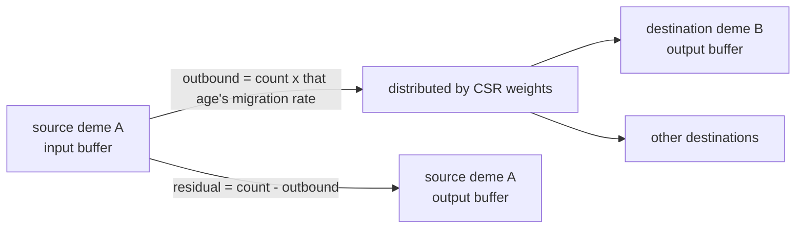

# Spatial lifecycle and the migration algorithm

[The previous chapter](spatial.md) covered what demes share and fork. This chapter is only about migration: how the structure folds into CSR at build time, the read-and-write rule at run time, the scope of conservation, and how females and sperm travel together.

## The flow between two demes

The key reading: migration **reads the old buffer and writes a new one**, it does not sweep in place. Verified: with A holding 100, B holding 0, A's age-1 rate 0.2 and a single destination B, migration leaves A at 80 and B at 20; the stacked total is preserved to within 1e-9 while the per-deme totals genuinely change.

## CSR and the rate column are separate things

| Structure | Fixed when | Contents |
| --- | --- | --- |
| CSR (`indptr`, `dest_idx`, `weights`) | folded at build time, frozen at run time | topology: who can reach whom, and in what ratio |
| Rate column | mutable at run time | the outbound fraction per source deme, sex, and age |

Topology is expressed as "every row's weights sum to 1"; how much migrates is written in the rate column — two independent degrees of freedom. Verified: the first row of a three-deme chain has weights `[0, 1, 0]` (a single neighbour) summing to 1.

The rate column's sugar form has one easily missed rule: **a scalar applies to adult ages only, with juveniles at 0**. Verified: `migration_rate=0.2` over three age slots gives `[[0, 0.2, 0.2], [0, 0.2, 0.2]]` (shaped `(deme, sex, age)`). Making juveniles migrate requires an explicit age vector.

## Who moves

| Category | Handling |
| --- | --- |
| Adult males | move wholesale at the male rate |
| Virgin females | female count minus the females implied by stored sperm, moving at the female rate |
| Mated females | never migrated as individuals; they are handled through sperm storage |
| Sperm storage | recorded per age, female type, and male type, tied to the movement of the females |

That is what "sperm is not an independent individual to migrate again" means: a sperm cell records "mated females × partner type", so counting it as individuals again would manufacture individuals.

## Boundaries and degenerate paths

| Case | Behaviour |
| --- | --- |
| A deme whose CSR row is empty | nothing leaves (an isolated deme), even with a positive rate |
| An edge deme with few neighbours | each neighbour receives a larger share, but the outbound total equals an interior deme's |
| A wrapping topology producing duplicate destinations | duplicate entries and their visit order are preserved, never sorted or merged |
| Source iteration order | a fixed deme order, which keeps the float accumulation bit-reproducible |
| A rate column or `indptr` of the wrong length | the kernel errors and names the expected length |

Verified: two demes with no edge between them and a rate of 0.5 still hold 100 age-1 individuals each after a tick — an empty CSR row means "no outbound edges", not "split evenly".

## Stochastic migration

In stochastic mode the outbound amount is drawn from binomial/Poisson-style sampling and the destinations are allocated by a multinomial draw over the CSR weights, using the source deme's random stream. The difference from the deterministic mode is only *how much is drawn*, never *where it goes*: destination proportions still come from the CSR.

So checking stochastic migration means comparing distributions or totals rather than cell by cell; the deterministic mode is the one to use for expectations and conservation.

## What a change affects

| Agent proposal | Test to apply |
| --- | --- |
| Shrink a row's weights to migrate less | Rows are normalised inside the container; the rate column controls the amount |
| Assume edge demes migrate less | Edges change each neighbour's share, not the outbound total |
| Make juveniles migrate too | A scalar rate excludes them; an explicit age vector is needed |
| Migrate sperm as an independent individual | Sperm storage is tied to females; migrating it again manufactures individuals |
| Change the topology at run time | The CSR is frozen at build time; a topology change needs a rebuild |

## Implementation and verification entry points

| Entry point | Responsibility in this chapter |
| --- | --- |
| [spatial/migration.py](https://github.com/jyzhu-pointless/natal-core/blob/main/src/natal/frontend/spatial/migration.py): `fold_migration_csr()`, `MigrationCSR` | Folding adjacency or a kernel into CSR, plus the rate-column rules |
| [spatial/topology.py](https://github.com/jyzhu-pointless/natal-core/blob/main/src/natal/frontend/spatial/topology.py) | Grid topologies, wrapping, coordinate normalisation |
| [kernels/spatial.rs](https://github.com/jyzhu-pointless/natal-core/blob/main/rust/src/kernels/spatial.rs): `migrate_csr_deterministic()`, `migrate_csr_stochastic*()` | The migration kernel: outbound, allocation, residual |
| [backends/rust/rust_backend.py](https://github.com/jyzhu-pointless/natal-core/blob/main/src/natal/backends/rust/rust_backend.py): `rust_migrate_csr_deterministic()` | The Python-side entry point |
| [spatial/population.py](https://github.com/jyzhu-pointless/natal-core/blob/main/src/natal/frontend/spatial/population.py): `migration_row()`, `migration_csr` | Inspecting the structure at run time |

The rate-column shape and its adult-only scalar rule, CSR row normalisation, the isolated deme, total conservation, and the per-deme redistribution were all verified from one set of inputs. Among the existing tests, [test_spatial_migration_conservation.py](https://github.com/jyzhu-pointless/natal-core/blob/main/tests/test_spatial_migration_conservation.py) and [test_spatial_population_run.py](https://github.com/jyzhu-pointless/natal-core/blob/main/tests/test_spatial_population_run.py) protect migration conservation and spatial runs.

Next comes the later chapter *How observation turns state into results*.
