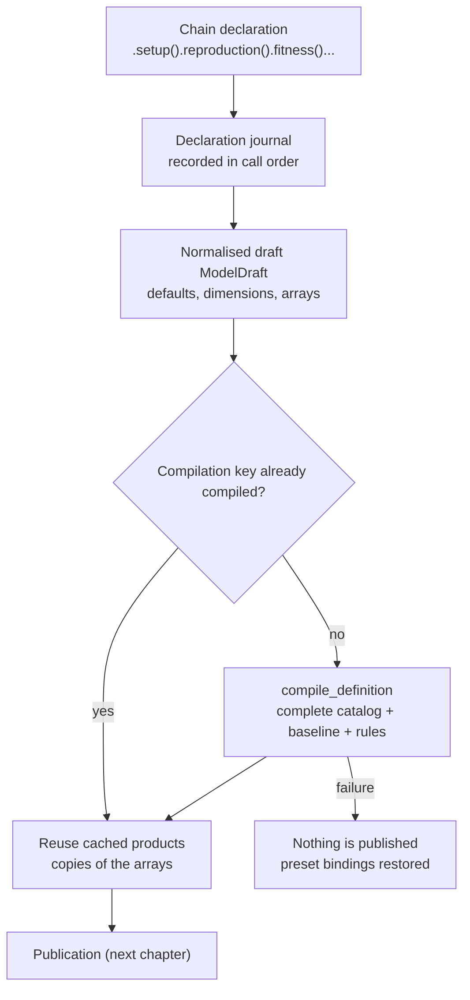

# From declaration to compiled products

[The previous chapter](selectors.md) explained how conditions become coordinates. This one answers the earlier question: how a chain of calls becomes a **candidate compilation product**, what gets normalised, what gets cached, and what a failure leaves behind.

Three kinds of thing must be kept apart here, because they are routinely conflated:

| Kind | Representative | Property |
| --- | --- | --- |
| Declaration | `PopulationBuilder` chain calls, `ModelDefinition` | Replayable and rebuildable; holds no computed results |
| Draft | `ModelDraft` | Numeric complete-axis arrays, still build-time |
| Candidate | `CompiledProducts` | Genetic maps, catalog, and modifier lists, not yet published |

## How one build is orchestrated

The branch is worth noting: **the second compilation of one declaration is not necessarily recomputed**, and a cache hit hands back copies rather than shared references.

## The declaration journal

Every domain method on the build chain (`setup`, `age_structure`, `competition`, `reproduction`, `survival`, `initial_state`, `custom`, `presets`, `modifiers`, `fitness`, `hooks`, `with_observation`, `record_history`) is marked as a declaration. Each call records a journal entry and is **trial-compiled on a copy**: only a successful trial is adopted, and a failed one leaves the original object untouched.

`ModelDefinition` is a snapshot of that chain: species, journal, presets, manual modifiers, compilation key, fitness baseline, hook calls, observation groups, the compression switch, and any declared types. It also carries `draft` and `registry` as working copies. Publication stores this definition, so rebuilding a variant of an existing model does not require re-running the user's build script.

The journal is the structured declaration record, interpreted by one projector (`builder/_declarations.py`): the chain methods delegate to it for their immediate writes, a dimensional rebuild (`age_structure()`) re-projects every declared call onto the new draft, and the spatial group compiler projects each deme's concrete declarations onto a fresh baseline and hands them straight to `compile_definition`.  No builder method is ever re-executed to rebuild or to generate a group.

## Normalisation: defaults and shapes

Users write scalars and dictionaries; kernels read fixed-length arrays. Normalisation fills the gap:

| Item | Normalised result | Note |
| --- | --- | --- |
| Age axis | a discrete-generation model fixes two slots | `age 0` juveniles, `age 1` adults; age-structured models declare theirs through `age_structure()` |
| `adult_ages` | an index array derived from `new_adult_age` | tells the kernel which ages breed |
| Reproduction/mating/survival rates | `(sex, age)` arrays | scalars are broadcast; missing age slots become 0 |
| Reproduction participation | internal adult value 1 for discrete models | user-facing entries are parameters such as `female_adult_mating_rate` |
| Density regulation | `BEVERTON_HOLT` by default | switched through `growth_mode`; see the later chapter *How density regulation and equilibrium are computed* |
| Fitness | `(sex, age, Z)`, `(sex, Z)`, and `(Z, Z)` shapes | equal shapes do not imply equal meanings, see [array coordinates](data_layout.md) |
| Type and name directories | `ztype_names`, `gtype_names` | generated from the registry and renumbered with it |

Normalisation also validates dimensions: illegal combinations fail at build time instead of surfacing later as an unexplained result. The two age slots of a discrete model are model semantics, not parameter defaults — setting the age-1 survival rate to 1 cannot make old adults survive into the next generation.

## What the compilation product contains

`CompiledProducts` is a tuple of four things: the draft, the complete-catalog registry, the gamete modifier list, and the zygote modifier list. Its genetic products have these shapes in this example:

| Product | Complete-axis shape | Note |
| --- | --- | --- |
| `zygotes_to_gametes_map` (M) | `(2, 6, 3)` | sex, six ZTypes, three GTypes |
| `gametes_to_zygotes_map` (F) | `(3, 3, 6)` | gamete pairs to offspring types |
| `offspring_tensor` (P) | `(0, 0, 0)` | a **placeholder** meaning "not yet derived on the final axes" |

The `(0, 0, 0)` placeholder is easy to misread: it does not mean "no pair can reproduce", it means "not yet projected". A complete six-type P would hold 216 entries while the runtime model needs 27, so derivation waits until after publication.

The registry on a compilation product is the **complete catalog**, unpublished: all six ZTypes are present, including the X types that stay at zero in this example.

## Compilation cache and candidate isolation

- The compilation key describes this declaration; when the key matches an existing compilation, the builder reuses the cached products but hands out **copies of the arrays**.
- Damaging one product therefore does not poison the next build: after overwriting a whole row of one builder's M table, a fresh builder over the same species still compiles the baseline values. This was verified.
- Chain methods trial-compile on a copy and adopt only on success, so an interrupted call never leaves a half-finished model behind.
- Compilation requires the registry to be **unpublished and complete**: unpublished means "the candidate is still editable", complete means "indices match the species catalog one-to-one". Failing either raises `ValueError` rather than repairing itself.

## What happens on failure

`compile_definition()` fails explicitly: it publishes nothing, restores the species binding of every preset, and re-raises. The declaration journal and the caller's preset objects are left as they were, so a failure can be fixed in one place and recompiled without rebuilding the whole model.

## What a change affects

| Agent proposal | Test to apply |
| --- | --- |
| Edit `ModelDraft` arrays to change the model | The draft is a build-time candidate; edits need a recompile and a publication before the runtime sees them |
| Keep editing a previous compilation product | A cache hit hands out copies; cross-declaration reuse goes through `ModelDefinition` |
| Call `age_structure` after `initial_state` or after domain methods | Legal: every declared call is re-projected onto the rebuilt draft, so neither the initial distribution nor competition / reproduction / survival parameters are lost |
| Read P as `(0, 0, 0)` meaning "cannot reproduce" | It means "not yet derived"; derivation happens at publication |
| Treat the default `growth_mode` as "no density regulation" | The default is `BEVERTON_HOLT`; disabling it is explicit |

## Implementation and verification entry points

| Entry point | Responsibility in this chapter |
| --- | --- |
| [builder/_base.py](https://github.com/jyzhu-pointless/natal-core/blob/main/src/natal/frontend/builder/_base.py): `_compile_products()`, `_definition_for_compile()`, `_publish_and_build()` | Declaration journal, compilation orchestration, candidate adoption |
| [model/definition.py](https://github.com/jyzhu-pointless/natal-core/blob/main/src/natal/frontend/model/definition.py) | Fields of the declaration snapshot |
| [model/draft.py](https://github.com/jyzhu-pointless/natal-core/blob/main/src/natal/frontend/model/draft.py) | Fields and shapes of the normalised draft |
| [model/assembly.py](https://github.com/jyzhu-pointless/natal-core/blob/main/src/natal/frontend/model/assembly.py): `build_discrete_engine_config()`, `build_config_maps()` | Defaults, dimension validation, complete-axis assembly |
| [model/definition_compiler.py](https://github.com/jyzhu-pointless/natal-core/blob/main/src/natal/frontend/model/definition_compiler.py): `compile_definition()` | Isolated compilation and failure rollback |

The complete-catalog shapes, the P placeholder, the cached copies, and candidate isolation were all verified from one set of inputs. Among the existing tests, [test_publication_contracts.py](https://github.com/jyzhu-pointless/natal-core/blob/main/tests/test_publication_contracts.py) and [test_spatial_publication.py](https://github.com/jyzhu-pointless/natal-core/blob/main/tests/test_spatial_publication.py) cover the contract between compilation products and publication; they do not protect the caching and isolation behaviour described here, which this batch's verification supplies.

Next, read [How genetic presets and conversion rules compile](genetic_compilation.md) to open the baseline-to-rules pipeline inside compilation.
