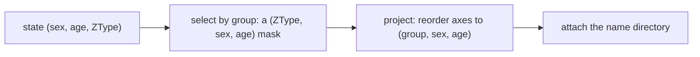

# How observation turns state into results

A session holds one `(sex, age, ZType)` count table; a researcher wants to know "how many individuals of that class". Observation is that projection layer: it picks coordinates by group, reorders the axes into a readable shape, and attaches names. This chapter explains the projection rules, what they lose, and how "current observation" differs from "post-hoc observation".

## Three projection actions

Verified: on the sample model the default identity observation returns `axes == ('group', 'sex', 'age')` with shape `(3, 2, 2)`, and `values` equals `state.individual_count.transpose(2, 0, 1)` — **the axis order changes, the numbers do not**.

| Axis | Source |
| --- | --- |
| `group` | one observation group; under identity mode each group is one ZType |
| `sex` | the sex axis, ordered female then male |
| `age` | the age axis; `collapse_age=True` removes it |

Names hang off the `group` axis only (`labels` has exactly the key `{"group"}`): the sex axis is defined by convention (0 female, 1 male) and the age axis by position. Assuming "every axis has labels" leads to a missing key.

## Groups and information loss

Groups are defined by `IndividualSelector`, so they may overlap, and several types may be merged into one group:

| Group definition | Result |
| --- | --- |
| `IndividualSelector(ztype="A|A")` | one type |
| `IndividualSelector(ztype="A|A") | IndividualSelector(ztype="a|a")` | the union of two types |
| `IndividualSelector(ztype="A|a")` | another group, which may coexist with the one above |

Verified: the sum over two groups (homozygous and heterozygous) equals the total of the current state. That also shows **aggregation is lossy**: after summing a group, the per-ZType counts cannot be recovered, so per-type detail requires an identity observation or a read of `pop.state`.

`collapse_age=True` makes the same trade: the verified axes become `('group', 'sex')` with the total preserved, and "which age" is no longer distinguishable.

## Observation is not only a query: it fixes the recording

The observation object compiles into a mask at build time and is reused by the recording plan:

- identity and grouped observations both produce masks;
- `record_history(mode="observation")` stores exactly those projected rows (see [history](history.md));
- spatial models add a further `deme` axis, see [spatial construction and sharing](spatial.md).

Changing the observation groups therefore changes both the query result and which column a history file contains — one rule for both, so "what a query shows" and "what was recorded" cannot drift apart.

## Current versus post-hoc observation

| Route | Data source | Note |
| --- | --- | --- |
| `pop.observe()` | a projection of the current state | re-projects on every call, reflecting the latest state |
| `history.observe(...)` | already recorded rows | post-hoc projection, rebuilt from the retained rows |

Both share the same grouping rules but **not the same source**: raw history keeps original counts, so a new grouping can be applied to it afterwards (within what the rows contain); observation history keeps the projection taken at the time and cannot recover what was aggregated away. Choosing a recording mode is really choosing which questions remain askable.

## What a change affects

| Agent proposal | Test to apply |
| --- | --- |
| Recover each type from an observation value | An aggregate group is irreversible; identity observation or `state` carries per-type data |
| Treat observation and state as the same data | The axis orders differ (`(group, sex, age)` versus `(sex, age, ZType)`) |
| Switch to new groups mid-run | Observation is compiled at build time and fixed with the recording plan |
| Match history against configuration by name | History labels read `A|A[default]` while configuration names read `A|A@default`; see [history](history.md) |
| Judge a grouping by its total | Equal totals do not prove the group boundaries are right; check per group |

## Implementation and verification entry points

| Entry point | Responsibility in this chapter |
| --- | --- |
| [output/observation.py](https://github.com/jyzhu-pointless/natal-core/blob/main/src/natal/frontend/output/observation.py): `Observation`, `build_mask_from_selectors()` | Grouping, masks, projection |
| [output/_recording.py](https://github.com/jyzhu-pointless/natal-core/blob/main/src/natal/frontend/output/_recording.py): `compile_recording_plan()` | How masks enter the recording plan |
| [patterns/individual_selector.py](https://github.com/jyzhu-pointless/natal-core/blob/main/src/natal/frontend/patterns/individual_selector.py) | How a group is defined, and unions |
| [rust/src/output/observation.rs](https://github.com/jyzhu-pointless/natal-core/blob/main/rust/src/output/observation.rs) | The native projection |

The identity projection, an aggregate group, `collapse_age`, and the name directory were all verified from one set of inputs. Among the existing tests, [test_observation_age_axis_contract.py](https://github.com/jyzhu-pointless/natal-core/blob/main/tests/test_observation_age_axis_contract.py) and [test_spatial_observation_phase6.py](https://github.com/jyzhu-pointless/natal-core/blob/main/tests/test_spatial_observation_phase6.py) protect the observation axis contract.

Next, read [History recording and the parameter timeline](history.md).
