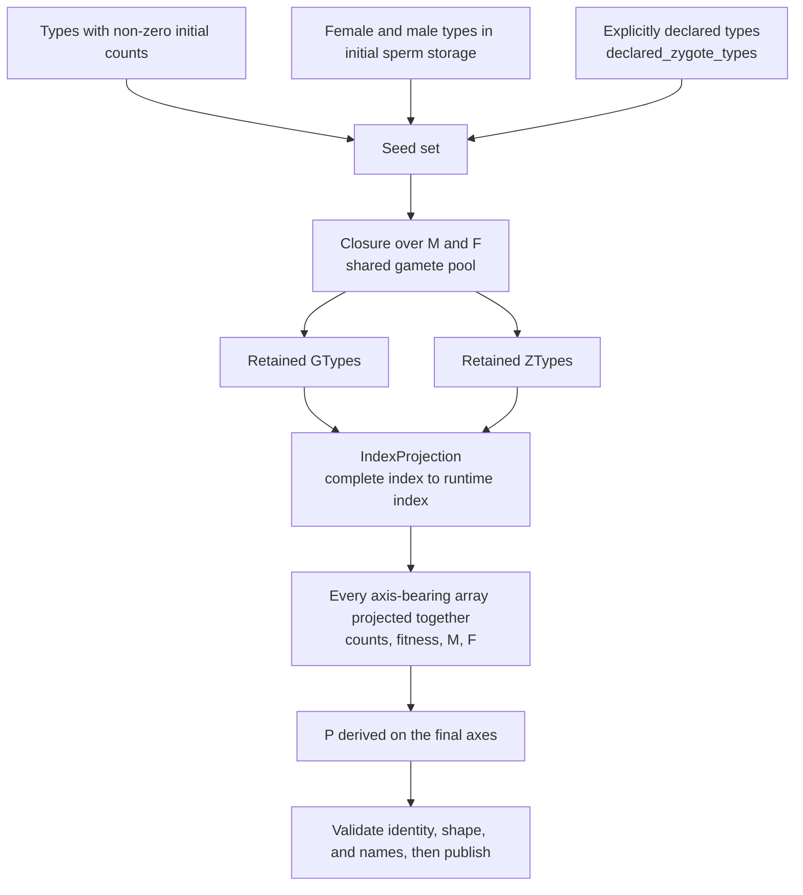

# Reachability, index compression, and publication

The complete catalog describes what the species permits; the runtime layout describes what this simulation needs. Publication turns the first into the second and makes sure every axis-bearing array changes coordinates together. This chapter covers where the seeds come from, how the closure is computed, which arrays must move together, and what an already-published layout still accepts.

## From seeds to a runtime layout



With no seeds at all the complete axes are retained, which is explicit behaviour rather than a fallback to "pick something".

## Keeping one type usually keeps a whole region

The closure is not "each seed keeps only itself". The verified examples show why:

| Declaration | Runtime catalog | Note |
| --- | --- | --- |
| None; initial A\|a in an A, a, X species | `A|A`, `A|a`, `a|a` | X is unreachable and removed |
| Declare `A|X` | all six | A\|X produces X gametes, X recombines with the A and a gametes, expanding back to the whole catalog |
| Two-allele species, initial A\|A, no declaration | `A|A` only | the closure holds only the A gamete |
| Two-allele species, initial A\|A, declare `a|a` | `A|A`, `A|a`, `a|a` | the declaration brings the a gamete into the pool |

The reason is that the gamete pool is shared: once a retained type can produce a new gamete, that gamete combines with every other retained gamete. "I only want to keep one type" therefore brings its whole reachable region. To control the runtime layout precisely, evaluate the closure rather than the individual type.

## Changing coordinates together

Projection must act on every axis-bearing array at once, otherwise "index 2" names different types on the two sides. The comparison for the sample model:

| Type | Complete index | Runtime index |
| --- | --- | --- |
| `A|A` | 0 | 0 |
| `A|a` | 1 | 1 |
| `a|a` | 3 | 2 |
| `A|X`, `a|X`, `X|X` | 2, 4, 5 | removed |

The arrays that move together include the initial counts, the four fitness tensors, M and F, the compatibility vectors and the read-only sex masks, and the name directories `ztype_names` and `gtype_names`. The projected shapes in this example are:

| Array | Complete axes | Runtime axes |
| --- | --- | --- |
| Initial counts | `(2, 2, 6)` | `(2, 2, 3)` |
| M | `(2, 6, 3)` | `(2, 3, 2)` |
| F | `(3, 3, 6)` | `(2, 2, 3)` |
| P | not constructed | `(3, 3, 3)`, i.e. 27 entries (216 on the complete axes) |

P is derived after projection: M and F first exist on the final axes, then a Rust numeric kernel computes P, avoiding a complete cube whose bulk would be discarded. When building a spatial variant, an already-published genetic table can be reused through `genetic_template`: M, F, P, and the four fitness tensors are shared read-only, and those arrays are marked unwritable before sharing.

## Declared retention: zero count is not unreachable

`declared_zygote_types` is the explicit retention entry point. The verified example in full (two-allele species, initial A|A only):

```text
no declaration:  runtime catalog = ('A|A@default',)                one step later [100]
declare a|a:     runtime catalog = ('A|A@default', 'A|a@default', 'a|a@default')
                 initial counts  = (200, 0, 0)
                 after seeding a|a with 5 females and 5 males and running one step → (95.24, 9.52, 0.24)
```

Three things to notice: declaring creates no individuals (a|a still starts at 0); a declared type can be written at run time and then takes part in the dynamics; an undeclared type simply does not exist in the runtime layout, so writing to it raises an index error rather than landing on a quiet zero.

Type references inside hooks join the retention set as well: declaring a hook that targets a type keeps that type in the runtime layout even while its count is zero.

## What a published layout still accepts

- Publishing once produces **a new, sealed runtime registry**; the source candidate stays unpublished, so one builder can produce several isolated builds.
- Registering a new type on the published registry is refused (`RuntimeError: published registry is immutable`).
- Replacing the genetic rules of a published layout requires **closure**: every retained ZType may only produce retained GTypes, and retained gamete pairs may only form retained ZTypes. `ensure_layout_closed()` raises `ValueError: published layout is not closed: ...` instead of renormalising the probability mass.
- Verified case: publish a layout without X, then add an A→X mutation rule; the closure check refuses the rule change because A|A can now produce an X gamete that has no place in the runtime layout.

This is why "changing one genetic rule at run time" sometimes fails and demands a rebuilt model: the runtime layout has no room for the new branch, and that is a design statement rather than an implementation shortcut.

## The three-type versus six-type comparison

Verified side by side, from one species and one set of initial conditions:

| Configuration | Runtime catalog | After one step (per sex) |
| --- | --- | --- |
| Compressed | `A|A`, `A|a`, `a|a` | 12.5, 25, 12.5 |
| Uncompressed | six types, the X types permanently 0 | the same values on the corresponding types, zeros on X |

Compression and no compression agree **by type identity**, which is exactly the evidence that distinguishes "compression is correct" from "compression broke the indices": comparing totals alone cannot tell the two apart.

## What a change affects

| Agent proposal | Test to apply |
| --- | --- |
| Disable compression to avoid index trouble | Compression only removes unreachable types; disabling it widens the arrays and keeps permanent zeros without changing reachable results |
| Introduce a new genetic branch at run time | Check it lies inside the closure; otherwise rebuild the model on a new layout |
| Release a retained type | The type and everything downstream may disappear together; zero count and unreachable are different things |
| Assume "complete index 2" means `A|X` | After publication index 2 is `a|a`; runtime coordinates must be resolved again |
| Share one genetic table across spatial variants | Allowed, but the shared arrays are marked read-only and cannot be a write target |

## Implementation and verification entry points

| Entry point | Responsibility in this chapter |
| --- | --- |
| [model/publication.py](https://github.com/jyzhu-pointless/natal-core/blob/main/src/natal/frontend/model/publication.py): `plan_projection()`, `publish_products()`, `IndexProjection`, `ensure_layout_closed()` | Seeds, closure, projection, publication, closure check |
| [genetics/structures/_helpers.py](https://github.com/jyzhu-pointless/natal-core/blob/main/src/natal/frontend/genetics/structures/_helpers.py): `build_compression_mask()` | The fixed-point reachability algorithm over the shared gamete pool |
| [genetics/matrices.py](https://github.com/jyzhu-pointless/natal-core/blob/main/src/natal/frontend/genetics/matrices.py): `recompute_offspring_tensor()` | Deriving P on the final axes through the Rust kernel |
| [builder/_registry_builder.py](https://github.com/jyzhu-pointless/natal-core/blob/main/src/natal/frontend/builder/_registry_builder.py): `resolve_declared_ztypes()` | Resolving declarations onto complete indices |
| [contracts/blueprint.py](https://github.com/jyzhu-pointless/natal-core/blob/main/src/natal/contracts/blueprint.py): `format_type_name()` | The name directory that changes with the indices |

The projection result, the closure expansion, both retention numbers, the closure-check error, and the compression comparison were all verified from one set of inputs. Among the existing tests, [test_publication_contracts.py](https://github.com/jyzhu-pointless/natal-core/blob/main/tests/test_publication_contracts.py), [test_publication.py](https://github.com/jyzhu-pointless/natal-core/blob/main/tests/test_publication.py), and [test_offspring_single_derivation.py](https://github.com/jyzhu-pointless/natal-core/blob/main/tests/test_offspring_single_derivation.py) protect projection, publication, and the timing of P derivation.

Next, read [How a session advances one simulation](runtime.md).
