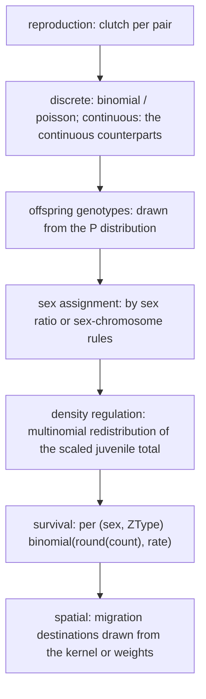

# Random sampling and reproducibility

Most numbers in the previous chapters are expectations (12.5, 0.25). In a real run they pass through sampling and become whole individuals. This chapter covers where sampling happens, with which distributions, who owns the random stream, and what "reproducible" actually promises.

## Three kinds of calculation

| Mode | Switch | Behaviour |
| --- | --- | --- |
| Deterministic | `stochastic=False` | expectations are used directly and may stay fractional |
| Discrete stochastic | `stochastic=True`, `continuous_sampling=False` | counts are rounded to integers first, then drawn from binomial/multinomial/Poisson |
| Continuous sampling | `stochastic=True`, `continuous_sampling=True` | fractional mass is kept and sampled with the continuous counterparts |

Verified: under discrete stochastic sampling every count recorded in history is an integer, while the deterministic mode of the same model produces values such as 12.5. Those are two different model statements, not two spellings of one result.

## Where sampling happens

The order matters: **the density resample happens before survival**, so the scaled integer total is what survival then samples from. Spatial migration sampling is covered in [spatial execution and migration](spatial.md).

The skip rules at the boundaries matter too: a zero juvenile total is cleared without sampling, and a type with no samplable individuals never enters the binomial call (avoiding a degenerate `n = 0` draw) instead of drawing a guaranteed zero.

## Who owns the random stream

- The session holds one `SessionRng` (xoshiro256++ shaped, with `seed_from_u64` expanding the seed through SplitMix64). Successive `run()` calls keep advancing the same stream; it is not reseeded per run.
- In a spatial model, deme `d`'s stream is derived as `seed ^ deme_id`; that deme's lifecycle and migration share one stream.
- `ctx.rng` inside a hook is the sampler controlled for the current event: repeated access returns the same sampler, successive draws advance the stream, and it expires when the callback returns.
- The session seed is supplied when the session is initialised (0 by default): `pop._initialize_session(seed=...)`. `reset()` restarts from the same value, so "reset and run again" replays the same trajectory. Restoring a checkpoint restores the RNG state that was recorded.

## What reproducibility promises

| Declaration | Promise | Verified by |
| --- | --- | --- |
| Deterministic model | bit-reproducible trajectory | two runs of the same input match exactly |
| Stochastic model + same seed | bit-reproducible trajectory | seed 11 matches itself bit for bit; seed 12 does not |
| Stochastic model + `reset()` | the same trajectory replays | the second pass equals the first |
| Stochastic model + different seeds | same distribution, different realisation | across 60 seeds the adult total averages 102.0 against an expectation of 100.0 |

The last row is how statistical equivalence is checked: **never validate a deterministic result with a single stochastic run**, and never declare a bug merely because two stochastic runs differ. Either switch to the deterministic mode and check the expectation, or compare distributions or means (as in the 60-run check above) with a stated tolerance.

## Boundaries and errors

| Case | Behaviour |
| --- | --- |
| A sampled expectation below zero | excluded during planning; the probability vector normalisation keeps draws non-negative |
| A probability vector summing near zero | handled by the degenerate branch (clear or skip), never by dividing by zero |
| Using `ctx.rng` after the callback returned | the sampler has expired; draw within the same event |
| Comparing two "deterministic" runs under different seeds | the deterministic model consumes no random stream, so the seed is irrelevant |

## What a change affects

| Agent proposal | Test to apply |
| --- | --- |
| Validate a deterministic expectation with one stochastic run | Compare distributions or switch to the deterministic mode |
| Reseed on every `run()` | That breaks the continuous trajectory; the seed belongs to session initialisation |
| Store `ctx.rng` and use it later | The sampler expires when the event ends |
| Assume "same seed + same parameters" always matches | The hook combination and call order matter too: who consumes the stream first is observable |
| Check integer counts under continuous sampling | Continuous mode keeps fractional mass, so an integrality assertion does not belong there |

## Implementation and verification entry points

| Entry point | Responsibility in this chapter |
| --- | --- |
| [kernels/rng.rs](https://github.com/jyzhu-pointless/natal-core/blob/main/rust/src/kernels/rng.rs) | `SessionRng`, `stream_seed()`, binomial/Poisson/multinomial and their continuous forms |
| [kernels/discrete_generation.rs](https://github.com/jyzhu-pointless/natal-core/blob/main/rust/src/kernels/discrete_generation.rs) | Sampling calls in each lifecycle stage |
| [hooks/tick_context.py](https://github.com/jyzhu-pointless/natal-core/blob/main/src/natal/frontend/hooks/tick_context.py): `ctx.rng` | The controlled sampler inside callbacks |
| [population/discrete_generation.py](https://github.com/jyzhu-pointless/natal-core/blob/main/src/natal/frontend/population/discrete_generation.py): `reset()` | Reseeding and trajectory replay |

Same-seed identity, the different-seed divergence, reset replay, integrality, and the 60-seed mean were all verified from one set of inputs. Among the existing tests, [test_session_state_ownership.py](https://github.com/jyzhu-pointless/natal-core/blob/main/tests/test_session_state_ownership.py) and [test_spatial_session_ownership.py](https://github.com/jyzhu-pointless/natal-core/blob/main/tests/test_spatial_session_ownership.py) protect session state, seeding, and segmented runs.

Next, read [The fused Wright-Fisher execution path](wright_fisher.md).
