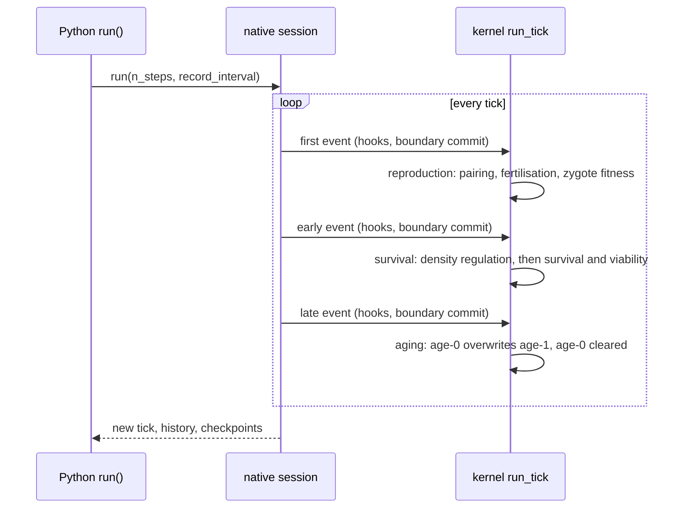
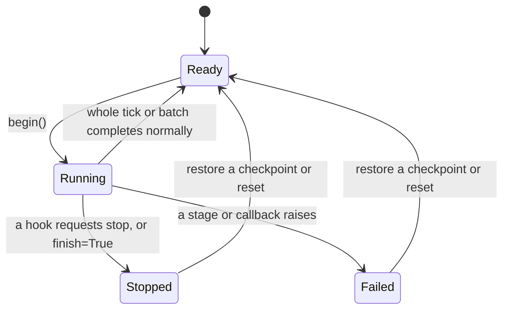

# How a session advances one simulation

[The previous chapter](contracts.md) handed the data to the native session. This one explains how the session uses it to advance time: which stages make up one tick, when the clock moves, how the execution status changes, and what stopping or failing leaves behind.

The chapter follows the plain discrete-generation path; age-structured and fused paths are distinguished in later chapters.

## Four layers and their responsibilities

| Layer | Representative | Responsibility |
| --- | --- | --- |
| Population object | `DiscreteGenerationPopulation` | entry guards, record-interval resolution, query interfaces |
| Backend adapter | `RustDiscreteLifecycleBackend` | materialising contracts, creating the session, adapting calls |
| Native session | `DiscreteGenerationSession` | owns state, tick, RNG, execution status, and parameters |
| Kernels | `run_tick()` and the stage functions | per-tick computation |

[DiscreteGenerationPopulation.run()](https://github.com/jyzhu-pointless/natal-core/blob/main/src/natal/frontend/population/discrete_generation.py) checks three guards in order (re-entrancy, failed, finished), resolves the record interval, and calls the backend; `run_tick()` is simply "run with a step count of one" using the population's configured interval. Batch runs loop inside Rust and **never hand the full state back to Python between stages**.

## The stages of one tick

| Boundary | Counts per sex at that moment (`[age-0, age-1]`) |
| --- | --- |
| End of build / `first` | `[0, 100]` |
| `early` (after reproduction) | `[100, 100]` |
| `late` (after survival) | `[50, 100]` |
| After aging | `[0, 50]` |

The first and last rows carry two lessons: at `early` both generations exist at once (200 per sex in total), so a summed total is *not* the size of the next generation; after aging the old adults are replaced and age 0 is empty.

Hooks at one boundary run in a single cross-type priority order, and **ecology parameter writes committed at a boundary are visible to the later stages of the same tick** — that is same-tick visibility, not "effective next tick".

## Clock and batches

- The session advances `state_tick` only after a tick completes normally. A stop or a failure leaves the clock untouched at the boundary.
- `run(n)` loops inside Rust; `record_every` decides whether each tick writes a history row, `0` records nothing at all (the clock still advances), and `None` uses the population default.
- Verified: after three steps the tick is 3 and the history ticks are `(0, 1, 2, 3)`; with `record_every=0` the history is empty while the tick is 2.

## Execution status

The native status has exactly four values: `Ready`, `Running`, `Stopped`, and `Failed` from [ExecutionStatus](https://github.com/jyzhu-pointless/natal-core/blob/main/rust/src/sessions/status.rs). `begin()` only allows Ready → Running, and a refused call **does not modify the status**, so the caller can inspect it.

Verified transitions (`execution_state()` returns `(status name, phase cursor)`):

| Operation | Result |
| --- | --- |
| End of build | `("Ready", 0)` |
| A clean two-step run | `("Ready", 0)` with tick 2 |
| Stop at early | `("Stopped", 2)` with tick still 0 and `is_finished` true |
| `run(1, finish=True)` | `("Stopped", 0)` with tick 1 |
| A callback raising | `("Failed", 2)` with tick still 0 and `is_failed` true |

The phase cursor in the second element says *where* execution stopped — information a read-only count snapshot cannot provide.

## Stopping, failing, and partial state

Stopping does not undo completed stages. The three verified stop positions, shown as per-sex `[age-0, age-1]`:

| Stop position | State afterwards | Meaning |
| --- | --- | --- |
| `first` | `[0, 100]` | nothing has happened yet |
| `early` | `[100, 100]` | offspring exist and the parents are still there |
| `late` | `[50, 100]` | offspring have survived but have not replaced the parents |

So a stop behaves like "pausing at a boundary" rather than "returning to the start of the tick". Failure is the same shape: after a callback raises, the completed stages of that tick remain, the session is marked `Failed`, and later `run()` calls are refused with a hint to restore a checkpoint or reset.

## Guards and their messages

| Case | Result |
| --- | --- |
| Calling `run()` inside a callback | `RuntimeError: Nested run is forbidden` |
| Calling `run()` after `finish=True` | `RuntimeError: Population '...' has finished. Cannot run() again after finish=True.` |
| Calling `run()` after a failure | `RuntimeError: Population has failed; restore a checkpoint or reset before run` |
| Several ordinary `run()` calls in a row | allowed; the guards target nesting and termination, not call counts |

Hooks are declared at build time only: the population object has no registration entry point, so a callback cannot be added after construction. That is why "attach an observation hook halfway through a run" is not possible — it needs a rebuild.

## What a change affects

| Agent proposal | Test to apply |
| --- | --- |
| Call `pop.run()` from inside a hook | It is refused; the work belongs inside the current stage |
| Use the `early` total as the next generation's size | Both generations coexist there; read the boundary after aging |
| Resume from an arbitrary point after a stop | A stop marks the session `Stopped`; restore or reset first |
| Rebuild the session every step to "refresh" parameters | That loses the timeline, RNG, and history; use a parameter channel |
| Read `record_every=0` as "no advance" | It only disables recording; the clock still advances |

## Implementation and verification entry points

| Entry point | Responsibility in this chapter |
| --- | --- |
| [population/discrete_generation.py](https://github.com/jyzhu-pointless/natal-core/blob/main/src/natal/frontend/population/discrete_generation.py): `run()`, `run_tick()` | Guards, record interval, batch entry |
| [backends/rust/rust_backend.py](https://github.com/jyzhu-pointless/natal-core/blob/main/src/natal/backends/rust/rust_backend.py): `RustDiscreteLifecycleBackend` | Session creation and call adaptation |
| [sessions/discrete_generation.rs](https://github.com/jyzhu-pointless/natal-core/blob/main/rust/src/sessions/discrete_generation.rs): `run_inner()`, `execution_state()` | Batch loop, status transitions, phase cursor |
| [kernels/discrete_generation.rs](https://github.com/jyzhu-pointless/natal-core/blob/main/rust/src/kernels/discrete_generation.rs): `run_tick()` | Stage order and boundary commits |
| [sessions/status.rs](https://github.com/jyzhu-pointless/natal-core/blob/main/rust/src/sessions/status.rs) | The four states and the `begin()` guard |

The stage count, clock behaviour, five status transitions, three stop positions, guard messages, and record intervals were all verified from one set of inputs. Among the existing tests, [test_rust_discrete_lifecycle.py](https://github.com/jyzhu-pointless/natal-core/blob/main/tests/test_rust_discrete_lifecycle.py) and [test_run_state_and_recording_lifecycle.py](https://github.com/jyzhu-pointless/natal-core/blob/main/tests/test_run_state_and_recording_lifecycle.py) protect the discrete lifecycle and run state.

Next, read [How survival and generation replacement are calculated](survival.md) to open up what happens between `early` and `late`.
