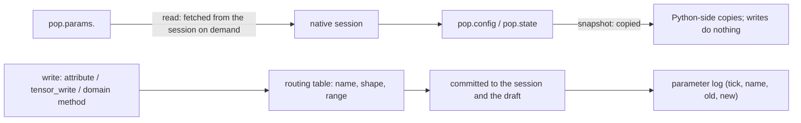

# How runtime parameters are read and updated

Once a model is built, its parameters are not frozen: carrying capacity, eggs per female, sex ratio, fitness, and custom fields can all change during a run without rebuilding the session. This chapter explains which route reads and writes take, when they take effect, and which changes go beyond "changing a parameter" and require rebuilding the model.

## Three write scenarios

| Scenario | Entry point | Use |
| --- | --- | --- |
| Between runs | `pop.update().<domain method>(...)` or `pop.params.<name> = value` | parameter sweeps, pre-run adjustments |
| Inside a callback | `ctx.params.<name> = value` or the declarative `Op.set_param` | event-driven intervention |
| Spatial models | `pop.params.tensor_write(...)` and per-deme ecology writes | affect a single deme |

All three pass the **parameter routing table's validation** and then commit to the same native session. They differ in when they take effect and in transaction scope: a between-runs write lands immediately, while a callback write commits at the event boundary (see [callback transactions](transactions.md)).

## Reading and writing take different routes

- `pop.config` and `pop.state` are **snapshots**: they copy the current values, and editing them does not affect the session.
- `pop.params.<name>` is a **live read surface**: every read fetches the current value.
- Writes must go through a channel: `pop.params.<name> = value` (scalars), `pop.params.tensor_write(...)` (tensors), or `pop.update()` (the same domain methods as build time).

Verified behaviour: writing `eggs_per_female = 4` is readable immediately; writing a tensor afterwards and then running leaves the scalar write in force — both share one session state. Building a snapshot and then writing a parameter leaves the snapshot at 4 while the session reads 7.

## Commit and visibility windows

| Timing | Who sees it |
| --- | --- |
| A write between runs | the whole next `run()` tick |
| A write inside `first` | this tick's reproduction and everything after |
| A write inside `early` | this tick's survival and aging |
| A write inside `late` | this tick's aging |

So **callback writes do not wait for the next tick**: they are readable in the later stages of the same tick. That follows from the boundary-commit design shown in the sequence diagram of [how a session advances one simulation](runtime.md).

Every write that actually changes a value appends a `(tick, name, old, new)` row to `pop.params_log`, so "what changed at which step" can be checked afterwards instead of inferred from the driving script.

## Validation and refusal

| Input | Result |
| --- | --- |
| Unknown parameter name | `AttributeError` naming the field |
| Wrong tensor shape | `ValueError: '...': expected 12 elements, got 8` and similar |
| A probability parameter out of range | refused per that parameter's declared range |
| The migration rate column | goes through its dedicated column channel; writing it as an ordinary tensor is refused |

Validation happens before the commit, so a rejected write leaves no half-state. Name and shape errors both quote the offending field, which keeps diagnosis cheap.

## When changing a parameter is not enough

Some changes alter **derived structure** and must be recompiled rather than written:

| Change | Why a recompile is required |
| --- | --- |
| Genetic conversion rules (presets, manual modifiers) | they change M and F, and therefore P; the old P no longer matches |
| Type count or labels | they change axis lengths, which is a layout change |
| Number of age slots | same reason |
| Whether the layout stays closed | new rules may produce types outside the layout, which the closure check enforces |

`RuntimeUpdater`'s preset and genetic entry points recompile on an **isolated candidate** and commit only on success; a failure leaves the previous state untouched. That is fundamentally different from editing a map table in place, which would leave the mapping inconsistent with P.

## What a change affects

| Agent proposal | Test to apply |
| --- | --- |
| Edit arrays in `pop.config` to tune parameters | That is a snapshot; use `pop.params` or `pop.update()` |
| Keep `pop.params` from a callback and write later | Callback parameter handles expire with the event; between runs use `pop.update()` |
| Edit the M table directly to implement a new rule | It needs a recompile and a rebuilt P; use the genetic update entry point |
| Assume a write only lands next tick | The later stages of the same tick already see it |
| Treat the parameter log as an audit of everything | It only records writes whose value actually changed |

## Implementation and verification entry points

| Entry point | Responsibility in this chapter |
| --- | --- |
| [population/_params_view.py](https://github.com/jyzhu-pointless/natal-core/blob/main/src/natal/frontend/population/_params_view.py) | The read surface, attribute writes, tensor channel |
| [builder/_runtime.py](https://github.com/jyzhu-pointless/natal-core/blob/main/src/natal/frontend/builder/_runtime.py): `RuntimeUpdater` | Domain entry points, candidate validation, genetic recompile, commit |
| [fitness/_writer.py](https://github.com/jyzhu-pointless/natal-core/blob/main/src/natal/frontend/fitness/_writer.py) | Selector resolution and write paths for fitness |
| [contracts/materialize.py](https://github.com/jyzhu-pointless/natal-core/blob/main/src/natal/contracts/materialize.py): `contract_field_source()` | The refresh channel that only builds the requested fields |

Snapshot isolation, the shared scalar/tensor state, domain-method writes, custom round-trips, the parameter log, and every refusal were verified from one set of inputs. Among the existing tests, [test_runtime_updater_contracts.py](https://github.com/jyzhu-pointless/natal-core/blob/main/tests/test_runtime_updater_contracts.py) and [test_conversion_refresh_contracts.py](https://github.com/jyzhu-pointless/natal-core/blob/main/tests/test_conversion_refresh_contracts.py) protect the pre-existing runtime update behaviour.

Next, read [How hooks compile and are scheduled](hooks.md).
