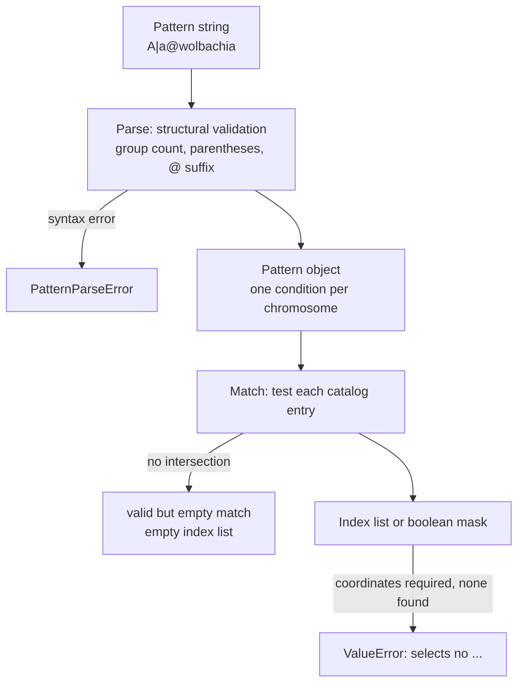

# How patterns and selectors locate data

A declaration names what it wants to affect — "every X heterozygote", "adult females", "types carrying the wolbachia label" — while arrays only understand subscripts. Selectors are the layer that translates human conditions into coordinates, and they decide three things at once: **which slots are touched, by how much, and when the binding to an index happens**.

The chapter reuses the sample species (A, a, X on `chr1`) and adds two cases: a labelled species and an ordered species.


Structured patterns returned by `parse_selector()` can be passed directly to `IndividualSelector(ztype=...)`; they retain their structure instead of being converted to display text and parsed again. Label names are checked against the species catalog together with any labels registered in the current index registry, including names inside sets and negations. Compression does not make a known species label invalid. A misspelled excluded label is an error, not a request to select every label.


## What a pattern string goes through



The three outcomes must be read separately, because they mean different things:

| Outcome | When it happens | Meaning |
| --- | --- | --- |
| `PatternParseError` | Syntax or structure is invalid: `A|a@`, `A|a@x@y`, `(A|a`, `A|a|b` | The text is not a pattern and cannot be interpreted |
| Valid but empty match | An unknown name (`A|Q`) or a condition with no intersection | A valid query whose answer is "nothing" |
| `ValueError` (empty mask) | An empty result used where a concrete selection is required (`IndividualSelector.compile()`) | The caller demanded at least one coordinate |

A verified example: `parse_selector("A|Q", species=sp)` parses and matches `[]`, while handing the same string to the exact parser `Species.get_genotype_from_str("A|Q")` raises `ValueError: Cannot parse haplotype segment string 'Q'`. The pattern language tolerates unknown names (wildcards and sets can legitimately mention entries that do not exist); exact strings do not.

## Grammar

| Form | Meaning | Result on this complete catalog |
| --- | --- | --- |
| `A|a` | maternal A, paternal a | index 1 |
| `A::a` | unordered pair, matches `A|a` or `a|A` | index 1 |
| `a|A` | ordered pair, maternal a, paternal A | empty in an unordered species; see below |
| `{A,a}|*` | set and wildcard | indices 0, 1, 2, 3, 4 |
| `!X|*` | negation | indices 0, 1, 2, 3, 4 |
| `*@wolbachia` | label condition (two-label species) | all six types carrying that label |

Multi-locus and multi-chromosome patterns reuse the same separators: `/` between loci, `;` between chromosomes, `@` before a label. Omitted chromosomes impose no constraint.

### One string, two entry points, two meanings

`a|A` is the trap worth remembering from this chapter:

```text
sp.parse_genotype_pattern("a|A")          → parses, matches nothing
resolve_zygote_type("a|A", species, reg)  → index 1
```

The reason is that an unordered species canonicalises genotype objects (see [genetic objects](genetic_objects.md)), so the catalog only contains the spelling whose maternal side sorts first. Every selection entry point — the unified `parse_selector` (which `resolve_zygote_type`, observation groups, fitness writes and hook declarations all funnel through), `IndividualSelector`, the conversion filters — promotes `|` to `::` for unordered species, so `a|A` still matches; the content-only helpers (`Species.parse_genotype_pattern` and friends) keep `|` strictly ordered. Under an ordered species (`unordered=False`), `A|a` and `a|A` are two different genotypes: `parse_selector("A|a", ...)` → index 1 and `parse_selector("a|A", ...)` → index 3.

So deciding whether a selector matches requires knowing **which entry point it travels through and whether the species is unordered**. The string alone does not tell you.

## From pattern to coordinates: `IndividualSelector`

[IndividualSelector](https://github.com/jyzhu-pointless/natal-core/blob/main/src/natal/frontend/patterns/individual_selector.py) combines conditions across the three axes into one immutable, hashable rule:

- inside one selector, **fields are ANDed** (the genotype and "female" must both hold);
- multiple values of one field are **ORed** (`{A,a}`, or `sex=["female","male"]`);
- combining two selectors with `|` or `+` **ORs their atoms**;
- `compile(registry, n_sexes=2, n_ages=2)` returns a boolean mask shaped `(n_sexes, n_ages, n_ztypes)`.

Verified combination behaviour: `IndividualSelector(ztype="A|A", sex="female", age=1)` selects exactly one coordinate (female adult A|A) on the compressed model; ORing it with `IndividualSelector(ztype="a|a", sex="male")` selects three (the second selector leaves age unconstrained, so both age slots match); `age=5`, outside the age axis, raises `ValueError: ... selects no (ZType, sex, age) coordinates in this population schema.` instead of returning an empty mask.

Immutability and hashability are deliberate: they let one selector serve as a dictionary key and as a fingerprint source, so observation-group caching can compare selectors rather than strings.

## Who consumes selection results

| Consumer | Entry point | Binding time |
| --- | --- | --- |
| Initial counts | `initial_state(individual_count={"female": {"A|a": 100}})` | build time, written into the complete-axis draft |
| Fitness | `fitness(viability={"A|a": 0.9})` | recorded at declaration, written to arrays at compile time |
| Hook declarations | `hooks(Op.scale(..., event="early"))` | **after publication**, compiled on final indices |
| Observation groups | `with_observation(groups={...})` | **after publication**, compiled into masks |
| Runtime parameter writes | `pop.params` writes by name | at run time, resolved on final indices |
| Genetic rules | preset and modifier `genotype` conditions | at compile time, on the complete catalog |

The decisive difference is *when the index binding happens*. Build-time writes use complete-catalog coordinates; hooks, observation, and runtime writes must use the **published** catalog. The two differ here: complete index 2 is `A|X`, runtime index 2 is `a|a`. Binding a selector at the wrong moment does not raise — it produces a mask that runs fine and points at the wrong individuals.

## Conversion targets: keep or replace

Conversion targets share the pattern grammar, but they describe changes to a source rather than a set of matching destinations. The unified target entry `parse_target()` (`natal.parse_target`) retains the original spelling and parsed structure; passing `validate=True` rejects forbidden target forms before testing source reachability. `ConversionTarget.apply_zygote()` or `.apply_gamete()` then fills in the parts retained from each source.

| Target part | Meaning |
| --- | --- |
| Omitted chromosome group or `*` | Keep the source part |
| Exact allele or label | Replace that part |
| Ordered local wildcard, such as `C|*` | Replace the left side and keep the source's right side |
| Set, negation, or unordered partial expression such as `C::*` | Reject an ambiguous target |

`*@infected` preserves each source genotype and changes its label. On a two-chromosome species, `A|A@*` replaces the specified first group and preserves the second group and label. Partial locus changes require a positional correspondence with the source loci. Complete exact targets retain the existing name-based chromosome interpretation, including explicitly reordered chromosome segments.

The whole-state modifier rule declarations still require an explicit `@label` part; use `@*` to preserve a label. An Op target may omit the label entirely. An Op target may also omit age or sex, preserving that source coordinate. A target must produce one legal destination per source, and the destination must exist in the active registry. Multiple sources can have different destinations without introducing probability splitting between destinations.

The ordinary pattern matching semantics above remain unchanged: omitted groups in a source impose no restriction. See [Hook conversions](../2_hooks.md) for execution order and sperm-storage behavior.

## Boundaries and errors

| Case | Result |
| --- | --- |
| Unknown allele name | The pattern parses; the match is empty |
| Unknown label name | Same; the `@` suffix is only matched, never validated at parse time |
| Empty or repeated label suffix | `PatternParseError` |
| Unbalanced parentheses | `PatternParseError: Unbalanced parentheses` |
| A selector compiling to nothing | `ValueError` (the message names the missing coordinate) |
| `a|A` for an ordered species | Matches index 3, distinct from `A|a` |

## What a change affects

| Agent proposal | Test to apply |
| --- | --- |
| Use `a|A` to select the heterozygote | Whether it matches depends on the entry point; public entry points promote `|`, direct parsing does not |
| Use `*` to select "all individuals" | Wildcards follow the catalog; after compression the catalog shrinks and so does the selection |
| Put a complete index inside a selector | Indices move with compression; write names or patterns |
| Treat "empty match" as "miswritten" | An empty match is a legitimate answer; only paths that must land upgrade it to an error |
| Reuse build-time indices inside a hook | Hooks compile on the final catalog and need runtime indices or names |

## Implementation and verification entry points

| Entry point | Responsibility in this chapter |
| --- | --- |
| [patterns/parser.py](https://github.com/jyzhu-pointless/natal-core/blob/main/src/natal/frontend/patterns/parser.py) | Pattern grammar and parse cache |
| [patterns/elements/](https://github.com/jyzhu-pointless/natal-core/tree/main/src/natal/frontend/patterns/elements) | Atoms, chromosome pairs, and diploid/haploid pattern elements |
| [patterns/individual_selector.py](https://github.com/jyzhu-pointless/natal-core/blob/main/src/natal/frontend/patterns/individual_selector.py) | Three-axis combination, mask compilation, empty-mask error |
| [patterns/selector.py](https://github.com/jyzhu-pointless/natal-core/blob/main/src/natal/frontend/patterns/selector.py): `resolve_zygote_type()` | `|` promotion for unordered species and index resolution |
| [registry/index.py](https://github.com/jyzhu-pointless/natal-core/blob/main/src/natal/frontend/registry/index.py): `resolve_ztype_indices()` | Landing a pattern on indices |
| [output/observation.py](https://github.com/jyzhu-pointless/natal-core/blob/main/src/natal/frontend/output/observation.py): `build_mask_from_selectors()` | How observation groups become masks |

The grammar behaviour, the three error classes, the unordered entry-point difference, selector combination, and the empty-mask error were all verified from one set of inputs. Among the existing tests, [test_genetic_patterns.py](https://github.com/jyzhu-pointless/natal-core/blob/main/tests/test_genetic_patterns.py) protects the pre-existing grammar behaviour; the entry-point difference and error classification are the new cases added here.

Next, read [From declaration to compiled products](model.md) to see how these selections are organised into one reproducible compilation.
