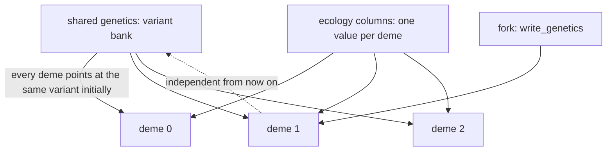

# How a spatial model is built and shares data

A spatial model copies one genetic architecture and lifecycle across several demes, differing only in their ecological conditions and migration routes. This chapter explains how the data is organised, who shares what, and who holds execution control; the migration algorithm itself is in [the next chapter](migration.md).

## Model conditions and entry point

```python
SpatialPopulationBuilder(species, n_demes=3).setup(stochastic=False) \
    .age_structure(n_ages=3, new_adult_age=1) \
    .initial_state(...) .reproduction(...) .survival(...) \
    .competition(juvenile_growth_mode="no_competition", age_1_carrying_capacity=1_000_000) \
    .migration(adjacency=chain, migration_rate=0.2)
```

The chain methods carry the same names and meanings as in a single-population model. Two things differ: **every domain method also accepts `batch_setting(...)`** to declare different values per deme (heterogeneous configuration), and there is an extra `migration()`.

## Three kinds of ownership



| Data | Organisation | Effect of a write |
| --- | --- | --- |
| Genetic tensors (M, F, P, fitness) | a variant bank, shared by demes at build time | a write forks that deme's variant and leaves the others alone |
| Ecology parameters (capacity, rates, ...) | columns taking one value per deme | changes only that deme's column |
| Counts and sperm storage | stacked arrays | independent per deme; migration is the only cross-deme channel |
| Index registry | one shared registry | type identity is identical across demes |

Verified: after `deme.write_ecology("carrying_capacity", 12345)` only that deme reads 12345 while the others keep the original value; `deme.write_genetics("viability_fitness", ...)` forks that deme's genetic variant while the untouched deme still reads the shared 1.0.

**Sharing is not writability.** Two demes start on the same genetic table because its content is identical; the moment one writes, it gets its own copy. Reading sharing as "a write affects every deme" is wrong.

## Stacked layout

| Array | Axis order |
| --- | --- |
| Individual counts | `(deme, sex, age, ZType)` |
| Sperm storage | `(deme, age, female ZType, male ZType)` |
| Migration rate column | `(deme, sex, age)` |

Verified: the stacked counts of a three-deme model are shaped `(3, 2, 3, 3)`, and each deme's indices and axis meanings match the single-population model, so one piece of reading code serves both.

Compression runs once at the spatial level and produces **one registry shared by every deme** — that is what lets cross-deme migration move individuals by type identity.

## Execution control belongs to the container

| Operation | Owner |
| --- | --- |
| `run()`, `run_tick()`, `reset()` | `SpatialPopulation` (the container) |
| `pop.demes[i].state` / `.params` / `.update()` | local reads and local commits |
| `pop.demes[i].write_ecology()` / `write_genetics()` | local writes |
| History, observation, checkpoints | the container |

Verified: `pop.demes[0]` has no `run` at all — a deme slice exposes only the aligned read surface and the local write surface, never lifecycle control. Time can only advance through the container, which is what makes "one shared timeline" a checkable statement.

## What a change affects

| Agent proposal | Test to apply |
| --- | --- |
| Call `run` on each deme to "advance in parallel" | A deme has no `run`; the container schedules |
| Edit the shared genetic table to affect every deme | A write forks that deme; a global change needs a rebuild or per-deme writes |
| Give each deme its own type indices | The registry is shared, so indices must agree |
| Edit `state` arrays on a deme directly | That is a snapshot; use `update()` or `write_ecology` |
| Let each deme keep its own history | History belongs to the container, separated by the deme axis |

## Implementation and verification entry points

| Entry point | Responsibility in this chapter |
| --- | --- |
| [spatial/builder.py](https://github.com/jyzhu-pointless/natal-core/blob/main/src/natal/frontend/spatial/builder.py) | Chain declarations, `batch_setting` heterogeneity, build |
| [spatial/population.py](https://github.com/jyzhu-pointless/natal-core/blob/main/src/natal/frontend/spatial/population.py): `DemeSlice` | The aligned read surface and local writes of a deme slice |
| [rust_backend.py](https://github.com/jyzhu-pointless/natal-core/blob/main/src/natal/backends/rust/rust_backend.py): `ecology_columns_from_drafts()`, `genetics_variant_bank()` | How ecology columns and genetic variants are organised |
| [sessions/spatial.rs](https://github.com/jyzhu-pointless/natal-core/blob/main/rust/src/sessions/spatial.rs) | The stacked session and its scheduling |

The stacked shape, per-deme ecology writes, the genetic fork, the absence of `run` on a slice, and the symmetric evolution of identical demes under zero migration were all verified from one set of inputs. Among the existing tests, [test_spatial_publication.py](https://github.com/jyzhu-pointless/natal-core/blob/main/tests/test_spatial_publication.py) and [test_hook_transaction_contract.py](https://github.com/jyzhu-pointless/natal-core/blob/main/tests/test_hook_transaction_contract.py) protect shared publication, variant relations, and the deme execution restriction.

Next, read [Spatial lifecycle and the migration algorithm](migration.md).
