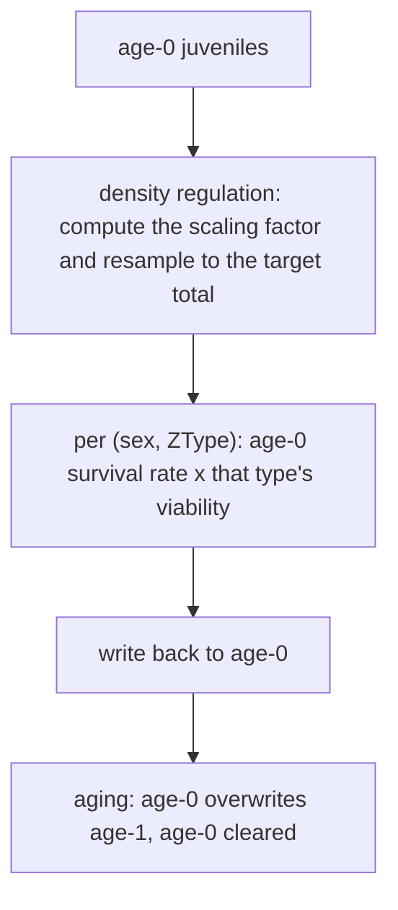

# How survival and generation replacement are calculated

[The previous chapter](runtime.md) showed counts moving from 100 juveniles per sex to 50 between `early` and `late`, after which aging turns those juveniles into the next adult generation. This chapter opens those two steps: what the survival stage does first and second, and what "non-overlapping generations" means in the implementation.

## One concrete input and output

Using the sample model (100 female and 100 male A|a adults, two eggs per female, base juvenile survival 0.5):

| Boundary | Per-sex `[age-0, age-1]` | Meaning |
| --- | --- | --- |
| `early` | `[100, 100]` | 200 offspring, half of each sex; the parents are still present |
| `late` | `[50, 100]` | juveniles have passed density regulation and survival |
| after aging | `[0, 50]` | juveniles became adults and the old adults were discarded |

The survival stage reads age-0 and writes age-0 only: it never touches age-1. Treating age-1 as "a surviving group that can be adjusted" is the most common misreading of this stage.

## Order inside the stage

What the three steps do:

1. **Density regulation** first computes this step's competition strength (in the discrete model simply the age-0 total, both sexes combined), turns it into a scaling factor through the growth mode, and resamples age-0 to the target total. Verified: `fixed` mode with K=100 and 200 juveniles gives a `late` total of 100 before the base survival rate of 0.5 halves it to 50.
2. **Survival and viability** compute `survival rate × viability` per (sex, ZType). The base rate comes from the age-0 cell of the `(sex, age)` array; viability comes from the **age-0 slice** of the `(sex, age, ZType)` tensor — under the discrete model the age-1 viability does not participate in this stage.
3. **Aging** writes age-0 into age-1 and clears age-0. Old adults are overwritten rather than "surviving and then being joined".

A verified viability example (female A|A age-0 viability set to 0.5, every other cell 1):

| Sex | `late` without the extra viability | `late` here |
| --- | --- | --- |
| female | `[12.5, 25, 12.5]` | `[6.25, 25, 12.5]` |
| male | `[12.5, 25, 12.5]` | `[12.5, 25, 12.5]` |

Only the modified cell halves; the others do not move. Although the written tensor also carries 0.5 at age 1, the discrete stage reads only the age-0 slice, so adult counts are unaffected.

## Deterministic, discrete-stochastic, and continuous sampling

The same stage computes in one of three ways, selected by two blueprint flags:

| Mode | Juvenile count | Note |
| --- | --- | --- |
| Deterministic | `count × survival rate` | the expectation, free to be fractional |
| Discrete stochastic | `binomial(round(count), survival rate)` | counts are rounded to integers before sampling |
| Continuous sampling | `continuous_binomial(count, survival rate)` | fractional mass is kept and sampled continuously |

Density regulation samples consistently: deterministic mode scales proportionally, while stochastic mode uses a multinomial draw to distribute the juvenile total across (sex, ZType). Verified: under stochastic mode the per-type counts at `early` are integers (discrete sampling), while deterministic mode produces values such as 12.5.

So "the same model under a different mode gives the same answer" does not hold: the deterministic path returns the expectation and the stochastic path returns one realisation. To judge an implementation, compare distributions or switch to the deterministic path and check the expectation — never compare sample by sample.

## Boundaries and errors

| Case | Result |
| --- | --- |
| A zero juvenile total | age-0 is cleared and the stage returns without sampling |
| A scaling factor driving the target to zero | age-0 is cleared (for example the linear mode under high competition) |
| Writing to age-1 in the hope of changing this generation's survival | age-1 is overwritten by aging, so the write has no effect |
| Setting the age-1 survival rate to 1 to survive generations | the discrete generation-replacement rule does not read that cell |

## What a change affects

| Agent proposal | Test to apply |
| --- | --- |
| Change how many juveniles survive this generation | Use the age-0 survival rate or that type's viability; they multiply |
| Let some adults survive into the next generation | The discrete model cannot; that is an age-structured capability |
| Move density regulation after survival | The order changed, so the same parameters give a different result; a `fixed`-mode K check separates the two |
| Validate a deterministic result with one stochastic run | The stochastic path samples integers while the deterministic path returns the expectation; compare distributions or switch modes |
| Treat the `late` total as the next generation's size | Aging still follows; parents are still present at `late` but will be overwritten |

## Implementation and verification entry points

| Entry point | Responsibility in this chapter |
| --- | --- |
| [kernels/discrete_generation.rs](https://github.com/jyzhu-pointless/natal-core/blob/main/rust/src/kernels/discrete_generation.rs): `survival()`, `aging()` | Stage order, the age-0 product, generation replacement |
| same file: `scaling_factor()`, `recruit_juveniles()` | Density scaling and resampling |
| [kernels/density_regulation.rs](https://github.com/jyzhu-pointless/natal-core/blob/main/rust/src/kernels/density_regulation.rs) | The curves of each growth mode |
| [population/discrete_generation.py](https://github.com/jyzhu-pointless/natal-core/blob/main/src/natal/frontend/population/discrete_generation.py): the `survival()` declaration entry | User-facing parameters (age-0 survival rates and so on) |
| [kernels/rng.rs](https://github.com/jyzhu-pointless/natal-core/blob/main/rust/src/kernels/rng.rs) | Binomial and multinomial sampling |

The `early`/`late`/aging boundary counts, the viability multiplication, the density ordering (200 → 100 → 50), and the integrality of the stochastic path were all verified from one set of inputs. Among the existing tests, [test_rust_discrete_lifecycle.py](https://github.com/jyzhu-pointless/natal-core/blob/main/tests/test_rust_discrete_lifecycle.py), [test_discrete_population.py](https://github.com/jyzhu-pointless/natal-core/blob/main/tests/test_discrete_population.py), and [test_frozen_lifecycle_rules.py](https://github.com/jyzhu-pointless/natal-core/blob/main/tests/test_frozen_lifecycle_rules.py) protect the pre-existing discrete-stage behaviour.

Next comes the later chapter *Age structure and long-term sperm storage*, on how a four-age-slot model expresses overlapping generations.
