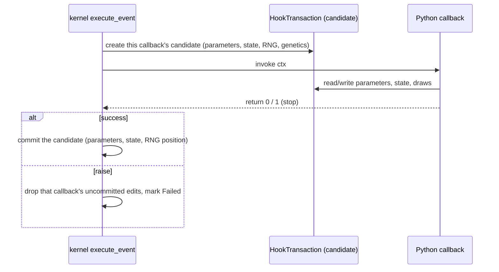

# Callback transactions, failure, and stop boundaries

[The previous chapter](hooks.md) explained how declarative hooks and callbacks enter one schedule. This chapter is only about callbacks: what data they work on, when it commits, what a failure leaves behind, and which handles expire the moment the callback returns.

## A callback never touches the session directly

The key point is **one candidate per callback**: Python never borrows the live session or its random stream. The candidate carries parameters, state arrays, the RNG position, and the genetic tables; it is committed as a whole on success and discarded as a whole on failure.

State arrays materialise on demand: a callback that only writes a scalar does not pull the whole individual-count array, and read-only parameter paths use the light field source described in [how Python and Rust exchange model data](contracts.md).

## Three different boundaries

| Boundary | Undone by failure |
| --- | --- |
| One callback's candidate | every uncommitted edit of that callback |
| Several callbacks in one event | **committed** edits from earlier callbacks survive; a later failure does not roll them back |
| The stages of a whole tick | completed stages are not rolled back; a stop or failure simply leaves execution at the boundary |

Verified (A successfully sets `carrying_capacity = 777`, then B sets 999 and raises): the run aborts and the session is marked `Failed`, while the session keeps **A's 777** and B's 999 never leaks. That contract is protected by the existing test `test_prior_callback_commit_survives_later_failure`.

So "a failure rolls back the whole tick" is wrong; the accurate statement is "uncommitted writes are dropped, committed ones survive, and execution stops at the boundary".

## Handle lifetimes

Handles obtained inside a callback expire with the event:

| Handle | After the callback returns |
| --- | --- |
| `ctx.params` | writes are refused (the transaction has ended) |
| `ctx.rng` | draws are refused; repeated access within one event returns the same sampler |
| `ctx.state` | the view is no longer valid; do the reads and writes within the event |

Verified: stashing all three handles and using them after the callback returns gets the write and the draw refused; accessing `ctx.rng` twice inside one event returns the same object.

The rule protects the random-stream position and state consistency: if handles stayed writable outside the event, between-runs writes and transaction commits would interleave and neither the parameter log nor the RNG position would be trustworthy.

## Stopping

`ctx.stop()` (or a declarative `Op.stop_if_*`) asks to end the current tick at this boundary:

- later slots and later stages do not run;
- already committed edits survive;
- the clock does not advance, the session reads `Stopped`, and `is_finished` is true;
- continuing requires restoring a checkpoint or calling `reset()`.

A callback may also return `1` to stop or `0` to continue, which is equivalent to `ctx.stop()`.

## Failure

An exception raised in a callback:

1. propagates to the caller unchanged in type and message;
2. moves the session to `Failed`;
3. keeps the results of earlier committed callbacks and completed stages;
4. makes later `run()` calls fail until a checkpoint is restored or the population is reset.

## What a change affects

| Agent proposal | Test to apply |
| --- | --- |
| Save `ctx.rng` for use in the next event | The sampler has expired; draw inside the event |
| Assume a failing callback rolls back the step | Only uncommitted edits are dropped; earlier commits survive |
| Call `pop.run()` from inside a callback | Re-entrancy is refused (`Nested run is forbidden`) |
| Edit `pop.state` arrays from a callback | That is a snapshot; use `ctx.state` or a parameter channel |
| Rely on "callback order equals declaration order" | Within one event the order is by priority, see [the previous chapter](hooks.md) |

## Implementation and verification entry points

| Entry point | Responsibility in this chapter |
| --- | --- |
| [rust/src/hooks/transaction.rs](https://github.com/jyzhu-pointless/natal-core/blob/main/rust/src/hooks/transaction.rs) | HookTransaction: the candidate, its `active` lifetime, and the commit |
| [hooks/_transaction.py](https://github.com/jyzhu-pointless/natal-core/blob/main/src/natal/frontend/hooks/_transaction.py) | The `EventTransaction` protocol and `HookRng`'s lifetime check |
| [hooks/tick_context.py](https://github.com/jyzhu-pointless/natal-core/blob/main/src/natal/frontend/hooks/tick_context.py) | `ctx.state` / `ctx.params` / `ctx.rng` / `ctx.stop()` |
| [kernels/age_structured.rs](https://github.com/jyzhu-pointless/natal-core/blob/main/rust/src/kernels/age_structured.rs): `EcoCtx::commit()` | Boundary commits and the parameter journal |

Earlier-commit survival, handle expiry, sampler identity, failure propagation, and the stop boundary were all verified from one set of inputs. Among the existing tests, [test_hook_transaction_contract.py](https://github.com/jyzhu-pointless/natal-core/blob/main/tests/test_hook_transaction_contract.py) and [test_manual_event_failure_contract.py](https://github.com/jyzhu-pointless/natal-core/blob/main/tests/test_manual_event_failure_contract.py) protect the transaction boundaries.

Next, read [How a spatial model is built and shares data](spatial.md).
