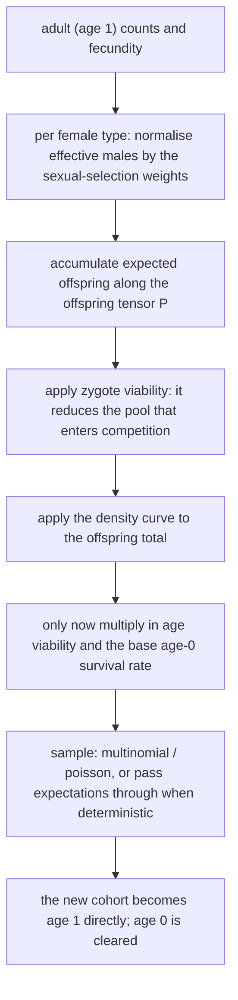

# The fused Wright-Fisher execution path

Every path described so far is staged: reproduction, survival, and aging run in sequence with hooks at the boundaries. The project has a second discrete execution path that fuses a whole step into one draw. This chapter covers when it is available, how what it computes differs, and how to judge whether "faster" really means "equivalent".

## Model conditions

The fused path is selected by `extreme_speed_mode`:

| Value | Meaning |
| --- | --- |
| 0 | off (the default); the staged path runs |
| 1 | multinomial: one multinomial draw |
| 2 | poisson: one Poisson draw per type |
| 3 | deterministic: the expected counts pass through, with no sampling |

A value outside 0–3 is refused **at declaration**, with the accepted values listed; there is no silent fallback for an unknown mode. Selecting a non-zero value also enables the fused execution path.

## What one step computes

The order around the density curve is deliberate and matches the staged lifecycle: zygote viability reduces the pool that enters competition, while age viability and the base age-0 survival rate act only after the curve. Moving them earlier would change the curve's input and therefore its equilibrium.

Three differences from the staged path stand out:

1. **Only the `first` event runs.** Verified: the same declaration fires `first` once under a fused mode and never fires `early` or `late`, while the staged path fires each once.
2. **There are no stage boundaries.** No "after reproduction but before survival" state can be observed, and there is no same-tick parameter-visibility window across stages.
3. **The generation is replaced directly.** The new cohort is written into age 1 and age 0 is cleared, without an aging stage.

## When the paths agree and when they do not

| Comparison | Result |
| --- | --- |
| `stochastic=False`, fused versus staged | Verified: all three modes reproduce the staged result **bit for bit** |
| `stochastic=True` | Sampling happens in different places (one multinomial/Poisson versus per-stage binomials), producing different realisations of the same distribution |
| Hooks that rely on `early`/`late` | The fused path never runs them, so behaviour differs |
| Models that need between-stage observations | The fused path offers no such boundaries |

So "the fused path is faster" is not its only property: it also constrains the **model conditions**. A declaration whose only hooks run at `first` can be swapped between the paths; a model with an `early` intervention silently loses it under the fused path.

## Judging applicability

Suitable for the fused path:

- allele-frequency trajectories and effective population size, rather than per-generation pairing detail;
- no interventions between reproduction and survival;
- cross-checking in deterministic mode against the staged path.

Unsuitable cases:

- hooks at `early`/`late` (for example sex-specific selection or type-specific killing);
- age structure or long-term sperm storage (the fused path reads only age 1 and the age-0 survival rate);
- observation of "after reproduction, before survival" counts within one tick.

## What a change affects

| Agent proposal | Test to apply |
| --- | --- |
| Enable the fused mode to speed things up | First check nothing relies on `early`/`late`; otherwise behaviour changes silently |
| Replace staged results with fused ones | In deterministic mode a bit-for-bit check works; in stochastic mode compare distributions |
| Attach an observation hook under a fused mode | Only `first` runs; the other events never fire |
| Treat the fused mode as "the staged path, faster" | It also changes the available hooks and state boundaries; it is a different execution path |
| Pass a mode outside 0–3 | It is refused at declaration with the accepted values listed |

## Implementation and verification entry points

| Entry point | Responsibility in this chapter |
| --- | --- |
| [kernels/discrete_generation.rs](https://github.com/jyzhu-pointless/natal-core/blob/main/rust/src/kernels/discrete_generation.rs): `run_wf_tick()` | The fused step: expected offspring, viability, sampling, write-back |
| [sessions/discrete_generation.rs](https://github.com/jyzhu-pointless/natal-core/blob/main/rust/src/sessions/discrete_generation.rs) | How the `wf` switch dispatches inside the batch loop |
| [builder/_base.py](https://github.com/jyzhu-pointless/natal-core/blob/main/src/natal/frontend/builder/_base.py): `setup(extreme_speed_mode=...)` | Mode declaration and value validation |
| [kernels/equilibrium.rs](https://github.com/jyzhu-pointless/natal-core/blob/main/rust/src/kernels/equilibrium.rs) | The equilibrium derivation shared with the fused path |

The bit-for-bit agreement of all three modes with the staged path, the `first`/`early`/`late` firing counts, and the declaration-time rejection of an unknown mode were all verified from one set of inputs. Among the existing tests, [test_wf_fallback_independent_contract.py](https://github.com/jyzhu-pointless/natal-core/blob/main/tests/test_wf_fallback_independent_contract.py) and [test_publication.py](https://github.com/jyzhu-pointless/natal-core/blob/main/tests/test_publication.py) protect the fused path and the publication contract.

Next comes the later chapter *How runtime parameters are read and updated*.
