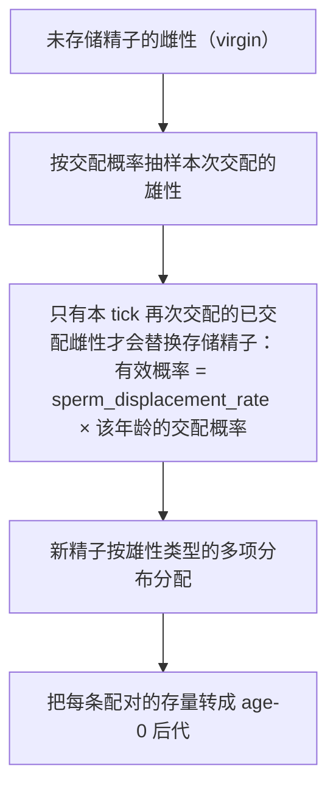

# 年龄结构与长期精子存储

[生存与世代更替](survival.md)里的模型只有两个年龄槽，一代人一次性替换上一代。真实种群里世代是重叠的：二岁和三岁的雌性同时繁殖，体内还存着上一次交配的精子。这一章解释项目如何表达这件事，以及它与离散模型的差异。

## 模型条件

```python
AgeStructuredPopulation.setup(species=sp, stochastic=False) \
    .age_structure(n_ages=4, new_adult_age=1) \
    .initial_state(individual_count={"female": {"A|a": [0, 100, 0, 0]}, ...}) \
    .survival(female_age_based_survival=[1.0, 1.0, 1.0, 0.0], ...)
```

| 参数 | 含义 |
| --- | --- |
| `n_ages` | 年龄槽数量；`age 0` 是新生个体，其余按序递增 |
| `new_adult_age` | 第一个可以繁殖的年龄槽；更年轻的个体只竞争、不繁殖 |
| `age_based_survival_rates` | `(sex, age)`，每个年龄各自的存活率 |
| `reproduction_rates` / `fertility` | `(age,)`，每个年龄的繁殖参与率与相对生育力 |
| `sperm_displacement_rate` | 再次交配时替换已存储精子的概率 |

与离散模型的关键差别不是"槽位更多"，而是**生命周期不再由一次替换完成**：每个年龄按自己的存活率存活，然后在每个 tick 结束时整体前移一格。

## 存储精子如何参与繁殖

[年龄结构繁殖阶段](https://github.com/jyzhu-pointless/natal-core/blob/main/rust/src/kernels/age_structured.rs)分四步：



精子存储张量的形状是 `(age, 雌性 ZType, 雄性 ZType)`，每一格表示"该年龄、该基因型的已交配雌性中，配偶为该雄性基因型的数量"。由此得到三条可以直接核对的含义：

- 存储不是"一个精子总量"，而是按配偶类型分开的雌性数量。
- 空格的贡献为零；没有交配的雌性不产生后代。
- 雌性在下一次交配前会继续使用已存储的精子，因此"这一代只与这一代交配"并不成立。

受精阶段把每对库存转换成 age-0 个体，使用雌性与雄性的 fecundity、雌性 fertility、繁殖参与率、后代张量（P）与性别分配；随机模式下每对的产卵量用二项或泊松抽样。

## 年龄推进

`aging(bp, ind, sperm)` 同时移动数量与精子存储：

1. 从最老的年龄开始向前平移一格，避免覆盖尚未读取的槽位。
2. 最老年龄的个体与精子直接消失（落出模型）。
3. age 0 的数量与精子全部清零。

核验（4 个年龄槽、初始 age 1 有 100 个 A|a 成体，并在 tick 开始前把 5 个雌性放到最老的 age 3）：

| 位置 | 一个 tick 之后 |
| --- | --- |
| age 0 | 0（被清零，新的新生儿进入 age 1） |
| age 1 | 本 tick 产生的新生儿 |
| age 2 | 100（原来的 age 1 前移） |
| age 3 | 0（原来的 age 3 已经落出） |

## 与离散模型的差异

| 方面 | 离散世代 | 年龄结构 |
| --- | --- | --- |
| 年龄槽 | 固定 2 个 | `n_ages` 由声明决定 |
| 旧成体 | 被下一代直接替换 | 按各自存活率存活并逐格前移 |
| 存储精子 | 不保存跨 tick 精子库 | 按 (年龄, 雌性类型, 雄性类型) 保存 |
| 繁殖参与 | 内部成体值 1 | 每个年龄各自的参与率与生育力 |
| 随机受精 | 直接按合子 fitness 与 P 抽样 | 先抽样交配与精子库存，再由库存受精 |

最后一行解释了为什么两侧共享字段不代表行为相同：`fixed_egg_count` 这类标志在两条路径上可能被不同阶段读取，判断时必须看具体调用链。

## 改动会影响谁

| agent 的建议 | 判断依据 |
| --- | --- |
| 用离散模型模拟世代重叠 | 离散模型在 aging 时替换成年个体，无法让两个年龄同时繁殖 |
| 让最老年龄继续存活 | 最老槽在 aging 时落出；需要加年龄或提高该年龄的存活率 |
| 把精子存储当成一个总库 | 它按配偶类型分格；按总量理解会算错后代基因型分布 |
| 认为雌性只与本 tick 的雄性交配 | 存储精子会继续使用，直到被替换 |
| 在两个路径之间直接搬运参数 | 先确认该参数在同一阶段被读取；共享字段不等于同等语义 |

## 实现定位与核验依据

| 实现入口 | 本章对应职责 |
| --- | --- |
| [kernels/age_structured.rs](https://github.com/jyzhu-pointless/natal-core/blob/main/rust/src/kernels/age_structured.rs)：`reproduction()`、`survival()`、`aging()`、`run_tick()` | 四阶段与年龄推进 |
| 同上：`sperm` 相关函数（抽样交配、替换、受精） | 长时间精子存储 |
| [population/age_structured.py](https://github.com/jyzhu-pointless/natal-core/blob/main/src/natal/frontend/population/age_structured.py) | 用户侧参数与状态容器 |
| [data/state.py](https://github.com/jyzhu-pointless/natal-core/blob/main/src/natal/frontend/data/state.py)：`PopulationState` | `(sex, age, ZType)` 数量与 `(age, ♀ZType, ♂ZType)` 精子 |

本章的四年龄槽推进、最老年龄落出、新生儿进入 age 1 与精子张量形状均由同一组输入核验。既有测试中，[test_age_structured_population.py](https://github.com/jyzhu-pointless/natal-core/blob/main/tests/test_age_structured_population.py) 与 [test_sex_chromosome_age_structure.py](https://github.com/jyzhu-pointless/natal-core/blob/main/tests/test_sex_chromosome_age_structure.py) 保护年龄结构模型的既有行为。

下一步阅读[密度调节与平衡量如何计算](density_regulation.md)。
