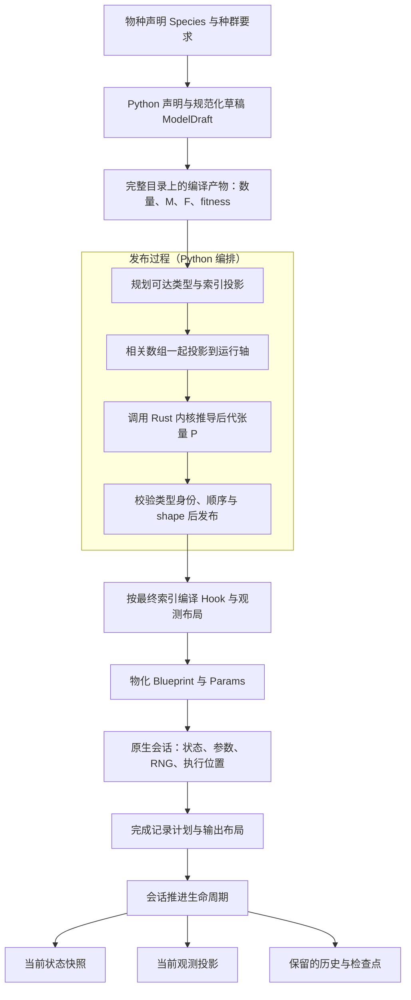
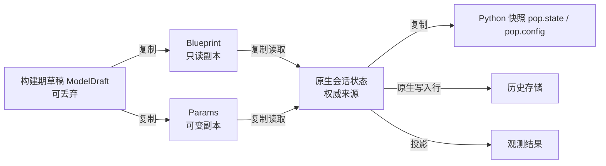

# 项目架构与职责边界

一个模型从声明走到结果，会经过三类完全不同的东西：描述模型的 Python 对象、跨语言传递的数组合同，以及持有运行状态的原生会话。本章说明每一层由谁负责、数据归谁所有、构建和运行在哪里交接。具体的一次旅程见[一个模型从声明到结果的完整旅程](model_journey.md)；本章不重复其中的数值，只解释它为什么必须这样分层。

如果只记一句话：**Python 负责把生物学声明变成确定布局的数组，Rust 负责在这些数组上执行计算并持有运行状态，两者之间靠复制传递，不共享可变数据。**

## 模型前端与浏览器 UI

`src/natal/frontend/` 是 Python 包内的模型前端：物种结构、种群声明、遗传编译、Hook 编译、输出布局都在这里。仓库根目录的 `ui/` 是浏览器界面。二者属于不同层次，本章只涉及前者。

## 整体数据流

下图是职责与产物流转图，不是逐行调用栈。箭头表示“产生或初始化下一个对象”，不表示共享同一个数组。

读图时注意三件事。第一，编译发生在**完整目录**上，投影发生在发布阶段，因此“初始数量为零的类型”和“被删除的类型”是两回事。第二，P（后代张量 `offspring_tensor`）的推导已经在发布阶段调用 Rust 内核：构建期并不只有 Python 在工作。第三，会话本身只在 I 之后才存在；在此之前的所有工作都还属于“尚未发布的候选”。

## 各层职责

| 层 | 主要对象或模块 | 负责什么 | 不负责什么 |
| --- | --- | --- | --- |
| 声明 | `Species`、`PopulationBuilder`、`ModelDefinition` | 保存可重编译的声明与顺序 | 不保存运行状态 |
| 构建 | `ModelDraft`、`CompiledProducts`、`IndexRegistry` | 完整轴上的数组、索引、修饰器候选 | 不是运行状态的权威来源 |
| 发布 | `IndexProjection`、已发布的 `IndexRegistry` | 固定运行坐标，把所有相关轴一起投影 | 不改变模型语义 |
| 传输合同 | `Blueprint`、`Params` | 定义跨语言字段、维度与数值表示 | 不做科学计算 |
| 执行 | Rust `sessions/`、`kernels/` | 持有当前数量、tick、执行状态、RNG、运行参数 | 不改写 Python 侧声明 |
| 输出 | Rust `output/` 与 Python 包装 | 历史行、观测投影、参数日志、检查点 | 不代替当前状态 |

[PopulationBuilder](https://github.com/jyzhu-pointless/natal-core/blob/main/src/natal/frontend/builder/_base.py) 把入口拆成 `_compile_products()`、`_publish_and_build()` 和 `_build_published()` 三步。这个划分决定了后面所有边界：Hook 选择器、观测组和历史维度都必须绑定**最终**索引，不能提前绑定到压缩前的坐标。

## 数据和执行权属于谁

这是本章最需要记住的部分，也是 agent 方案最容易含糊的地方。

| 问题 | 答案 | 依据 |
| --- | --- | --- |
| 当前数量和 tick 谁说了算？ | 原生会话 | `pop.state` 与 `pop.config` 都是点时刻快照 |
| 改快照数组能改引擎吗？ | 不能 | 快照是复制，写入不会回到会话 |
| 运行期怎么改参数？ | 走参数通道或更新器 | 由后端转发到原生会话 |
| Python 侧保留的声明有什么用？ | 重建与解释 | 它不反映原生会话的最新值 |
| 空间种群有几个执行权？ | 一个堆叠会话 | deme 对象只是局部数据入口 |

具体的复制关系如下：

- `materialize()` 把草稿拆成 `Blueprint` 与 `Params`，其中每个数组都重新复制一次为 C 连续的 float64；草稿在构建结束后可以丢弃。
- `Blueprint` 的数组是只读副本；`Params` 承载所有运行期可变值。
- Rust 的 `from_python()` / 合同读取按切片取值并复制进自己拥有的存储，因此原生会话不持有任何 Python 数组的视图。
- 反向也成立：`state_snapshot()` 返回的是一维副本，调用方按自己的维度重塑，写它不会影响会话。

图中每条箭头都表示复制；没有任何一条表示 Python 与 Rust 共享同一个可变数组。这条性质是后面许多行为的前提：改快照无效、重启会话不修改旧对象、空间变体可以共享只读遗传表。

需要注意的是，**运行期更新并不总是整份复制**。`materialize_params()` 会跳过 Blueprint，`contract_field_source()` 只重建被请求的字段，而它的连续数组转换在数组本就连续时不复制。这类优化改变的是复制次数，不改变“Python 数组与原生状态互不别名”的结论；判断一段代码是否安全，要看它是否把 Python 数组交给了会写入的通道。

## 构建与运行在哪里交接

- 声明阶段收集要求；`_compile_products()` 在完整目录上得到遗传映射、fitness 与初始化输入。
- `_publish_and_build()` 规划并发布最终布局，随后建立会话与记录计划。压缩开关只影响这一步，不影响声明。
- `_build_published()` 创建种群对象并初始化原生会话；到此模型才可运行。
- 空间种群在这一步把多个 deme 的执行权合并成一个堆叠会话，见[空间执行](spatial.md)。

因此“build 只做构建、run 才碰 Rust”是不准确的说法：发布阶段已经调用 Rust 数值内核推导 P。准确的分工是 Python 编排模型与接口、Rust 承担原生数值计算和运行会话，边界不能等同于 build 与 run。

## 读与写走不同的方向

已有会话时，`pop.state` 和 `pop.config` 是查询快照；修改其中的数组不能作为修改引擎的机制。`RustDiscreteLifecycleBackend.state_snapshot()` 与 `config_snapshot_from_session()` 是查看快照如何重建的入口。

运行期写入经参数通道或更新器进入原生会话；回调内的写入还受事务约束，见 [Hook 与受控修改](hooks.md)。Python 中保留的声明用于重建与解释，不能靠它推断原生会话的最新值——这也是参数读取必须经过后端，而不能一律读取旧草稿的原因。

## 改动会影响谁

| agent 的建议 | 需要追问的问题 |
| --- | --- |
| 直接改 `pop.state` 的数组来干预种群 | 改的是快照；应使用受控写入通道，并说明生效时机 |
| 让 Python 在构建期算完所有东西，Rust 只做循环 | P 已经由 Rust 内核推导；换成 Python 需要说明数值等价与所有权变化 |
| 把 `Blueprint` 当作可变的运行时配置 | 它是只读副本；运行期可变值属于 `Params` |
| 每个 deme 各推进自己的时间线 | 执行权集中在堆叠会话，deme 不是独立容器时间线的所有者 |
| 复制一份种群对象并行跑两次 | 要说明共享哪些只读表、复制哪些可变状态 |

判断标准不是“哪一层看起来更自然”，而是改动之后**哪一份数据成为权威**，以及旧路径是否仍然只读。

## 阅读与验证入口

- [rust_backend.py](https://github.com/jyzhu-pointless/natal-core/blob/main/src/natal/backends/rust/rust_backend.py)：合同转换、会话调用、快照与参数写入的适配层。
- [materialize.py](https://github.com/jyzhu-pointless/natal-core/blob/main/src/natal/contracts/materialize.py)：草稿到 `Blueprint` / `Params` 的复制规则。
- [Rust model](https://github.com/jyzhu-pointless/natal-core/blob/main/rust/src/model/mod.rs)：原生侧的数据组织；与 Python 合同对照阅读。
- [test_contracts_materialize.py](https://github.com/jyzhu-pointless/natal-core/blob/main/tests/test_contracts_materialize.py)：字段映射、名称目录、custom 值、数组隔离与仅参数物化。
- [test_hook_transaction_contract.py](https://github.com/jyzhu-pointless/natal-core/blob/main/tests/test_hook_transaction_contract.py)：原生字段的新值、回调通道与空间执行所有权。

改变一份数据的所有者时，要沿“构建 → 传输 → 执行 → 快照 → 恢复”检查所有路径。只检查一次正常运行是否得到相同结果，无法证明共享与恢复行为仍然正确。
