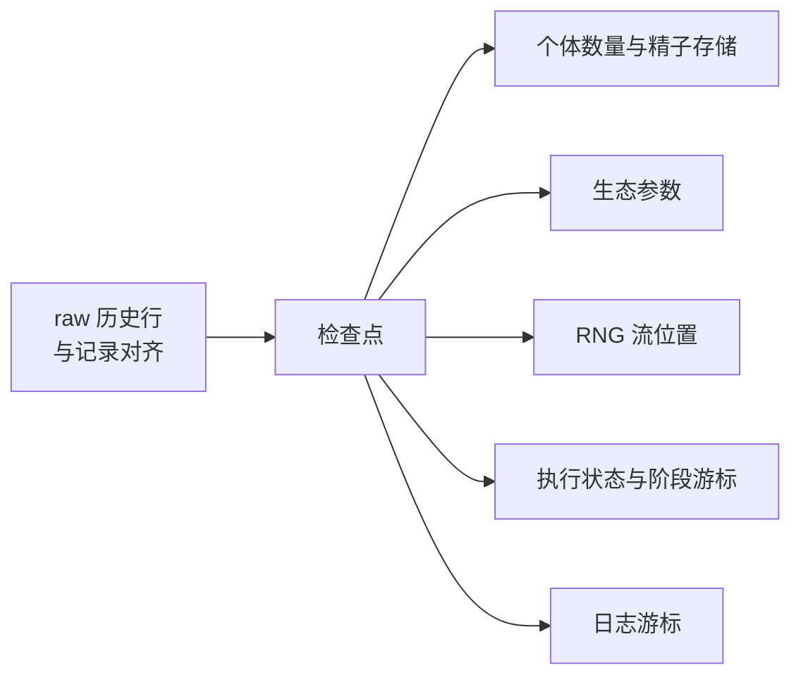

# 检查点恢复与实验重放

历史记录让过去可读；检查点让过去可以**重新出发**。这一章说明一次恢复包含什么、恢复之后下一段轨迹为什么与原来一致、以及"导入状态"与"恢复检查点"的区别。

## 一次恢复包含什么

核验（一次完整对照）：

| 项目 | 恢复后 |
| --- | --- |
| tick | 回到精确的记录 tick（3） |
| 数量 | 与该 tick 记录的一致 |
| 后续历史行 | 截断到该 tick：`ticks == (0, 1, 2, 3)` |
| 参数修改 | 记录之后做的 `carrying_capacity` 修改被撤销，回到记录值 |
| RNG | 从记录的流位置继续，而不是重新播种 |
| 执行状态 | 恢复为记录时的状态（`Ready`/`Stopped`/`Failed`） |

**RNG 的"继续"语义值得单独核验**：种子 17 的种群跑到 tick 4 记下末行，回到 tick 2 再跑到 tick 4，得到逐位相同的末行。这说明恢复没有把随机流倒回起点——否则第二段轨迹会与第一段不同。

## 导出/导入状态与恢复检查点的区别

| 维度 | `restore_checkpoint(tick)` | `import_state(...)` |
| --- | --- | --- |
| 数据来源 | 会话内与历史行对齐的检查点 | 调用方提供的状态 |
| 时间线 | 截断到该 tick，保留更早的历史 | **清空**历史，从零开始 |
| 生态参数 | 恢复到记录值 | 不涉及 |
| RNG | 恢复到记录的流位置 | 重新初始化 |
| 用途 | 重放、分支实验 | 外部构造状态、跨对象搬运 |

核验：`export_state()` 之后继续跑到 tick 4，再 `import_state(exported)`，历史 ticks 变成空元组——时间线从头开始，而不是回到导出时的 tick 3。两者都能"回到过去"，但语义完全不同，混用会让"下一段轨迹为什么不一样"难以解释。

## 遗传表不会被回滚

检查点保存的是**运行状态**（数量、精子、生态参数、RNG、执行位置），不包含遗传张量。核验：记录检查点后把 M 表的一行改成合法但不同的分布，再恢复该检查点，改过的行**保持修改后**的值——遗传表不在回滚范围内。

这正是"运行布局不随检查点变化"的自然结果：类型身份、M、F、P 属于发布后的布局，改变它们需要重编译（见[运行参数如何读取和更新](runtime_updates.md)）。如果恢复检查点同时把 M 表退回旧内容，会话的结构与派生张量就会不一致。

## 边界与限制

| 情形 | 行为 |
| --- | --- |
| 历史为空 | `ValueError: No history available for checkpoint restore.` |
| observation 模式的历史 | `ValueError`，消息说明该模式无法恢复 |
| tick 不在历史中 | `ValueError: Tick n not found in history.` |
| 行已被 `max_rows` 淘汰 | 对应检查点不可恢复 |
| 恢复后再向前跑 | 从记录边界继续；已提交的遗传更新不受影响 |
| 检查点保留策略 | 可用 `retain_checkpoints_from` / `truncate_checkpoints` 控制 |

## 改动会影响谁

| agent 的建议 | 判断依据 |
| --- | --- |
| 用检查点回滚一次遗传规则变更 | 遗传表不在检查点内；需要重建模型 |
| 用 `import_state` 复现一次实验分支 | 它会清空时间线；分支重放应用 `restore_checkpoint` |
| 认为恢复会重播种 | 恢复继续原随机流；重播种会让后续轨迹与原来不同 |
| 在 observation 模式下做检查点实验 | 该模式无法恢复；先改为 raw |
| 依赖已被淘汰的行对应的检查点 | 淘汰同时使检查点失效 |

## 实现定位与核验依据

| 实现入口 | 本章对应职责 |
| --- | --- |
| [population/base.py](https://github.com/jyzhu-pointless/natal-core/blob/main/src/natal/frontend/population/base.py)：`restore_checkpoint()`、`export_state()` | 恢复入口、状态导出与时间线截断 |
| [population/discrete_generation.py](https://github.com/jyzhu-pointless/natal-core/blob/main/src/natal/frontend/population/discrete_generation.py)：`import_state()` | 导入状态与时间线重置 |
| [backends/rust/rust_backend.py](https://github.com/jyzhu-pointless/natal-core/blob/main/src/natal/backends/rust/rust_backend.py)：`restore_from_checkpoint()`、`retain_checkpoints_from()`、`truncate_checkpoints()` | 原生检查点通道 |
| [rust/src/sessions/discrete_generation.rs](https://github.com/jyzhu-pointless/natal-core/blob/main/rust/src/sessions/discrete_generation.rs) | 检查点内容：状态、生态、RNG、执行状态 |

本章的精确 tick 恢复、历史截断、参数回滚、RNG 继续、导入状态清空时间线与遗传表不回滚均由同一组输入核验。既有测试中，[test_run_state_and_recording_lifecycle.py](https://github.com/jyzhu-pointless/natal-core/blob/main/tests/test_run_state_and_recording_lifecycle.py) 与 [test_native_session_contracts.py](https://github.com/jyzhu-pointless/natal-core/blob/main/tests/test_native_session_contracts.py) 保护检查点与恢复路径。

下一步阅读后续的《从开发需求到可验收的改动》一章。
