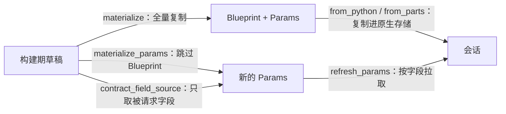

# Python 与 Rust 如何交换模型数据

[发布](publication.md)完成后，模型还是 Python 侧的一组数组；真正运行它需要把这些数组交给原生会话。这一章解释那次交接：交出去的是什么、以什么格式、谁负责校验，以及"构建期传输"和"运行期更新"为什么不是同一条路径。

## 两个合同对象

| 合同 | 内容 | 变化频率 |
| --- | --- | --- |
| `Blueprint` | 维度、执行开关、类型名称目录、初始数量与初始精子、deme 数与迁移 CSR | 构建期固定，重建才能改 |
| `Params` | 全部运行期可变值：生态标量、各速率与 fitness 张量、遗传表、自定义槽、迁移率列 | 运行期可改 |

分工的理由很直接：任何"运行期想改"的东西都必须有可变通道，所以它们统一放在 `Params`；而"改了就必须重建"的东西放在只读的 `Blueprint`。把维度或初始数量当作运行期参数，会让一个正在推进的会话失去自洽。

原生侧对应三个结构：`Blueprint`（冻结规范）、`EcologyParams`（按 deme 存放的运行期生态列）、`GeneticsTensors`（可被多个 deme 共享的遗传张量）。

## 字段转换表（节选）

两侧的字段名并不总是相同，转换在 `materialize()` 中集中完成：

| 草稿字段 | 合同字段 | 形状 |
| --- | --- | --- |
| `carrying_capacity` | `carrying_capacity` | 标量 |
| `juvenile_growth_mode` | `growth_mode` | 标量（整数枚举） |
| `age_based_survival_rates` | `survival_rates` | `(sex, age)` |
| `age_based_mating_rates` | `mating_rates` | `(sex, age)` |
| `female_age_based_fertility` | `fertility` | `(age,)` |
| `zygotes_to_gametes_map` | `meiosis_map` | `(2, Z, G)` |
| `gametes_to_zygotes_map` | 无对应合同字段——留在 Python 侧，构建期作为派生 `offspring_tensor` 的后代张量内核输入 | `(G, G, Z)` |
| `offspring_tensor` | `offspring_tensor` | `(Z, Z, Z)` |
| `initial_individual_count` | `initial_individual_count`（Blueprint） | `(2, A, Z)` |

`external_expected_eggs` 与 `equilibrium_individual_distribution` 使用哨兵值表示"未声明"：分别是负数和 `(0, 0)` 空矩阵。它们不是"0 个卵"或"没有平衡分布"的另一种写法，读取方必须先判断哨兵。

## dtype、连续内存与所有权

- 交给内核的每个数组都会被重新复制为 **float64 且 C 连续**；整数与布尔数组分别用 int64 与 bool。
- Rust 侧用 `extract_f64_vec()` 一类的读取器取值：它要求入参是 C 连续的 float64 数组，**非连续或带步长的视图会被拒绝**，而不是被悄悄重排。
- 复制方向是单向的：`materialize()` 复制出合同，Rust 再复制进自己的存储，因此原生会话不持有任何 Python 数组的视图。
- `Blueprint` 的数组在构造时被标记为只读；`Params` 的数组是可写的副本，但写 Python 侧的副本不会影响会话。

## 谁负责校验

| 检查 | 位置 | 例子 |
| --- | --- | --- |
| 形状与语义 | Python 构建期 | 投影后的每个带轴字段都要与运行布局一致 |
| 概率表合法性 | Python 侧 `validate_meiosis_table()` | 行和不为 1 或出现负值即拒绝 |
| 取值域 | Rust 侧 `validate_state_values()` / `validate_scalar_value()` | 数量为 NaN 或负数、tick 为负 |
| 参数通道写入 | 参数写入路径 | 形状不符时报 `expected 6 elements, got 9`；未知字段名报 `AttributeError` |

校验责任不能全部推到一侧：Python 知道模型的语义（哪些字段该有什么形状与含义），Rust 知道运行期的不变量（状态不能是负数）。两边都拒绝非法输入，且都给出可定位的错误，而不是回退到默认值。

## 构建传输与运行更新的区别

三条入口的差别只在**复制多少**，不在语义：

- `materialize()`：构建期全量传输，产出 `Blueprint` 与 `Params`。
- `materialize_params()`：运行期刷新参数，跳过 Blueprint；用于"只改参数、不改布局"的场景。
- `contract_field_source()`：只重建被请求的字段，且当某个数组本来就是 C 连续的 float64 时**不复制**，直接把它交给参数通道（Rust 读取时仍会复制）。

迁移率列是特例：它有自己的列写入通道，不出现在通用字段源表里。把它当作普通张量写入会被拒绝。

## 改动会影响谁

| agent 的建议 | 判断依据 |
| --- | --- |
| 把维度或初始数量改成运行期可改 | 它们在 Blueprint 中；改这些需要重建会话，而不是写参数 |
| 直接在 Python 侧改 `Params` 数组来影响会话 | 那是副本；要用参数通道或更新器 |
| 传入一个切片视图作为张量 | 非连续数组会被 Rust 读取器拒绝；先 `np.ascontiguousarray` |
| 用 0 表示"未声明" | 外部期望卵数与平衡分布用哨兵值；0 有真实含义 |
| 在运行期刷新参数时重建 Blueprint | 有 `materialize_params()` 与字段源通道，重建是多余开销 |

## 实现定位与核验依据

| 实现入口 | 本章对应职责 |
| --- | --- |
| [contracts/blueprint.py](https://github.com/jyzhu-pointless/natal-core/blob/main/src/natal/contracts/blueprint.py) | 冻结合同的字段与 `frozen()` |
| [contracts/params.py](https://github.com/jyzhu-pointless/natal-core/blob/main/src/natal/contracts/params.py) | 运行期可变合同的字段 |
| [contracts/materialize.py](https://github.com/jyzhu-pointless/natal-core/blob/main/src/natal/contracts/materialize.py) | 字段转换、复制、哨兵与字段源表 |
| [rust/src/model/python.rs](https://github.com/jyzhu-pointless/natal-core/blob/main/rust/src/model/python.rs) | 原生读取器与连续性要求 |
| [rust/src/model/validation.rs](https://github.com/jyzhu-pointless/natal-core/blob/main/rust/src/model/validation.rs) | 状态与取值域校验 |
| [backends/rust/rust_backend.py](https://github.com/jyzhu-pointless/natal-core/blob/main/src/natal/backends/rust/rust_backend.py) | 会话创建与参数刷新适配 |

本章的复制隔离、只读冻结、连续性要求、字段源不复制与哨兵形状均由同一组输入核验。既有测试中，[test_contracts_materialize.py](https://github.com/jyzhu-pointless/natal-core/blob/main/tests/test_contracts_materialize.py) 与 [test_native_session_contracts.py](https://github.com/jyzhu-pointless/natal-core/blob/main/tests/test_native_session_contracts.py) 保护合同映射与原生会话行为。

下一步阅读[会话如何推进一次模拟](runtime.md)，看这些数据如何在原生会话里被推进。
