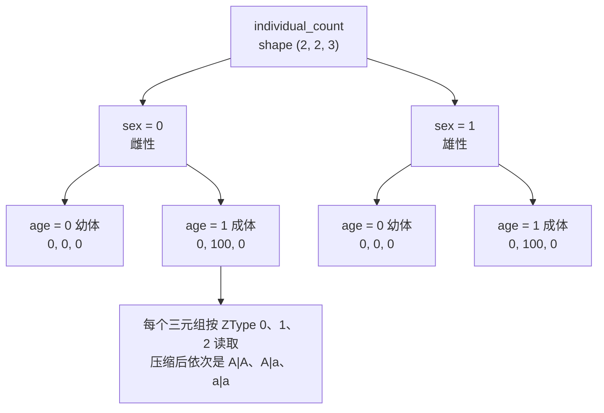

# 类型目录、索引与数组坐标

[上一章](genetic_objects.md)把生物学概念变成了对象；本章把对象变成数组下标，并回答一个更具体的问题：同一个个体，在数量数组、遗传表、观测结果和历史记录里，分别落在哪个位置、用哪个名字表示。

本章沿用样章模型：`chr1` 上一个基因座，等位基因 A、a、X，初始 100 个杂合雌性与 100 个杂合雄性。所有数字都经过本地核验，包括索引、名称、扁平偏移和错误类型。

## 两个编号空间

对象适合比较和推导，数组只认整数。项目用两个编号空间连接两者：

| 空间 | 元素 | 由谁分配 | 谁来消费 |
| --- | --- | --- | --- |
| ZType | 二倍体基因型 × 体细胞标签 | `IndexRegistry.register_ztype()` | 个体数量、fitness、M、F、P、观测、历史 |
| GType | 单倍体基因型 × 配子标签 | `IndexRegistry.register_gtype()` | 遗传表 M、F 的配子轴 |

[IndexRegistry](https://github.com/jyzhu-pointless/natal-core/blob/main/src/natal/frontend/registry/index.py) 是这两个空间的唯一权威。它有三条不变量：

1. **注册顺序就是索引**：新条目追加在末尾，历史索引在压缩前保持不变。
2. **发布前可变、发布后只读**：`mark_published()` 之后任何注册都报 `RuntimeError: published registry is immutable`，压缩也不再允许。
3. **不存在的组合就是不存在**：查询未注册的 `(基因型, 标签)` 组合会抛 `KeyError`，不会返回一个“大概是零”的位置。

第三条尤其重要。它把“这一格是 0 个个体”和“这一格在这个模型里根本不存在”区分开；把两者混淆，就会出现“程序正常算完了，但把数量写进了错误的基因型”这种情况。

## 完整目录长什么样

物种声明 A、a、X 之后，完整目录有 6 个 ZType 与 3 个 GType：

| 完整 ZType 索引 | 基因型 | 标签 | 完整 GType 索引 | 单倍体 | 标签 |
| --- | --- | --- | --- | --- | --- |
| 0 | A\|A | default | 0 | A | default |
| 1 | A\|a | default | 1 | a | default |
| 2 | A\|X | default | 2 | X | default |
| 3 | a\|a | default | | | |
| 4 | a\|X | default | | | |
| 5 | X\|X | default | | | |

索引顺序来自物种枚举顺序（见上一章），标签在同一个基因型内部相邻：多标签物种会得到 `A|A@default`、`A|A@wolbachia`、`A|a@default`……这样的排列。

“完整”是关键词：这份目录包含**模型允许的全部类型**，而不是当前数量非零的类型。X 类型的数量从一开始就是 0，但它在完整目录里占 2、4、5 三个位置。发布阶段才会把不可达类型删掉，届时索引会整体重排，详见[可达性、索引压缩与模型发布](publication.md)。本章后面会强调这件事为什么危险。

## 数组的轴

数量张量的轴是 `(sex, age, ZType)`：

- **sex**：`Sex.FEMALE = 0`、`Sex.MALE = 1`，直接当数组下标使用。
- **age**：年龄槽。普通离散模型固定为 2 个槽：age 0 是本步产生的幼体，age 1 是参与繁殖的成体。它们表示生命周期角色，不是两个任意长度的现实年龄区间；年龄结构模型可以声明更多槽。
- **ZType**：上一节的类型索引，最后一轴。



图中的三元素序列都按 ZType 顺序读取，取值是构建结束、尚未运行时的状态。跑一步之后，同一批 age-1 格子会变成 `12.5, 25, 12.5`：旧成体被替换，而不是与后代相加。

样本模型压缩后是 `(2, 2, 3)`；未压缩时是 `(2, 2, 6)`，多出来的三格始终为零。两种布局的**轴含义相同、轴长度不同**，这正是下一节要处理的坐标问题。

`natal.frontend.data.state.state_axes()` 是读取轴长度的统一入口：遇到 rank-2 的 `(sex, ZType)` 张量时，它按“只有一个年龄槽”解释，因此投影输入与状态输入共用同一段代码。

## 扁平偏移

会话与历史之间传递的不是多维数组，而是一维行。理解行的排布，是判断“agent 说的下标对不对”的唯一办法。

数量张量按 C 顺序展开为 `(sex, age, ZType)`，前面再放一个 tick：

```text
offset(0)                                        = tick
offset(1 + (sex * n_ages + age) * n_ztypes + z)  = 该格的个体数量
```

在样本模型上（`n_ages = 2`、`n_ztypes = 3`），整行长度是 `1 + 2×2×3 = 13`：

| 偏移 | 内容 | 偏移 | 内容 |
| --- | --- | --- | --- |
| 0 | tick | 7 | 雄性 age-0 的 ZType 0 |
| 1 | 雌性 age-0 的 ZType 0 | 8 | 雄性 age-0 的 ZType 1 |
| 2 | 雌性 age-0 的 ZType 1 | 9 | 雄性 age-0 的 ZType 2 |
| 3 | 雌性 age-0 的 ZType 2 | 10 | 雄性 age-1 的 ZType 0 |
| 4 | 雌性 age-1 的 ZType 0 | 11 | 雄性 age-1 的 ZType 1 |
| 5 | 雌性 age-1 的 ZType 1（初始为 100） | 12 | 雄性 age-1 的 ZType 2 |
| 6 | 雌性 age-1 的 ZType 2 | | |

年龄结构模型在数量块之后追加一段精子存储，形状是 `(age, 雌性 ZType, 雄性 ZType)`，整行长度变成 `1 + n_sexes×n_ages×n_ztypes + n_ages×n_ztypes²`。以 `2×2×3` 与 `2×3×3` 为例，前 12 格是数量、随后 18 格是精子，`精子[age=1, 雌=2, 雄=1]` 落在偏移 `13 + (1×3 + 2)×3 + 1 = 29`。注意精子块的轴是“年龄在前、性别的角色在类型轴两侧”，与数量块的 `(sex, age, ztype)` 不同。

历史行、检查点与快照共用这套排布；空间模型在最外层再加一条 deme 轴，见[空间执行与迁移](spatial.md)。

## 名称映射：数字要能被解释

只有整数下标的结果无法核对，因此每一层都带一份名称目录：

| 位置 | 形态 | 样本模型中的值 |
| --- | --- | --- |
| `Blueprint.ztype_names` / `gtype_names` | 元组，按索引排列 | `('A|A@default', 'A|a@default', 'a|a@default')` |
| 观测结果的 `labels["group"]` | 每个观测组一个名称 | 同上 |
| 观测结果的 `axes` | 轴名 | `('group', 'sex', 'age')` |
| 历史记录的 `axes` | 轴名 | `('record', 'sex', 'age', 'ztype')` |

三个可以立刻核对的规律：

- 名称一律带 `@标签` 后缀，默认标签也写出来（`@default`），因此名称在同一个目录内不会重复。
- 数量张量的 `(sex, age, ztype)` 与观测的 `(group, sex, age)` 轴顺序不同：观测把 ZType 挪成了最外层分组，`obs.values` 等于 `state.individual_count.transpose(2, 0, 1)`。想把两者对上，必须显式转置，不能靠“形状看起来差不多”。
- 历史记录多一条 `record` 轴，形状是 `(record, sex, age, ztype)`，在样本模型上为 `(2, 2, 2, 3)`。

还有一个已经核验、但不在名称目录保证范围内的行为：无序基因型的**拼写**取决于谁先构造它。先在同一个物种上解析 `"a|A"`，运行目录里就会写成 `a|A@default`，而索引位置与数值完全不变（杂合子仍在索引 1，初始数量仍是 `[0, 200, 0]`）。名称是可解析的符号，不是跨实例的身份凭证。

## 形状相同，语义不同

这是本节最需要带走的内容，也是“程序跑通”和“结果正确”之间最常见的裂缝。

样本模型里同时存在下面这些数组。请只看形状和语义，不要看字段名：

| 形状 | 字段 | 每个元素是什么意思 |
| --- | --- | --- |
| `(2, 2, 3)` | `initial_individual_count` | 每格的个体数量 |
| `(2, 2, 3)` | `viability_fitness` | 每格个体在生存阶段的乘数 |
| `(2, 3)` | `fecundity_fitness` | 该 sex·ZType 的母方对产卵量的贡献系数 |
| `(2, 3)` | `zygote_viability_fitness` | 该 sex·ZType 的**后代**在性别分配之后的存活乘数 |
| `(2, 2)` | `age_based_mating_rates`、`age_based_survival_rates` | sex·age 上的速率 |
| `(3, 3)` | `sexual_selection_fitness` | 雌性 ZType × 雄性 ZType 的配对权重 |
| `(2, 3, 2)` | `zygotes_to_gametes_map`（M） | sex·ZType 产生各 GType 的概率 |
| `(2, 2, 3)` | `gametes_to_zygotes_map`（F） | 两个配子形成哪种 ZType |
| `(3, 3, 3)` | `offspring_tensor`（P） | 雌雄亲本 ZType 产生各 ZType 的期望数 |

注意 M 是 `(2, 3, 2)` 而 F 是 `(2, 2, 3)`：两者形状互为镜像，多一个轴的理解错误就会让配子轴和类型轴互换，而数组运算照样完成。

核验过的两个具体后果：

1. 把同一个 `(2, 3)` 数组 `[[0.5, 0.5, 0.5], [1, 1, 1]]` 分别写进两个通道，结果不同。写进 `fecundity_fitness` 时，雌性亲本的产卵量减半，两性后代都变成 `12.5 / 25 / 12.5`（合计 100 而非 200）；写进 `zygote_viability_fitness` 时，只有雌性**后代**减半，结果是雌 `12.5 / 25 / 12.5`、雄 `25 / 50 / 25`（合计 150）。
2. 把 `initial_individual_count`（数量）整份写进 `viability_fitness`（乘数）不会报错：两者都是 `(2, 2, 3)`。它的后果是 age-0 的乘数变成 0，整批幼体消失，一步之后种群归零。

形状校验能拦住什么、拦不住什么，也有明确边界：写一个 `(3, 3)` 进 `fecundity_fitness` 会被拒绝，错误信息是 `expected 6 elements, got 9`；但形状正确的语义错误不会被拒绝，因为**轴的长度相同并不代表轴的含义相同**。

能区分这两种方案的证据也应该具体：不要只看“总量对不对”，而要检查早/晚阶段的数量分布（繁殖后、生存后），并在单类型上做扰动——把某一个 ZType 的系数改成 0.5，观察是“母方产卵减少”还是“某类后代减少”。总量相同的错误实现在这一步会分开。

## 发布改变索引语义

发布阶段会删除遗传上不可达的类型，索引随即重排。样本模型的变化是：

| 类型 | 完整索引 | 运行时索引 |
| --- | --- | --- |
| A\|A | 0 | 0 |
| A\|a | 1 | 1 |
| a\|a | 3 | 2 |
| A\|X、a\|X、X\|X | 2、4、5 | 已删除 |

于是“索引 2”在两个阶段指的不是同一个基因型：发布前是 A|X，发布后是 a|a。所有会长期保存或在运行期使用的坐标，都必须在最终索引上解析后再落盘：

- Hook 的选择器与观测组（构建期编译，绑定最终索引）；
- 历史的维度名与名称目录；
- 检查点中的状态数组。

这条规则解释了为什么“形状相同”不能用来判断两份模型布局兼容：还要求类型身份、顺序与名称目录一致。

## 边界与错误

| 情形 | 结果 |
| --- | --- |
| 查询未注册的 `(基因型, 标签)` | `KeyError` |
| 向已发布注册表注册新类型 | `RuntimeError: published registry is immutable` |
| 向参数通道写入轴长不符的张量 | `ValueError`，消息给出期望与实际元素数 |
| rank-2 数量张量 | 视为只有一个年龄槽，不视为错误 |
| 未知字段名 | 写入被拒绝（`AttributeError`，消息点名缺失的字段），不会静默落到别的字段 |

## 改动会影响谁

| agent 的建议 | 判断依据 |
| --- | --- |
| 直接按索引写数量数组 | 索引随压缩改变；应使用类型名或选择器，并说明运行的是哪个布局 |
| 追加一个数组列来承载新状态 | 轴长度变化会传导到 fitness、遗传表、观测和历史名称 |
| 用 `(2, 2, 3)` 现有数组“顺手”承载新含义 | 形状校验不会拦；需要新的字段或显式的语义说明 |
| 靠名称匹配两份运行结果 | 名称拼写可能随首次构造改变；应比较索引与其对应的类型身份 |
| 在压缩后的模型上使用构建期记录的索引 | 完整索引与运行时索引不同，必须重新解析 |

## 实现定位与核验依据

| 实现入口 | 本章对应职责 |
| --- | --- |
| [registry/index.py](https://github.com/jyzhu-pointless/natal-core/blob/main/src/natal/frontend/registry/index.py) | ZType/GType 注册、查询、压缩与发布锁定 |
| [builder/_registry_builder.py](https://github.com/jyzhu-pointless/natal-core/blob/main/src/natal/frontend/builder/_registry_builder.py) | 完整目录的构建顺序 |
| [data/state.py](https://github.com/jyzhu-pointless/natal-core/blob/main/src/natal/frontend/data/state.py) | `state_axes()`、`flatten_all()`、扁平行往返 |
| [contracts/blueprint.py](https://github.com/jyzhu-pointless/natal-core/blob/main/src/natal/contracts/blueprint.py)：`format_type_name()` | 名称目录的 `@标签` 格式 |
| [contracts/materialize.py](https://github.com/jyzhu-pointless/natal-core/blob/main/src/natal/contracts/materialize.py) | 字段名到草稿字段与形状的对应 |
| [output/observation.py](https://github.com/jyzhu-pointless/natal-core/blob/main/src/natal/frontend/output/observation.py) | 观测组标签与轴的顺序 |

本章的完整目录、压缩前后索引、扁平偏移（含偏移 5 与 11 的值）、历史与观测的形状、两个同形不同义的对照实验，都由同一组输入核验。既有测试中，[test_index_registry.py](https://github.com/jyzhu-pointless/natal-core/blob/main/tests/test_index_registry.py)、[test_tick_metrics_index_alignment.py](https://github.com/jyzhu-pointless/natal-core/blob/main/tests/test_tick_metrics_index_alignment.py) 与 [test_observation_age_axis_contract.py](https://github.com/jyzhu-pointless/natal-core/blob/main/tests/test_observation_age_axis_contract.py) 保护索引、轴对齐与观测轴合同。

下一步阅读[从声明到编译产物](model.md)，看这份目录是如何从声明中生成候选取值并在发布时被重排的。
