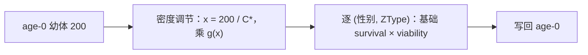

# 密度调节与平衡量如何计算

[生存](survival.md)阶段的第一个动作是密度调节：它决定幼体在被逐类型筛选之前，先整体放大或缩小多少。这一章解释那条曲线的输入输出、承载量与平衡量的关系，以及顺序为什么重要。

## 一个变量、一条曲线

所有模式共用同一个签名：

- `x` = 当前幼体竞争强度 ÷ 平衡竞争强度；
- `g(x)` = 施加在平衡生存率之上的缩放因子。

内置曲线（`r` 是低密度增长率）：

| 模式 | id | `g(x)` | `g(0)` | `g(2)`，r = 2 |
| --- | --- | --- | --- | --- |
| `no_competition` | 0 | 1 | 1 | 1 |
| `fixed` | 1 | `min(1, 1/x)` | 1 | 0.5 |
| `linear`（别名 `logistic`） | 2 | `max(0, r - (r - 1)x)` | `r` | 0 |
| `beverton_holt` | 3 | `r / (1 + (r - 1)x)` | `r` | 2/3 |
| `ricker` | 4 | `r^(1 - x)` | `r` | 0.5 |

三条共同性质在实现里有显式检查：`g(1) == 1`（精确）、随 `x` 单调不增、非负且有界。`r = 2` 时的数值已核验：`fixed` 在 `x = 2` 时给出 0.5，而 `beverton_holt` 给出 2/3；`linear` 在高竞争下可以到 0（整批幼体消失），`fixed` 只会等比削减。

注意 `fixed` 是**上限**而不是补偿：在平衡点以下它不放大（`g = 1`），只是把超过承载量的部分按比例削掉。补偿型曲线（`linear`、`beverton_holt`、`ricker`）在低密度时放大到 `r`。

## 平衡量从哪里来

平衡竞争强度 `C*` 与平衡生存率 `s*` 由当前参数按需推导，不保存为派生状态：

```text
分布： 年龄 1 的总量 = K；雌性 = K × 性别比 × s_f ÷ (性别比 × s_f + (1 − 性别比) × s_m)
       （即存活后的性比——两性 age-0 生存率相等时退化为出生性别比）；
       更老的年龄按前一个年龄的存活率衰减
产卵： produced = Σ(可繁殖年龄的雌性 × 繁殖参与率 × 生育力 × eggs_per_female)
C*  = produced × 幼体竞争权重 + Σ(幼体年龄数量 × 权重)
s_0 = 性别比 × 雌性 age-0 生存率 + (1 - 性别比) × 雄性 age-0 生存率
s*  = K ÷ (产卵量 × s_0)
```

核验：K = 100、每雌 2 卵、性别比 0.5、两性 age-0 生存率均为 0.5 时，推导出的平衡分布是雌 50 / 雄 50，产卵量 100，`C* = 100`、`s* = 100 ÷ (100 × 0.5) = 2`。把每雌产卵数改成 4 后，产卵量与 `C*` 变成 200，而 `s*` 变成 1。

两个容易误读的点：

- `s*` 可以大于 1。它是曲线的参考值，不是概率，不用于抽样。
- 声明了 `equilibrium_individual_distribution` 时直接使用它，不再按 K 推导；`external_expected_eggs` 只替换 `s*` 公式里的产卵量，不影响 `C*`。

## 顺序：密度调节在生存之前



核验过的对照（单位年龄-0 生存率，只看密度）：

| 配置 | `late` 幼体总量 |
| --- | --- |
| `no_competition` | 200 |
| `fixed`，K = 100 | 100 |
| `beverton_holt`，x = 2 | 133.3 = 200 × 2/3 |
| `beverton_holt`，x = 1 | 100（`g(1) = 1`） |
| `beverton_holt`，x = 0.5 | 66.7 = 50 × 4/3 |

同一组参数在固定 K 下给出 200 → 100 → 50（先缩放、再乘 0.5 的生存率），换成"先生存再缩放"会得到 200 × 0.5 = 100 → 100，两者数值相同但含义不同；把 K 或生存率改一改，差别立刻显现。这就是"顺序是可区分行为"的例子：只比较一次结果不足以判断顺序。

## 零平衡、阈值与退化

| 情况 | 行为 |
| --- | --- |
| `x ≤ 0`（没有幼体） | `fixed` 直接返回 1，不做除法 |
| `linear` 在高竞争下 `g ≤ 0` | 取 0：整批幼体被清零，这是合法的模型结果 |
| 产卵量或 `s_0` 接近 0 | 没有可解的尺度，`s*` 退化为 1，避免除零 |
| `growth_mode` 未知 | 声明期即报错；不存在"未知模式按无竞争处理"的回退 |

## 改动会影响谁

| agent 的建议 | 判断依据 |
| --- | --- |
| 用 `fixed` 当"硬性天花板" | 它确实是天花板，但在平衡点以下不放大；想要低密度增长要用补偿型 |
| 在 `beverton_holt` 上调大 `r` | `r` 同时改变 `g(0)` 与曲线形状；平衡点 `g(1) = 1` 不变 |
| 把密度调节挪到生存之后 | 顺序改变可观察结果；用 `fixed` + K 对照即可区分 |
| 用 `s*` 当作生存概率 | 它可能大于 1，是参考尺度 |
| 让未知模式退回无竞争 | 声明期会拒绝未知模式；不要依赖静默回退 |

## 实现定位与核验依据

| 实现入口 | 本章对应职责 |
| --- | --- |
| [kernels/density_regulation.rs](https://github.com/jyzhu-pointless/natal-core/blob/main/rust/src/kernels/density_regulation.rs) | 各曲线、`regulation_scaling()` 与曲线性质检查 |
| [kernels/equilibrium.rs](https://github.com/jyzhu-pointless/natal-core/blob/main/rust/src/kernels/equilibrium.rs) | `equilibrium_metrics()`：`C*` 与 `s*` 的推导 |
| [kernels/discrete_generation.rs](https://github.com/jyzhu-pointless/natal-core/blob/main/rust/src/kernels/discrete_generation.rs)：`scaling_factor()`、`recruit_juveniles()` | 竞争强度、缩放与重抽样 |
| [model/ecology.py](https://github.com/jyzhu-pointless/natal-core/blob/main/src/natal/frontend/model/ecology.py) | 平衡分布与外部期望卵数的声明形式 |

本章的五组曲线数值、`C*`/`s*` 的两组推导结果、顺序对照与退化行为均由同一组输入核验。既有测试中，[test_density_zero_equilibrium.py](https://github.com/jyzhu-pointless/natal-core/blob/main/tests/test_density_zero_equilibrium.py) 与 [test_default_growth_mode.py](https://github.com/jyzhu-pointless/natal-core/blob/main/tests/test_default_growth_mode.py) 保护曲线性质与默认模式。

下一步阅读[随机采样与可复现性](randomness.md)。
