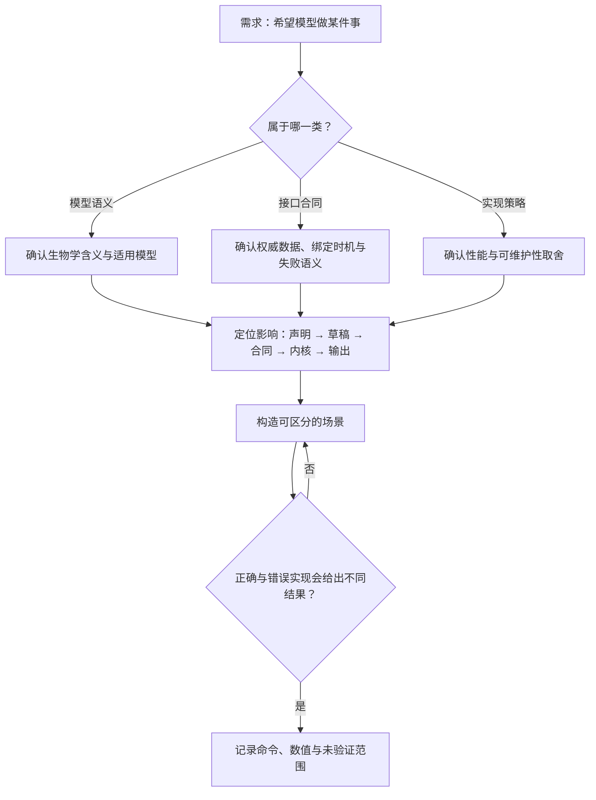

# 从开发需求到可验收的改动

前二十几章解释了机制。这一章把它们组装成工作方式：拿到一个需求时怎么问清楚、怎么定位影响范围、怎么比较方案，以及交付时该拿出什么证据。全文使用的判断标准只有一个——**改造之后哪一份数据成为权威，什么证据能区分对与错**。

质量门禁、风险分类和审批流程以仓库 [AGENTS.md](https://github.com/jyzhu-pointless/natal-core/blob/main/AGENTS.md) 与 [quality_checks_spec.md](https://github.com/jyzhu-pointless/natal-core/blob/main/quality_checks_spec.md) 为准，本章不复制它们的条文。

## 先分清三类改动

| 类别 | 例子 | 谁能回答"对不对" |
| --- | --- | --- |
| 模型语义 | 世代是否重叠、损失发生在哪个阶段、性比如何确定 | 生物学与研究设计 |
| 接口合同 | 快照与写入、事务边界、坐标绑定时机 | 仓库规范与既有测试 |
| 实现策略 | 是否压缩、是否复用缓存、数组如何布局 | 性能与可维护性 |

同一个需求往往同时碰到三类。以"给模型加一个会影响死亡的参数"为例：它是不是新的生物学过程（模型语义），它出现在 `Params` 还是 `Blueprint`（接口合同），以及它读的是哪一列（实现策略）。把三者分开，讨论才不会绕圈。

## 一张图：从一个需求到一组证据

## 四个案例走一遍

### 案例 A：新增生态参数

**先问清楚**：单位与量纲、默认值、合法范围、是否按 deme 变化、在哪个阶段生效、是否随检查点恢复、是否需要出现在参数日志里。

**再定位影响**：声明入口 → `ModelDraft` → 合同字段 → 原生生态列 → 阶段读取点 → 快照/日志/恢复。参考清单在[运行参数如何读取和更新](runtime_updates.md) 与[Python 与 Rust 如何交换模型数据](contracts.md)。

**验收证据**：一个能区分新旧行为的小模型（例如同一种群在两个取值下得到不同结果），加上"非法取值不会产生部分写入"的场景。若参数在空间模型可用，还要验证只改目标 deme 时其他 deme 不受影响。

### 案例 B：修改算法（例如改变密度调节顺序）

**先问清楚**：这是模型语义变更还是实现调整？如果改变结论，需要重新核验所有引用该算法的结果。

**再定位影响**：顺序变化会传导到阶段边界数量、Hook 可见状态、以及任何依赖"繁殖后/生存前"数值的检查。

**验收证据**：构造一个顺序敏感的参数组合（例如固定承载量 + 特定的基础生存率），使两种顺序给出不同结果；只比较总量的测试无法区分顺序。

### 案例 C：新增 Hook 操作

**先问清楚**：它作用于哪个选择集、在哪个事件、与既有操作如何排序、失败时保留什么。

**再定位影响**：编译期（去重、priority、选择器绑定）、原生解释器（操作码、边界提交）、事务（候选与提交）、以及保留集合（Hook 引用的类型会被保留在运行布局里）。

**验收证据**：作用域的坐标级断言（哪些格子变了、哪些没变）、与回调混合时的执行顺序、以及空选择在编译期报错。

### 案例 D：扩展观测或历史

**先问清楚**：新增的是分组、轴还是记录模式？会不会改变已有历史的含义？

**再定位影响**：观测组定义 → 掩码 → 记录计划 → 历史行列布局 → 名称目录。

**验收证据**：投影前后的轴与名称断言、聚合组的总量与逐组数值、以及"记录模式是否仍支持恢复"。

## 方案比较的四个问题

拿到 agent 的方案时，按顺序问：

1. **权威数据是谁**：改完之后，谁是当前状态的权威来源？是会话、草稿，还是某个 Python 缓存？
2. **绑定在什么时候**：名字在哪一步解析成索引？构建期、发布后，还是运行期？
3. **失败留下什么**：非法输入、回调抛错、停止分别留下什么？是否等价于整步回滚？
4. **什么证据能区分**：有没有一个场景，使正确实现与错误实现给出不同结果？如果两种方案在这个场景下表现相同，这个场景就不构成证据。

## 交付时该给出什么

| 项 | 内容 |
| --- | --- |
| 变更范围 | 改了哪些文件、哪些层（声明/合同/内核/输出） |
| 行为变化 | 之前是什么、之后是什么、对哪些既有结果有影响 |
| 验证证据 | 实际运行的命令与结果；数值预期来自哪里（手算、不变量、既有测试） |
| 未验证部分 | 没有覆盖的组合、没有运行的检查、以及原因 |
| 残留风险 | 已知的近似、位级差异、性能影响 |

数值与状态验证的具体做法见[如何验证数值、状态与跨语言行为](verification.md)。

## 常见误区

| 说法 | 问题 |
| --- | --- |
| "测试通过了，所以行为正确" | 测试只覆盖它断言的部分；没有断言的路径仍是未知 |
| "总量对上了" | 顺序、分组、索引错误都可能保持总量不变 |
| "改的是查询快照，不会有副作用" | 快照写入无效，但基于快照值做的决策可能已经错了 |
| "这是实现细节" | 若它改变了可观察结果，它就不是实现细节 |
| "文档已经这么写了" | 文档可能描述的是旧行为；以当前代码与测试为准，冲突时先确认合同 |

## 维护这套指南

- 中英两版必须同步；含义冲突时以英文版为准（见仓库 `AGENTS.md`）。
- 改动公开 API 时同步 `docs/zh/`、`docs/en/` 与相关示例。
- 源码文件移动或重命名后，检查本指南里的 GitHub 链接是否仍指向存在的路径。
- 新增带索引轴的字段时更新布局表；阶段或恢复行为变化时更新执行边界说明。
- 图表与正文一起更新：流程、所有权或阶段改变时，图里的箭头也要改。
- 表格里写基因型注意管道符：反引号内直接写成 `A|a`（不要转义，转义会在页面上显示多余的反斜杠）；反引号外的正文里则要写成转义形式，否则该行会被断成多一列。该结论在本仓库实测得出。

浏览器界面的独立代码位于 [根目录 ui/](https://github.com/jyzhu-pointless/natal-core/tree/main/ui)，Python 服务入口位于 [frontend/webui/](https://github.com/jyzhu-pointless/natal-core/tree/main/src/natal/frontend/webui)。核心模拟指南到这里结束；界面改动还应继续追踪 session、序列化、REST/WebSocket 协议与显示组件之间的数据链路。

下一步阅读[如何验证数值、状态与跨语言行为](verification.md)，或回到[阅读路线](index.md)重新选择入口。
