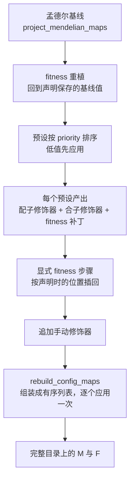

# 遗传预设与转换规则如何编译

[上一章](model.md)说到，编译会在完整目录上重建遗传映射。这一章展开那条流水线：孟德尔基线怎么算出来、预设与手动修饰器按什么顺序叠加、为什么重编译不会重复施加同一个转换，以及什么样的规则会破坏概率分布。

## 编译顺序

两个顺序来源必须一起看：预设之间由 `priority` 决定先后，而"预设"与"显式 fitness 步骤"之间的相对顺序由**声明时的位置**决定——每条 fitness 步骤记录自己声明的时刻已经应用了多少个预设，重编译时按这个计数插回原来的位置。因此先写 `fitness(...)` 再写 `presets(...)`，与反过来写，得到的结果可以不同。

核验过的重复应用行为，是本批最值得记住的一条：

| 声明方式 | 杂合子 A\|A 的配子行（A、a、X） | 说明 |
| --- | --- | --- |
| 无规则 | 1.00、0、0 | 基线 |
| 一条 A→X 突变规则（速率 0.1） | 0.90、0、0.10 | 按速率损失质量 |
| 同一个规则对象声明两次 | 0.90、0、0.10 | 同一个对象被去重，只应用一次 |
| 两个参数相同但对象不同的规则 | 0.81、0、0.19 | 各自应用一次，效果叠乘 |

结论很具体：**"声明了两次"不等于"应用了两次"**。去重按对象身份进行，两个等价但不同的规则对象会叠加。agent 说"这个转换只是重复声明，不会有事"时，需要问清楚重复的是同一个对象还是两份等价的声明。

## 基线：孟德尔映射

`project_mendelian_maps()` 在完整目录上生成 M 与 F：

- M 的每一行是"某性别、某 ZType 产生各 GType 的概率"，行和为 1。杂合子 A|a 的行是 `(0.5, 0.5, 0)`。
- F 的前两轴是配子来源，最后一轴是后代类型。A 配子与 a 配子指向 A|a；由于基因型是无序的，两个方向都计入：`F[0, 1]` 与 `F[1, 0]` 都指向同一个类型，漏掉一条会把杂合子的概率少算一半。
- 重组改变的是 M。核验案例：两个位点的双杂合子 `A/B|a/b` 在重组率 0.5 时，四个配子 `A/B`、`A/b`、`a/B`、`a/b` 各占 0.25；重组率为 0 时只有两个亲本型配子各占 0.5。

`rebuild_config_maps()` 拿到基线后，把收集到的修饰器按顺序应用一次，并再次把出生张量置为 `(0, 0, 0)` 占位——因为新映射意味着 P 需要重新推导。

## 预设与手动修饰器的分工

| 入口 | 展开成什么 | 顺序 |
| --- | --- | --- |
| `presets(HomingDrive(...))` | 一个配子修饰器、一个合子修饰器（若需要）与一组 fitness 补丁 | 按预设 `priority` |
| `modifiers(gamete_modifiers=[...], zygote_modifiers=[...])` | 直接给出的可调用对象或规则对象 | 排在全部预设之后 |
| `fitness(...)` | 直接写入 fitness 数组的显式步骤 | 按声明位置插回 |

预设是"打包好的规则集合"：它既可能改写配子映射（驱动、突变），也可能改写合子映射（转换规则），还可能同时打 fitness 补丁（例如降低携带者的适合度）。手动修饰器是同样的东西但不打包，适合一次性实验。

两类规则都作用在**完整目录**上，因此它们可以引用当前数量为零的类型——只要那个类型在闭包内。这也意味着"规则作用于某类型"与"该类型最终是否留在运行布局"是两件事：规则的引用会被记录为保留依据，剩余的仍由可达性决定。

## 预设的绑定与失败回滚

一个预设实例在第一次编译时绑定到某个物种。把同一个实例用到另一个物种会得到 `ValueError: Preset '...' is already bound to species '...' and cannot be applied to population species '...'`。这条约束保护的是预设内部按物种解析的选择器与索引。

编译失败时，`compile_definition()` 会把每个预设的物种绑定恢复到编译前的值，再把异常抛出。因此"失败的编译"不会留下半绑定状态，也不会发布任何产物。

## 规则必须保持概率分布

核验过：一条作用在 A|A 上的 A→X 突变规则把行从 `(1, 0, 0)` 变成 `(0.9, 0, 0.1)`，行和仍为 1。项目的检查入口是 `validate_meiosis_table()`：任何 (性别, ZType) 行不满足"和为 1 且非负"都会被拒绝，而不是被悄悄归一化。

这条约束解释了一个常见错误：为了让某类型"减少"，直接在 M 上减掉一部分质量，会让行和小于 1；正确的位置是 fitness（`viability_fitness`、`fecundity_fitness`、`zygote_viability_fitness`）或密度调节，而不是配子概率表。反过来，P 的推导允许"有概率损失"——核验中把 F 整体乘 0.5 之后，行和不再为 1，后代数量相应减少，这是被允许的模型表达，见[一次繁殖如何计算](reproduction.md)。

## 改动会影响谁

| agent 的建议 | 判断依据 |
| --- | --- |
| 声明两条相同的转换规则 | 同一个对象会被去重；两个等价对象会叠加，先确认想要哪个 |
| 改一条规则后重编译 | 编译从基线重新开始，不会在已修饰的表上继续叠加 |
| 调整预设顺序 | 顺序由 `priority` 与 fitness 声明位置共同决定，改一个可能改变另一个的相对位置 |
| 在 M 表里直接扣掉一部分概率 | 行和必须为 1；损失应表达在 fitness 或密度曲线 |
| 把预设实例复用到另一个物种 | 预设绑定物种，需要新建实例 |

## 实现定位与核验依据

| 实现入口 | 本章对应职责 |
| --- | --- |
| [genetics/compile.py](https://github.com/jyzhu-pointless/natal-core/blob/main/src/natal/frontend/genetics/compile.py)：`project_mendelian_maps()`、`compile_modifier_maps()` | 基线与修饰器应用 |
| [builder/_registry_builder.py](https://github.com/jyzhu-pointless/natal-core/blob/main/src/natal/frontend/builder/_registry_builder.py)：`rebuild_config_maps()` | 组装有序修饰器列表并应用一次 |
| [model/definition_compiler.py](https://github.com/jyzhu-pointless/natal-core/blob/main/src/natal/frontend/model/definition_compiler.py)：`compile_definition()` | 预设排序、fitness 插位、手动修饰器追加与失败回滚 |
| [presets/](https://github.com/jyzhu-pointless/natal-core/tree/main/src/natal/frontend/presets) | 打包好的规则集合（驱动、突变、细胞质等） |
| [modifiers/](https://github.com/jyzhu-pointless/natal-core/tree/main/src/natal/frontend/modifiers) | 单项转换规则的条件与可调用对象 |
| [genetics/matrices.py](https://github.com/jyzhu-pointless/natal-core/blob/main/src/natal/frontend/genetics/matrices.py)：`validate_meiosis_table()` | 行和为 1 的检查点 |

本章的突变数值（0.9/0.81 对照）、重组配子分布（0.25 × 4）、行和为 1 与预设绑定报错均由同一组输入核验。既有测试中，[test_point_mutation_dynamics.py](https://github.com/jyzhu-pointless/natal-core/blob/main/tests/test_point_mutation_dynamics.py) 与 [test_complex_genetics_e2e.py](https://github.com/jyzhu-pointless/natal-core/blob/main/tests/test_complex_genetics_e2e.py) 保护已有规则的端到端行为。

下一步阅读[可达性、索引压缩与模型发布](publication.md)，看这份完整目录如何变成最终运行布局。
