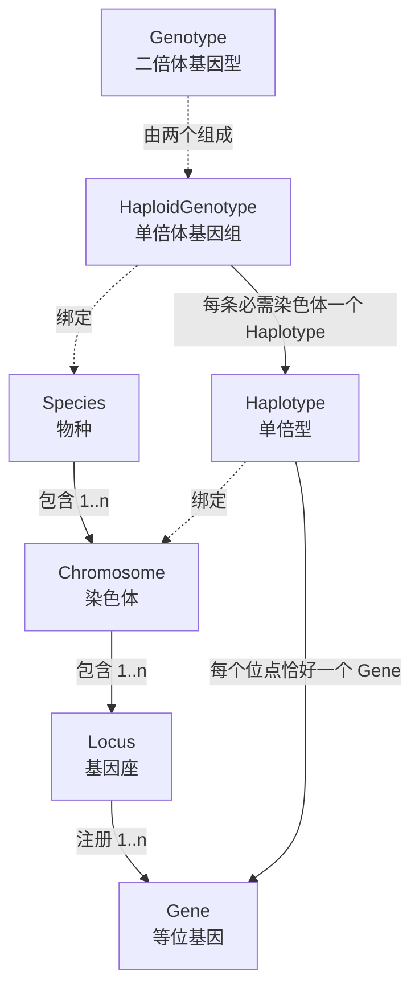

# 从生物学概念到遗传对象

上一章解释了分层；本章进入最下面那层：一个物种声明如何变成可以被枚举、比较和编号的对象。读完应该能回答三个问题：为什么项目里既有 `Species` 又有 `Genotype`；为什么“无序”和“标签”这两个看起来多余的概念必须存在；以及当 agent 说“只是加一个等位基因”时，实际会牵动什么。

本章沿用样章的物种：一条常染色体 `chr1`，一个基因座 `marker`，三个等位基因 A、a、X。所有数值都经过核验，命令见文末。

## 结构层与实体层

项目把“声明”和“由声明生成的对象”分成两层，这是理解后面一切的基础。

| 生物学概念 | 结构对象（声明） | 实体对象（生成物） |
| --- | --- | --- |
| 物种 | `Species` | `HaploidGenotype`（单倍体基因组）、`Genotype`（二倍体） |
| 染色体 | `Chromosome` | `Haplotype`（一条染色体上的等位基因序列） |
| 基因座 | `Locus` | 无独立实体，由基因座持有等位基因集合 |
| 等位基因 | 无独立结构，`Gene` 注册到 `Locus` 上 | `Gene`（也可写作 `Allele`） |

结构层描述“这个物种允许什么”，并且是唯一可以修改的地方：加染色体、加位点、注册等位基因都在这一层。实体层描述“在这些允许之中，当前讨论的是哪一个”，由结构层按需生成并缓存。[Species](https://github.com/jyzhu-pointless/natal-core/blob/main/src/natal/frontend/genetics/structures/species.py)、[Chromosome](https://github.com/jyzhu-pointless/natal-core/blob/main/src/natal/frontend/genetics/structures/chromosome.py)、[Locus](https://github.com/jyzhu-pointless/natal-core/blob/main/src/natal/frontend/genetics/structures/locus.py) 属于前者，[Gene](https://github.com/jyzhu-pointless/natal-core/blob/main/src/natal/frontend/genetics/entities/gene.py)、[Haplotype](https://github.com/jyzhu-pointless/natal-core/blob/main/src/natal/frontend/genetics/entities/haplotype.py)、[Genotype](https://github.com/jyzhu-pointless/natal-core/blob/main/src/natal/frontend/genetics/entities/genotype.py) 属于后者。

## 对象关系图

下图只画“包含”和“绑定”两种关系，不画继承。读图时请区分：实线是结构之间的包含，虚线是实体绑定到哪个结构。



由此得到两条容易记错的规则。第一，`Gene` 绑定的是**基因座**而不是染色体：染色体只管“哪些位点连在一起”，等位基因始终属于位点。第二，`Locus` 没有自己的实体对象：在一个单倍体里，位点的状态就是“该位点上选了哪个基因”，这件事由 `Haplotype` 表达。基因组的完整单倍体是 `HaploidGenotype`，二倍体再把它配对成 `Genotype`。

`Species` 在结构层的实体类型正是 `HaploidGenotype`，这也是为什么同一个物种对象既能枚举单倍体、又能构造二倍体。

## 声明顺序决定枚举顺序

本例声明 A、a、X 之后，物种可以枚举出六种无序基因型：

```text
A|A、A|a、A|X、a|a、a|X、X|X
```

顺序不是按名称排序，而是由声明顺序与枚举方式决定：先枚举单倍体（三个等位基因各成一个），再按“先出现的作母方”组合。`A|X` 排在 `a|a` 之前，正是因为 X 是在 a 之前注册的。

位点的 `position` 同样来自声明：未指定时取同染色体现有位点的最大值加一。它只影响重组图的相邻关系，不影响基因型的排列。改变声明顺序会让目录编号整体改变，这一点在[类型目录、索引与数组坐标](data_layout.md)里会带来实际后果：编号是位置，不是身份。

## 对象身份：同名同结构只有一个实例

实体有三个不变量：必须绑定结构、创建时自动注册到结构、同一个物种下同名同结构返回同一实例。

```text
Gene("A", locus=locus) is locus.alleles[0]      → True：同名同基因座
Species.get_gene("A") is locus.alleles[0]       → True：物种级名称索引
```

缓存键是 `(物种身份, 结构类型, 结构名, 实体类, 名称)`，所以在同一个 `Species` 内部，“A|a”的两种写法拿到的是同一个对象；不同 `Species` 之间不共享。可以用 `Species.clear_entity_cache()` / `clear_all_caches()` 清空。

这条性质不是细节优化，而是被下游依赖：

- `Genotype.is_homozygous_at(locus)` 直接用 `is` 比较两个等位基因对象，不比较字符串。
- 索引注册表用 `(Genotype, slab_label)` 元组作为键，依赖 `Genotype` 对象的稳定身份。
- 枚举得到的对象集合可以直接当作缓存命中，不必每次重建。

代价是：**任何对声明顺序的修改都必须让缓存失效**。项目通过物种级失效入口处理（例如注册基因时让基因名索引失效），而不是让调用者手动清理。

## 名字从哪里来

实体名由组成它的东西拼出来，规则固定且可以反向解析：

| 层次 | 拼法 | 本例 | 多位点示例 |
| --- | --- | --- | --- |
| `Haplotype` | 基因名用 `/` 连接 | `A` | `A/B` |
| `HaploidGenotype` | 单倍型名用 `;` 连接 | `A` | `A/B;C` |
| `Genotype` | 每条染色体一段“母\|父”，段间用 `;` | `A|a` | `A/B|a/B;C|C` |

因此 `A|a` 是可往返解析的字符串：`Species.get_genotype_from_str()` 按同一套语法把它还原成对象。解析语法在模式匹配里还会扩展出 `::`（无序对）、`*`（任意）和 `{A,B}`（集合），详见[模式与选择器](selectors.md)。

### 无序：`A|a` 与 `a|A` 是同一个对象

二倍体基因型记录母方与父方两套单倍体，但很多模型并不关心基因来自哪一方。`Species(unordered=True)`（默认）下，构造时会逐位点比较等位基因的注册序号，把较小的排在母方：

```text
get_genotype_from_str("a|A") is get_genotype_from_str("A|a")   # True
```

于是无序物种只有六种基因型；把 `unordered=False` 打开会得到九种，其中 `A|a` 与 `a|A` 是两个对象。多位点差异更大：一条染色体上三个位点、每个位点两个等位基因的物种，有序模式有 64 种、无序模式只有 27 种（每个位点各自合并）。

合并是**逐位点**的，不是按字符串排序：性别染色体类型不同时（X|Y、Z|W）保留亲本顺序，因为“父方提供 Y”本身携带信息。

这里有一个已经核验、但不直观的行为：身份是规范的，**渲染出的拼写却取决于谁先构造**。先在同一个物种上解析 `"a|A"`，之后再枚举，得到的仍是同一个对象，但它的名字是 `a|A`；运行目录里也会写成 `a|A@default`。索引位置和数值都不受影响，改变的只是符号。

因此：名称适合展示和解析，不适合作为跨实例的身份凭证。要比较两个模型是否描述同一种基因型，应比较对象或索引，而不是字符串。

## 标签：把“同一个基因型的不同状态”分开

标签（label）是物种级的目录，和基因型正交：

- `somatic_labels` 与基因型叉积，形成 **ZType**：一个个体的身份是“基因型 + 体细胞标签”。
- `gamete_labels` 与单倍体基因型叉积，形成 **GType**：一个配子的身份是“单倍体基因型 + 配子标签”。

在本例上声明 `somatic_labels=["default", "wolbachia"]` 与 `gamete_labels=["default", "drive"]`，目录立刻从 6 个 ZType / 3 个 GType 变成 12 个 ZType / 6 个 GType：

```text
ZType 0：A|A@default      ZType 1：A|A@wolbachia      …        ZType 11：X|X@wolbachia
GType 0：A@default        GType 1：A@drive            …
```

注意展开方式：先注册的标签排在前面，同一个基因型的全部标签相邻。没有显式声明标签时，物种会补上 `default` 一项，这就是样章里 `A|a@default` 的来源。

标签解决的问题是：感染状态、转基因背景这类“不改变基因型但要单独计数”的信息，不应该通过增加等位基因来表达。代价同样直接——每个标签都会复制一整条类型轴，数量、fitness、遗传表和输出都会一起变宽。

## 性别染色体与性别来源

染色体可以声明 `sex_type`：`X`、`Y`、`Z`、`W` 或省略（常染色体）。声明之后：

- `Species.sex_system` 推断出 `"XY"` 或 `"ZW"`；同时出现两套系统会报错。
- 合法组合由结构推导：XY 系统下是 `(X, X)` 与 `(X, Y)`；ZW 系统下是 `(Z, Z)` 与 `(W, Z)`。
- 传递方向受约束：Y 只能来自父方，W 只能来自母方。核验中，母方可传递的单倍体只有 4 个（`A;X1`、`A;X2`、`a;X1`、`a;X2`），父方有 8 个（多出带 Y 的四个）。
- 性别由结构判定，不由配子行和推断：`Species.classify_genotype_sex()` 给出 `female`/`male`/`None`，发布时写入 `female_only_by_sex_chrom` 与 `male_only_by_sex_chrom` 掩码。核验中这两个掩码互不相交，且与类型一一对应。

一个可以直接观察的结果：用 100 个雌性 `A|A;X1|X1` 与 100 个雄性 `A|A;X1|Y1` 起步、每雌产 2 卵、幼体全存活，跑一步后仍是每个性别 100 个。子代性别完全由父方提供 X 还是 Y 决定，这就是“结构决定性别”的可观察形式。

## 边界与错误

| 情形 | 结果 | 原因 |
| --- | --- | --- |
| 同一基因座重复注册同名基因 | 缓存命中，返回原对象 | 同名同结构是同一实体 |
| 不同基因座出现同名基因 | `ValueError: Duplicate gene name …` | 字符串查找必须唯一 |
| 染色体没有任何位点 | 计算入口报错，消息点名物种与染色体 | `validate_structure()` |
| 位点没有任何等位基因 | 计算入口报错，消息点名到基因座 | 同上 |
| 单倍型漏掉某个位点 | `ValueError: Incomplete haplotype …` | 必须覆盖该染色体全部位点 |
| 单倍型在同一基因座给出两个基因 | `ValueError: Duplicate locus …` | 每个位点只能有一个等位基因 |

结构完整性只在“计算入口”检查，允许先分步搭建物种再补全。这和“初始数量为零的类型仍然保留”是同一类设计：声明可以暂时不完整，一旦进入计算就必须自洽。

基因名限制为字母、数字与下划线；标签名用同一套校验。等位基因和位点可以携带自定义属性（`**kwargs` 会被写成实例属性），这些属性不参与枚举，只供使用方读取。

## 改动会影响谁

| agent 的建议 | 判断依据 |
| --- | --- |
| 保留一个“当前用不到”的等位基因 | 它仍然进入完整目录；是否留在运行模型里由可达性决定，详见[可达性、索引压缩与模型发布](publication.md) |
| 删除一个当前数量为零的等位基因 | 删除会改变枚举、索引与历史名称；零数量与不可达是两件事 |
| 用新等位基因表示感染状态 | 若感染不改变基因型，用 `somatic_labels` 更小；否则需要说明遗传规则如何随类型变化 |
| 打开 `unordered=False` 精确追踪亲本来源 | 类型数量翻倍（本例 6 → 9），fitness、观测与历史的轴一起变宽 |
| 重命名一个等位基因 | 名称目录与所有依赖字符串的声明同时改变；对象身份不变，但历史与观测的名称会变 |

前两项不是索引细节，而是“哪些生物学状态可以被表示”的决定；第三项是模型语义；第四、五项属于实现与接口层。提出改动时先说明属于哪一类，再讨论实现。

## 实现定位与核验依据

| 实现入口 | 本章对应职责 |
| --- | --- |
| [structures/_base.py](https://github.com/jyzhu-pointless/natal-core/blob/main/src/natal/frontend/genetics/structures/_base.py) | 结构的父子注册与查询 |
| [structures/_enumeration.py](https://github.com/jyzhu-pointless/natal-core/blob/main/src/natal/frontend/genetics/structures/_enumeration.py) | 单倍体、基因型枚举与有序/无序计数 |
| [structures/_helpers.py](https://github.com/jyzhu-pointless/natal-core/blob/main/src/natal/frontend/genetics/structures/_helpers.py)：`canonical_haploid_pair()` | 逐位点规范化的位置 |
| [entities/_base.py](https://github.com/jyzhu-pointless/natal-core/blob/main/src/natal/frontend/genetics/entities/_base.py) | 实体缓存与自动注册 |
| [entities/genotype.py](https://github.com/jyzhu-pointless/natal-core/blob/main/src/natal/frontend/genetics/entities/genotype.py)：`to_string()` | 基因型字符串与缓存键 |
| [builder/_registry_builder.py](https://github.com/jyzhu-pointless/natal-core/blob/main/src/natal/frontend/builder/_registry_builder.py)：`build_registry()` | 标签叉积展开成完整目录 |

本章的六类型目录、九/六与二十七/六十四对比、标签叉积的 12/6 目录、XY 系统的 4/8 单倍体与 100/100 结果，均由同一组输入在本地核验；脚本与结果随本批交付记录保存，不在正文中伪造可执行示例。既有测试中，[test_genetic_structures.py](https://github.com/jyzhu-pointless/natal-core/blob/main/tests/test_genetic_structures.py)、[test_genetic_entities.py](https://github.com/jyzhu-pointless/natal-core/blob/main/tests/test_genetic_entities.py) 与 [test_species_structure_validation.py](https://github.com/jyzhu-pointless/natal-core/blob/main/tests/test_species_structure_validation.py) 覆盖枚举、实体缓存与结构校验的既有行为，不能替代本章新增的多位点与标签案例。

下一步阅读[类型目录、索引与数组坐标](data_layout.md)，把这些对象变成数组下标。
