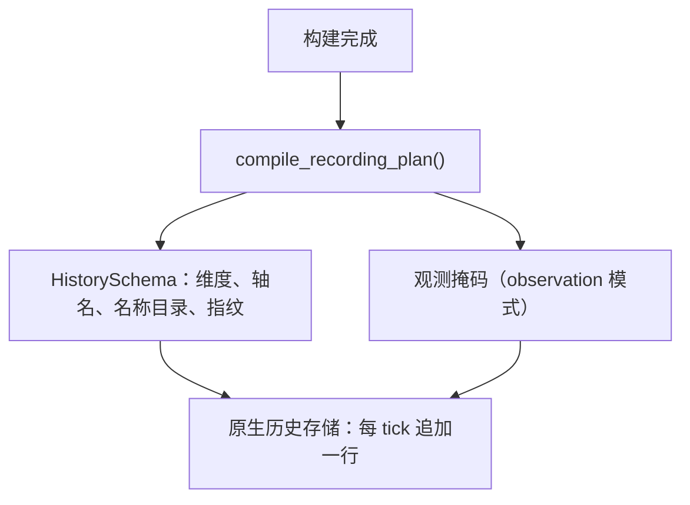

# 历史记录与参数时间线

[观测](observation.md)回答"现在是什么"；历史回答"一路上发生过什么"。这一章说明记录计划编译出什么、两种模式各存什么、行什么时候被淘汰，以及参数时间线如何与历史对齐。

## 记录计划：构建期编译一次

计划在构建时冻结，之后不再变化。原生会话按它写入行，因此记录过程不需要每 tick 经过 Python。

| 组成 | 内容 |
| --- | --- |
| `PopulationLayout` | 类型、性别、年龄轴长度、标签与指纹；指纹由这些字段派生 |
| 行布局 | 无精子模型为 `1 + n_sexes×n_ages×n_ztypes`；有精子再加 `n_ages×n_ztypes²` |
| 观测掩码 | `observation` 模式下用于投影；`raw` 模式为 `None` |

`PopulationLayout` 在构建时就校验注册表类型数与声明的 `n_ztypes` 一致，避免行布局与目录错位。

## 两种记录模式

| 模式 | 存什么 | 事后能力 |
| --- | --- | --- |
| `raw` | tick 加原始数量（必要时含精子） | 可以事后投影、可以恢复检查点 |
| `observation` | 当时的观测投影行 | 只能看当时的分组；不能恢复检查点 |

核验：`observation` 模式的历史 `schema.mode == "observation"`，调用 `restore_checkpoint(1)` 会被拒绝，消息说明 observation 模式的历史无法恢复。这条限制是设计选择：投影已经把信息聚合掉了，用它回滚状态等于用一个有损的表示重建状态。

raw 模式的行轴是 `('record', 'sex', 'age', 'ztype')`；样本模型跑 3 步后 `ticks == (0, 1, 2, 3)`，形状 `(4, 2, 2, 3)`。

### 名称格式的差异

历史布局里的类型标签使用 `基因型[标签]` 形式（例如 `A|A[default]`），而配置里的名称目录使用 `A|A@default`。核验：`history.schema.population.ztype_labels == ("A|A[default]", "A|a[default]", "a|a[default]")`。

两处格式不同是有意留存的：`@` 也是选择器语法里的标签后缀，历史标签改用方括号可以避免与选择器字符串混淆。跨来源比较名称时（例如把历史与配置对照），必须先确认格式，不要直接字符串相等。

## 记录间隔与淘汰

| 声明 | 行为 |
| --- | --- |
| `record_every=1` | 每个 tick 一行 |
| `record_every=2` | 每两个边界一行：核验 ticks 为 `(0, 2, 4)` |
| `record_every=0` | 不记录，时钟照常推进 |
| `max_rows=k` | 只保留最新 k 行：核验 `max_rows=3` 跑 5 步后 ticks 为 `(3, 4, 5)` |

淘汰是最旧的先走。被淘汰的行同时意味着对应的检查点不可再恢复——检查点与历史行对齐。

连续多次 `run()` 会继续同一条时间线（核验：两步 `run(1)` 之后 ticks 为 `(0, 1, 2)`），而不是每次重新开始；`reset()` 会清空历史并回到初始状态。

## 参数时间线

边界上提交的参数写入会追加 `(tick, name, old, new)` 行到 `pop.params_log`：

- 只有值**实际变化**时才记录，因此"写了一次相同的值"不会留下噪声行；
- 空间模型按 deme 记录；
- 恢复检查点会把日志截断到该 tick，与历史行一致。

参数时间线与历史行共用 tick 语义，因此可以回答"第 3 步之前把承载量改成了多少"这类问题；但它不记录未提交的回调修改（见[回调事务](transactions.md)）。

## 改动会影响谁

| agent 的建议 | 判断依据 |
| --- | --- |
| 用 observation 历史做检查点恢复 | 会被拒绝；改用 raw 模式 |
| 事后想按新分组看旧数据 | observation 历史已聚合；raw 历史可以重新投影 |
| 认为历史会自动保存每个阶段 | 历史保存的是记录边界，不是 tick 内部阶段 |
| 用名称字符串对照历史与配置 | 两种格式不同（`[...]` vs `@...`） |
| 依赖 `max_rows` 之外的旧行 | 淘汰过的行不可恢复，其检查点也一并失效 |

## 实现定位与核验依据

| 实现入口 | 本章对应职责 |
| --- | --- |
| [output/_recording.py](https://github.com/jyzhu-pointless/natal-core/blob/main/src/natal/frontend/output/_recording.py) | `RecordingPlan` 与计划编译 |
| [output/history.py](https://github.com/jyzhu-pointless/natal-core/blob/main/src/natal/frontend/output/history.py)：`PopulationLayout`、`HistorySchema`、`History` | 布局、模式、行访问与截断 |
| [rust/src/output/history.rs](https://github.com/jyzhu-pointless/natal-core/blob/main/rust/src/output/history.rs) | 原生存储行 |
| [rust/src/output/parameter_log.rs](https://github.com/jyzhu-pointless/natal-core/blob/main/rust/src/output/parameter_log.rs) | 参数日志存储 |

本章的两种模式、轴名与形状、记录间隔、淘汰窗口、连续时间线、标签格式与参数日志均由同一组输入核验。既有测试中，[test_history_observation_contract.py](https://github.com/jyzhu-pointless/natal-core/blob/main/tests/test_history_observation_contract.py) 与 [test_single_history_contract.py](https://github.com/jyzhu-pointless/natal-core/blob/main/tests/test_single_history_contract.py) 保护记录计划与历史合同。

下一步阅读[检查点恢复与实验重放](checkpoints.md)。
