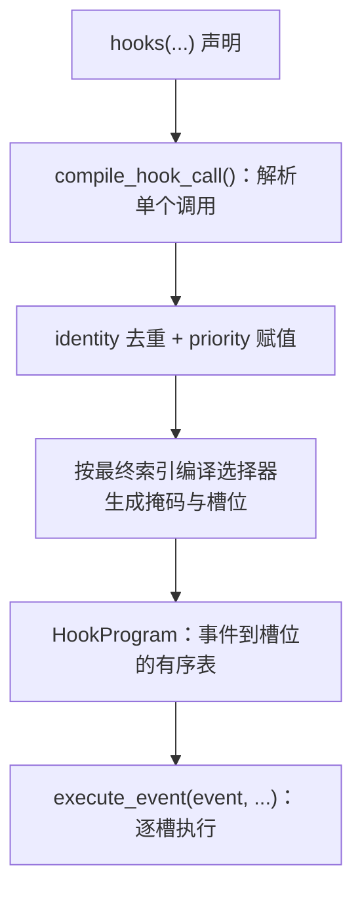

# Hook 如何编译和调度

Hook 是在运行期干预模型的手段。项目提供两种写法：声明式操作（`Op.*`）与 Python 回调；两者进入同一个事件调度，按 priority 混合排序，但它们的访问方式和事务边界不同。

## 两种写法

| 写法 | 例子 | 特点 |
| --- | --- | --- |
| 声明式操作 | `Op.scale(genotypes="A|A", ages=0, sex="female", factor=0.5, event="early")` | 原生执行、无需跨语言回调、可静态编译选择集 |
| Python 回调 | `def hook(ctx): ctx.params.carrying_capacity = 300; return 0` | 任意逻辑，但需要受控访问与事务 |

声明式操作的选择集是 `(genotypes, ages, sex)`，外加可选的 `when` 条件；它在编译期解析成掩码。回调拿到的 `ctx` 提供状态、参数、`rng` 与 `stop()`，其边界见[回调事务](transactions.md)。

## 从声明到执行槽

几个必须记住的细节：

- **选择器在发布后编译**。因此 Hook 里的类型名会按最终目录解析；引用到的类型会被保留在运行布局里（核验：在只有 `A|A` 的两等位基因模型上声明一个作用于 `a|a` 的 Hook，`a|a@default` 会留在目录中）。
- **priority 的赋值模型**：调用级 `priority=` 给该次调用的整组操作赋值；一次打包传入的操作共享同一个值；不传时使用操作自身携带的 priority，且它们必须一致。用 `Op.*` 写法时 priority 也可以直接写在操作里。
- **身份去重**：同一个操作对象被声明两次只会记录一次。核验：把同一个 `Op.scale` 对象声明两次，缩放只发生一次（成年总数 50，而不是 12.5）。

## 事件与执行顺序

| 事件 | 位置 |
| --- | --- |
| `first` | 繁殖之前 |
| `early` | 繁殖之后、生存之前 |
| `late` | 生存之后、aging 之前 |
| `finish` | `run(..., finish=True)` 结束时 |

同一事件内，声明式槽与回调槽按 priority 混合执行，**不是"先跑完所有声明式再跑回调"**。核验：priority 1 的声明式缩放与 priority 5 的回调，执行顺序是 `callback-first`、`callback-early`（各自事件内回调在后），最终数量是缩放两次中的一次作用于幼体后的结果（每性别 `[6.25, 12.5, 6.25]`）。

Rust 侧 [HookProgram](https://github.com/jyzhu-pointless/natal-core/blob/main/rust/src/hooks/interpreter.rs) 在执行前先校验操作码，遇到未知操作码直接报错，而不是部分应用前面的操作；任一槽请求停止都会立即短路整个事件。

## 选择集与作用域

`Op.scale(genotypes="A|A", ages=0, sex="female", factor=0.5, event="early")` 只影响匹配坐标：

| 选择 | 效果（核验值） |
| --- | --- |
| 全类型、age 0、两性 | 幼体整体减半 |
| `A|A`、age 0、雌性 | 只有雌性 A\|A 变成 6.25，其余不变 |
| 引用不存在的类型 | 空选择在编译期即报错，不会静默跳过 |

最后一行与选择器章节的规则一致：需要具体坐标的路径上，空匹配是错误。

## 停止与声明式条件

`Op.stop_if_*` 与回调里的 `ctx.stop()` 等价：在当前边界结束本次 tick。核验：`stop_if_below(threshold=10000)` 在 `early` 触发后，时钟仍为 0，会话状态为 `Stopped`，`is_finished` 为真。停止不改写已经完成的阶段。

## 改动会影响谁

| agent 的建议 | 判断依据 |
| --- | --- |
| 在运行期追加一个 Hook | Hook 只在构建期声明；需要重建种群 |
| 假定声明式 Hook 都先于回调执行 | 两者按 priority 混合排序 |
| 用同一个操作对象声明两次以"叠加" | 同对象会去重；要叠加需两个不同对象 |
| 在 Hook 里引用一个被压缩掉的类型 | 引用会让该类型进入保留集合；否则选择器编译会失败 |
| 在 Hook 里改遗传映射 | 遗传更新需要候选重编译路径，不能就地改表 |

## 实现定位与核验依据

| 实现入口 | 本章对应职责 |
| --- | --- |
| [hooks/_compile.py](https://github.com/jyzhu-pointless/natal-core/blob/main/src/natal/frontend/hooks/_compile.py) | 单个调用的解析、去重、选择器编译与槽位组装 |
| [hooks/entry/declarative.py](https://github.com/jyzhu-pointless/natal-core/blob/main/src/natal/frontend/hooks/entry/declarative.py) | `Op.*` 声明式操作的参数与语义 |
| [rust/src/hooks/interpreter.rs](https://github.com/jyzhu-pointless/natal-core/blob/main/rust/src/hooks/interpreter.rs) | `execute_event()`：槽位遍历、操作码校验、停止短路 |
| [hooks/tick_context.py](https://github.com/jyzhu-pointless/natal-core/blob/main/src/natal/frontend/hooks/tick_context.py) | 回调可用的状态、参数、RNG 与 `stop()` |

本章的混合排序、priority 赋值、同对象去重、作用域选择、类型保留与声明式停止均由同一组输入核验。既有测试中，[test_hook_transaction_contract.py](https://github.com/jyzhu-pointless/natal-core/blob/main/tests/test_hook_transaction_contract.py) 与 [test_manual_finish_event_contract.py](https://github.com/jyzhu-pointless/natal-core/blob/main/tests/test_manual_finish_event_contract.py) 保护 Hook 编译与事件边界。

下一步阅读[回调事务、失败与停止边界](transactions.md)。
