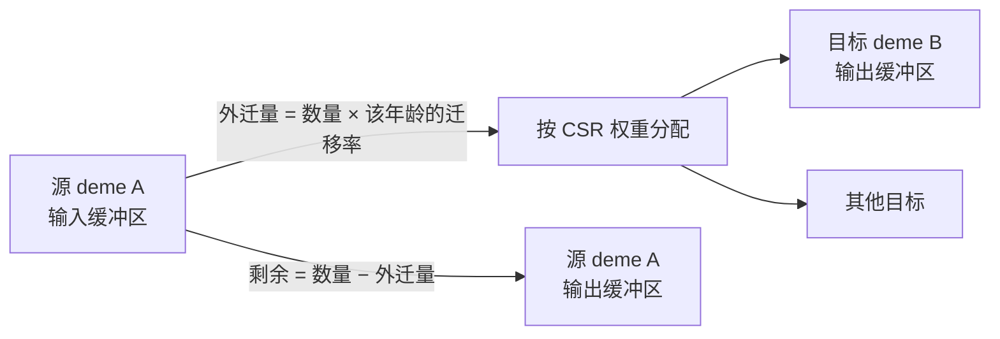

# 空间生命周期与迁移算法

[上一章](spatial.md)说明了 deme 之间共享什么、分叉什么。这一章只讲迁移：结构在构建期如何折叠成 CSR、执行期的读写规则、守恒的范围，以及雌性与精子如何一起移动。

## 两个 deme 的数量流

读图要点：迁移是**读出旧缓冲、写入新缓冲**，不是原地扫一遍。核验：A 有 100、B 有 0、A 的年龄-1 迁移率 0.2 且唯一目标是 B，迁移后 A 为 80、B 为 20；堆叠总量精确不变（误差 < 1e-9），而各 deme 的总量确实改变。

## CSR 与率列是两件事

| 结构 | 什么时候确定 | 内容 |
| --- | --- | --- |
| CSR（`indptr`、`dest_idx`、`weights`） | 构建期折叠，运行期冻结 | 拓扑：谁能到谁，以及权重比例 |
| 率列 | 运行期可变 | 每个源 deme、性别、年龄的外迁比例 |

把拓扑写成"每行权重加起来是 1"，把"迁移多少"写在率列——这是两个独立自由度。核验：3 deme 链条的第一行权重是 `[0, 1, 0]`（只有一个邻居），行和为 1。

率列的 sugar 形式有一条容易忽略的规则：**标量只作用于成体年龄，幼体为 0**。核验：`migration_rate=0.2` 在 3 个年龄槽上得到 `[[0, 0.2, 0.2], [0, 0.2, 0.2]]`（形状 `(deme, sex, age)`）。想让幼体也迁移，必须显式给出年龄向量。

## 谁在移动

| 类别 | 处理 |
| --- | --- |
| 雄性成人 | 按雄性率整体外迁 |
| 未交配雌性（virgin） | 雌性数量减去已存储精子所对应的雌性，按雌性率外迁 |
| 已交配雌性 | 不单独作为个体迁移；它们随精子存储一起处理 |
| 精子存储 | 按年龄、雌性类型、雄性类型记录，与雌性的移动绑定 |

这就是"不能把精子当作独立个体再迁移一次"的含义：精子存储记录的是"已交配雌性 × 配偶类型"，把它当成个体数量重复计算会凭空造出个体。

## 边界与退化路径

| 情形 | 行为 |
| --- | --- |
| 某 deme 的 CSR 行为空 | 什么都不外迁（孤立 deme），即使率大于 0 |
| 少数邻居的边缘 deme | 每个邻居分到的份额更大，但外迁总量与其他 deme 相同 |
| 环绕拓扑产生重复目标 | 保留重复条目与其访问顺序，不排序合并 |
| 源遍历顺序 | 固定的 deme 顺序，保证浮点累加位级可复现 |
| 率列或 `indptr` 长度不符 | 内核报错并指出期望长度 |

核验：两个互相没有任何边的 deme、率 0.5，跑一步后双方仍各有 100 个年龄-1 个体——空 CSR 行意味着"没有出边"，而不是"平均分配"。

## 随机迁移

随机模式下，外迁量按二项/泊松类抽样，目的地按 CSR 权重做多项分配，使用源 deme 的随机流。它与确定性模式的差别只在"抽多少"，不在"往哪去"：目的地比例仍来自 CSR。

因此核对随机迁移时应当比较分布或总量，而不是逐格比较；确定性模式适合核对期望与守恒。

## 改动会影响谁

| agent 的建议 | 判断依据 |
| --- | --- |
| 通过缩小某一行权重来减少迁移量 | 行会在容器内归一化；迁移量由率列控制 |
| 认为边缘 deme 外迁更少 | 边缘只改变每个邻居的份额，不改变外迁总量 |
| 让幼体也迁移 | 标量率不含幼体；需要显式年龄向量 |
| 把精子当作独立个体迁移 | 精子存储与雌性绑定，重复迁移会造出个体 |
| 在运行期改拓扑 | CSR 构建期冻结；拓扑变更需要重建模型 |

## 实现定位与核验依据

| 实现入口 | 本章对应职责 |
| --- | --- |
| [spatial/migration.py](https://github.com/jyzhu-pointless/natal-core/blob/main/src/natal/frontend/spatial/migration.py)：`fold_migration_csr()`、`MigrationCSR` | 邻接/核折叠成 CSR 与率列规则 |
| [spatial/topology.py](https://github.com/jyzhu-pointless/natal-core/blob/main/src/natal/frontend/spatial/topology.py) | 网格拓扑、环绕与坐标归一化 |
| [kernels/spatial.rs](https://github.com/jyzhu-pointless/natal-core/blob/main/rust/src/kernels/spatial.rs)：`migrate_csr_deterministic()`、`migrate_csr_stochastic*()` | 迁移内核：外迁、分配、留存 |
| [backends/rust/rust_backend.py](https://github.com/jyzhu-pointless/natal-core/blob/main/src/natal/backends/rust/rust_backend.py)：`rust_migrate_csr_deterministic()` | Python 侧调用入口 |
| [spatial/population.py](https://github.com/jyzhu-pointless/natal-core/blob/main/src/natal/frontend/spatial/population.py)：`migration_row()`、`migration_csr` | 运行期查看结构 |

本章的率列形状与"标量只作用于成体"、CSR 行归一化、孤立 deme、总量守恒与 deme 总量重分配均由同一组输入核验。既有测试中，[test_spatial_migration_conservation.py](https://github.com/jyzhu-pointless/natal-core/blob/main/tests/test_spatial_migration_conservation.py) 与 [test_spatial_population_run.py](https://github.com/jyzhu-pointless/natal-core/blob/main/tests/test_spatial_population_run.py) 保护迁移守恒与空间运行的既有行为。

下一步阅读后续的《观测如何从状态生成结果》一章。
