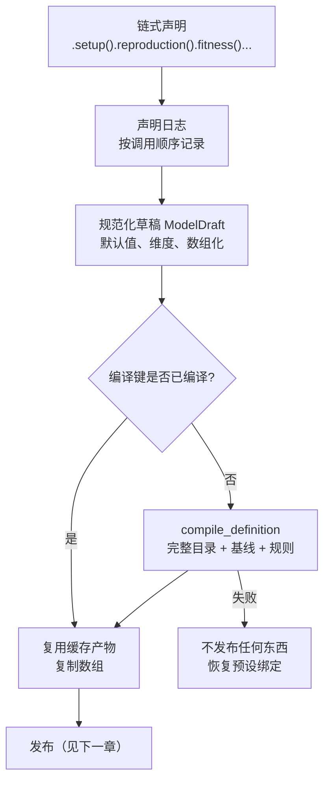

# 从声明到编译产物

[上一章](selectors.md)解释了条件如何变成坐标。这一章回答更前面的问题：一串链式调用如何变成一份**候选编译产物**，哪些东西被规范化，什么被缓存，失败时留下了什么。

本章要分清三类东西，它们经常被混为一谈：

| 类别 | 代表 | 特点 |
| --- | --- | --- |
| 声明 | `PopulationBuilder` 的链式调用、`ModelDefinition` | 可重放、可重建，不含计算结果 |
| 草稿 | `ModelDraft` | 已数值化的完整轴数组，仍在构建期 |
| 候选人 | `CompiledProducts` | 遗传映射、目录与修饰器列表，尚未发布 |

## 一次构建的编排

图里的分叉点值得注意：**同一个声明第二次编译时不一定重新计算**，而缓存命中时给出的是数组副本，不是共享引用。

## 声明日志与可重放性

构建链上的每个领域方法（`setup`、`age_structure`、`competition`、`reproduction`、`survival`、`initial_state`、`custom`、`presets`、`modifiers`、`fitness`、`hooks`、`with_observation`、`record_history`）都被标记为"声明"。调用时记录一条日志，并且**在副本上**试算：算成功才采纳，算失败原对象不变。

`ModelDefinition` 是这条链的快照：物种、日志、预设、手动修饰器、编译键、fitness 基线、Hook 调用、观测组、压缩开关、声明保留的类型。它同时携带 `draft` 与 `registry` 作为工作副本。发布阶段保存的就是这份定义，因此"从已有模型重建一个变体"不需要重新执行用户的构建脚本。

## 规范化：默认值和形状

用户写的是标量与字典，内核读的是定长数组。规范化负责补齐：

| 项目 | 规范化的结果 | 备注 |
| --- | --- | --- |
| 年龄轴 | 离散世代模型固定 2 个槽 | `age 0` 幼体、`age 1` 成体；年龄结构模型由 `age_structure()` 声明 |
| `adult_ages` | 由 `new_adult_age` 推导的索引数组 | 供内核按年龄决定参与繁殖者 |
| 生殖/交配/生存速率 | `(sex, age)` 数组 | 标量被广播；缺失的年龄槽填 0 |
| 繁殖参与率 | 离散模型内部成体值为 1 | 用户入口用 `female_adult_mating_rate` 等专用参数 |
| 密度调节 | 默认 `BEVERTON_HOLT` 曲线 | 可用 `growth_mode` 切换，见后续的《密度调节与平衡量如何计算》 |
| fitness | `(sex, age, Z)`、`(sex, Z)` 与 `(Z, Z)` 三种形状 | 形状相同语义不同，见[数组坐标](data_layout.md) |
| 类型与名称目录 | `ztype_names` 与 `gtype_names` | 由注册表生成，随索引一起改变 |

规范化同时验证维度：非法组合在构建期报错，而不是留到运行期产生难以解释的结果。离散模型的两年龄槽不是"参数默认值"，而是模型语义——不能通过把 age-1 生存率改成 1 让旧成体跨代存活。

## 编译产物里有什么

`CompiledProducts` 是四件东西的元组：草稿、完整目录注册表、配子修饰器列表、合子修饰器列表。它的遗传产物在本例中的形状是：

| 产物 | 完整轴 shape | 说明 |
| --- | --- | --- |
| `zygotes_to_gametes_map`（M） | `(2, 6, 3)` | 性别、6 个 ZType、3 个 GType |
| `gametes_to_zygotes_map`（F） | `(3, 3, 6)` | 配子对到后代的映射 |
| `offspring_tensor`（P） | `(0, 0, 0)` | **占位**，表示"尚未在最终轴上推导" |

P 的占位形状（0, 0, 0）是一个容易误读的细节：它不是"任何配对都不能生育"，而是"还没有投影"。完整六类型的 P 会有 216 个元素，而运行时只需要 27 个，所以推导推迟到发布之后。

编译产物上的注册表是**完整目录**且未发布：六个 ZType 全在，包括本例中永远为零的 X 类型。

## 编译缓存与候选隔离

- 编译键（`compilation_key`）描述这次声明；键相同且已有编译结果时，构建器复用缓存产物，但给的是**数组副本**。
- 因此"写坏产物"不会污染下一次构建：把某个构建器产物的 M 表整行改掉之后，用同一物种新建的构建器再编译，仍然得到基线值。这是核验过的行为。
- 链式方法在副本上试算、成功后采纳，所以中途失败的调用不会把一个半成品留在构建器上。
- 编译要求注册表**未发布且完整**：未发布是"候选还能改"，完整是"索引与物种目录一一对应"。任何一条不满足都会 `ValueError`，而不是自动修复。

## 失败会发生什么

`compile_definition()` 的失败路径是明确的：不发布任何产物、恢复预设的物种绑定、把异常抛给调用方。声明日志与用户传入的预设对象保持原样，所以失败后可以改一处再重编译，不需要重建整个模型。

## 改动会影响谁

| agent 的建议 | 判断依据 |
| --- | --- |
| 直接改 `ModelDraft` 数组来改模型 | 草稿是构建期候选；改它需要经过重新编译与发布，否则运行期看不到 |
| 复用上一次的编译产物继续改 | 缓存命中给的是副本；跨声明的复用要靠 `ModelDefinition` 重建 |
| 在 `initial_state` 之后调用 `age_structure` | 领域方法调用顺序受约束，规范化会在构建期报错 |
| 认为 P 是 `(0, 0, 0)` 表示"不能生育" | 它表示尚未推导；推导发生在发布阶段 |
| 把默认 `growth_mode` 当作"没有密度调节" | 默认是 `BEVERTON_HOLT`；要关闭需显式选择 |

## 实现定位与核验依据

| 实现入口 | 本章对应职责 |
| --- | --- |
| [builder/_base.py](https://github.com/jyzhu-pointless/natal-core/blob/main/src/natal/frontend/builder/_base.py)：`_compile_products()`、`_definition_for_compile()`、`_publish_and_build()` | 声明日志、编译编排、候选采纳 |
| [model/definition.py](https://github.com/jyzhu-pointless/natal-core/blob/main/src/natal/frontend/model/definition.py) | 声明快照的字段 |
| [model/draft.py](https://github.com/jyzhu-pointless/natal-core/blob/main/src/natal/frontend/model/draft.py) | 规范化草稿的字段与形状 |
| [model/assembly.py](https://github.com/jyzhu-pointless/natal-core/blob/main/src/natal/frontend/model/assembly.py)：`build_discrete_engine_config()`、`build_config_maps()` | 默认值、维度验证与完整轴组装 |
| [model/definition_compiler.py](https://github.com/jyzhu-pointless/natal-core/blob/main/src/natal/frontend/model/definition_compiler.py)：`compile_definition()` | 隔离编译与失败回滚 |

本章的完整目录形状、P 的占位形状、缓存副本与候选隔离均由同一组输入核验。既有测试中，[test_publication_contracts.py](https://github.com/jyzhu-pointless/natal-core/blob/main/tests/test_publication_contracts.py) 与 [test_spatial_publication.py](https://github.com/jyzhu-pointless/natal-core/blob/main/tests/test_spatial_publication.py) 覆盖编译产物与发布之间的合同；它们不保护本章描述的缓存与隔离行为，那部分由本批核验提供证据。

下一步阅读[遗传预设与转换规则如何编译](genetic_compilation.md)，展开编译过程内部那条"基线 → 规则"的流水线。
