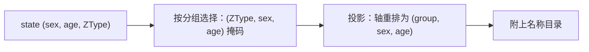

# 观测如何从状态生成结果

会话持有的是一张 `(sex, age, ZType)` 的数量表；研究者想看的是"某类个体有多少"。观测就是这层投影：按分组挑出坐标、把轴重排成可读的形状，并给出名称。这一章解释投影的规则、会丢失什么，以及"当前观测"与"事后观测"的区别。

## 投影的三个动作

核验：默认 identity 观测在样本模型上返回 `axes == ('group', 'sex', 'age')`、shape `(3, 2, 2)`，且 `values` 等于 `state.individual_count.transpose(2, 0, 1)`——**轴顺序改变，数值不变**。

| 轴 | 来源 |
| --- | --- |
| `group` | 一个观测组；identity 模式下每组对应一个 ZType |
| `sex` | 性别轴，顺序为 female、male |
| `age` | 年龄轴；`collapse_age=True` 时该轴消失 |

名称只挂在 `group` 轴上（`labels` 的键就是 `{"group"}`）：性别的含义由轴约定给出（0 雌、1 雄），年龄由顺序给出。把名称目录当成"每个轴都有"会导致取不到键。

## 分组与信息损失

分组由 `IndividualSelector` 定义，因此分组之间可以重叠，也可以把多个类型并成一组：

| 分组定义 | 结果 |
| --- | --- |
| `IndividualSelector(ztype="A|A")` | 只包含一个类型 |
| `IndividualSelector(ztype="A|A") | IndividualSelector(ztype="a|a")` | 两个类型的并集 |
| `IndividualSelector(ztype="A|a")` | 另一个组；与上面可以并存 |

核验：两组（纯合子与杂合子）观测的总和等于当前状态的总和。这同时说明**聚合是有损的**：分组求和之后无法还原每个 ZType 的数量，需要逐类型细节时应使用 identity 观测或读 `pop.state`。

`collapse_age=True` 做同样的取舍：核验中轴变成 `('group', 'sex')`，总量保持不变，但"哪个年龄"不再可分辨。

## 观测不只是查询：它决定记录方式

观测对象在构建期编译成掩码，被记录计划复用：

- identity 观测与分组观测都会产生掩码；
- `record_history(mode="observation")` 保存的就是这些投影行（见[历史记录](history.md)）；
- 空间模型在 `deme` 轴上再分一层，见[空间构建与共享](spatial.md)。

因此改观测组不仅改查询结果，也会改历史文件里存的是哪一列——两者用同一个规则，避免"查询看到的"和"记录下来的"不一致。

## 当前观测与事后观测

| 方式 | 数据来源 | 说明 |
| --- | --- | --- |
| `pop.observe()` | 当前状态的投影 | 每次调用重新投影，反映最新状态 |
| `history.observe(...)` | 已记录的行 | 事后投影，按记录时保存的原始行重建 |

两者共享同一套分组规则，但**数据来源不同**：raw 历史保存的是原始数量，事后投影可以对它应用新的分组（受历史保存的行内容限制）；observation 历史保存的是当时的投影结果，事后无法还原被聚合掉的细节。选择记录模式实际上是在选择"以后还能问什么问题"。

## 改动会影响谁

| agent 的建议 | 判断依据 |
| --- | --- |
| 用观测值反推每个类型 | 聚合组不可逆；identity 观测或 `state` 才有逐类型数据 |
| 认为观测与 state 是同一份数据 | 轴顺序不同（`(group, sex, age)` vs `(sex, age, ZType)`） |
| 在运行中改用新的分组 | 观测在构建期编译并随记录计划固定 |
| 用名称匹配历史与配置 | 历史标签格式是 `A|A[default]`，配置名称是 `A|A@default`；见[历史记录](history.md) |
| 只看总量判断分组是否正确 | 总量相同不代表分组边界正确；应逐组核对 |

## 实现定位与核验依据

| 实现入口 | 本章对应职责 |
| --- | --- |
| [output/observation.py](https://github.com/jyzhu-pointless/natal-core/blob/main/src/natal/frontend/output/observation.py)：`Observation`、`build_mask_from_selectors()` | 分组、掩码与投影 |
| [output/_recording.py](https://github.com/jyzhu-pointless/natal-core/blob/main/src/natal/frontend/output/_recording.py)：`compile_recording_plan()` | 掩码如何进入记录计划 |
| [patterns/individual_selector.py](https://github.com/jyzhu-pointless/natal-core/blob/main/src/natal/frontend/patterns/individual_selector.py) | 分组的定义方式与并集 |
| [rust/src/output/observation.rs](https://github.com/jyzhu-pointless/natal-core/blob/main/rust/src/output/observation.rs) | 原生侧投影 |

本章的 identity 投影、聚合组、`collapse_age` 与名称目录均由同一组输入核验。既有测试中，[test_observation_age_axis_contract.py](https://github.com/jyzhu-pointless/natal-core/blob/main/tests/test_observation_age_axis_contract.py) 与 [test_spatial_observation_phase6.py](https://github.com/jyzhu-pointless/natal-core/blob/main/tests/test_spatial_observation_phase6.py) 保护观测轴合同。

下一步阅读[历史记录与参数时间线](history.md)。
