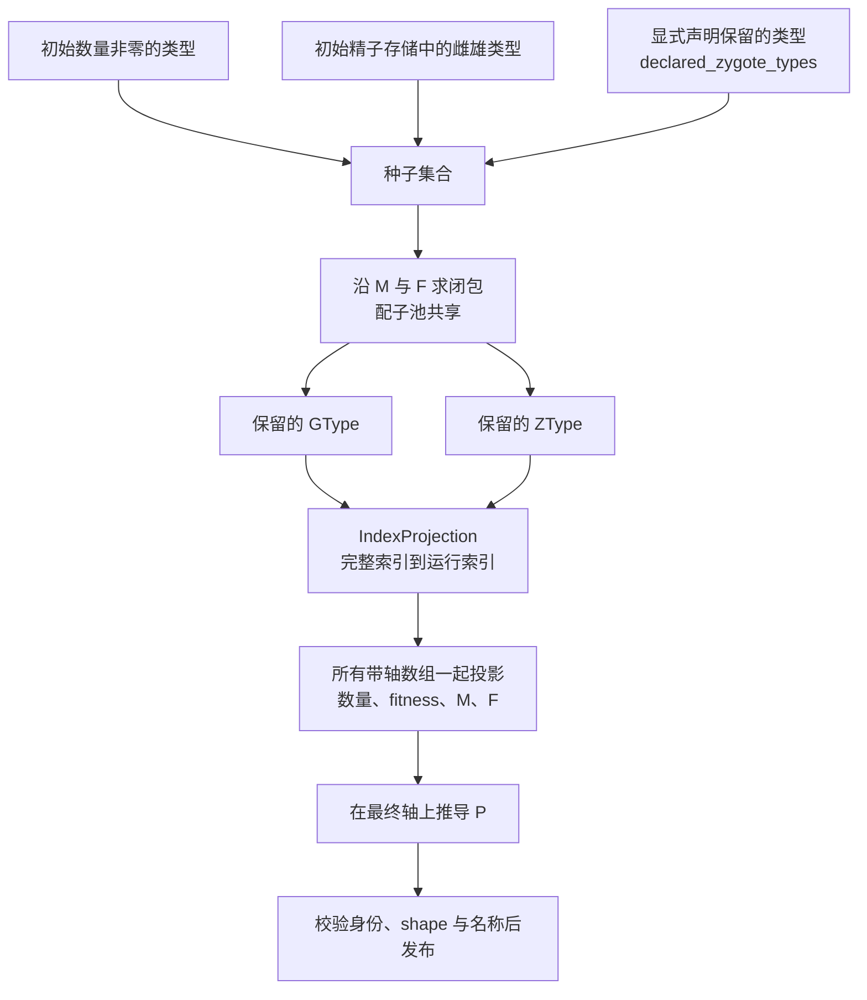

# 可达性、索引压缩与模型发布

完整目录描述"这个物种允许什么"，运行布局描述"这次模拟需要什么"。发布就是把前者变成后者，并且保证所有带轴的数组一起换坐标。本章展开这个过程：种子从哪里来、闭包怎么算、哪些数组必须同步、以及一个已经发布的布局还能接受什么改动。

## 从种子到运行布局



没有种子时保留完整轴，这是显式行为而不是回退到"随便选一个"。

## 保留一个类型，常常保留一片

闭包不是"只为每个种子保留它自己"。核验过的例子能说明原因：

| 声明 | 运行目录 | 说明 |
| --- | --- | --- |
| 无声明，初始 A\|a（A、a、X 三等位基因） | `A|A`、`A|a`、`a|a` | X 不可达，被删除 |
| 声明 `A|X` | 全部六种 | A\|X 产生 X 配子，X 与 A、a 配子又能组合，扩回整个目录 |
| 两等位基因物种，初始 A\|A，无声明 | 只有 `A|A` | 闭包只有 A 配子 |
| 两等位基因物种，初始 A\|A，声明 `a|a` | `A|A`、`A|a`、`a|a` | 声明把 a 配子带进配子池 |

原因是配子池是共享的：一旦某个保留类型能产生新配子，新配子会与所有其他保留配子组合。因此"我只是想留一个类型"实际会带来它的整个可达片。需要精确控制运行布局时，要按闭包而不是按单个类型来评估。

## 一起换坐标

投影必须同时作用于所有带轴的数组，否则"索引 2"在两层之间指向不同的类型。样本模型的对照表：

| 类型 | 完整索引 | 运行时索引 |
| --- | --- | --- |
| `A|A` | 0 | 0 |
| `A|a` | 1 | 1 |
| `a|a` | 3 | 2 |
| `A|X`、`a|X`、`X|X` | 2、4、5 | 已删除 |

同步投影的数组包括初始数量、fitness 的四个张量、M 与 F、兼容性向量与只读的性别掩码，以及名称目录 `ztype_names`、`gtype_names`。投影后的形状在本例中是：

| 数组 | 完整轴 | 运行轴 |
| --- | --- | --- |
| 初始数量 | `(2, 2, 6)` | `(2, 2, 3)` |
| M | `(2, 6, 3)` | `(2, 3, 2)` |
| F | `(3, 3, 6)` | `(2, 2, 3)` |
| P | 不构造 | `(3, 3, 3)`，即 27 项（完整轴会是 216 项） |

P 在投影之后推导：先在最终轴上得到 M 与 F，再调用 Rust 数值内核算出 P，避免构造完整立方体再切掉大部分元素。构建空间变体时还可以复用一份已发布的遗传表（`genetic_template`）：此时 M、F、P 与四个 fitness 张量按只读方式共享，共享前会把这些数组标成不可写。

## 声明保留：零数量不等于不可达

`declared_zygote_types` 是显式保留入口。核验过的完整例子（两等位基因物种，初始只有 A|A）：

```text
无声明：      运行目录 = ('A|A@default',)                 运行一步后 [100]
声明 a|a：    运行目录 = ('A|A@default', 'A|a@default', 'a|a@default')
              初始数量 = (200, 0, 0)
              运行期把 a|a 设为雌雄各 5 后运行一步 → (95.24, 9.52, 0.24)
```

三点值得注意：声明不会创造个体（a|a 初始仍为 0）；被声明的类型在运行期可以被写入并参与动力学；未声明的类型在运行布局里根本不存在，写入它会得到索引错误而不是一个安静的零。

Hook 的类型引用也会进入保留集合：声明一个作用于某类型的 Hook，会让该类型留在运行布局里，即使它当前数量为零。

## 已发布的布局还能接受什么

- 发布一次会产生**一个新的、已密封的运行注册表**；源候选保持未发布，因此同一个构建器可以产出多次相互隔离的构建。
- 在已发布的注册表上新增类型会被拒绝（`RuntimeError: published registry is immutable`）。
- 若要在已发布布局上换一套遗传规则，必须满足**闭合性**：保留的每个 ZType 只能产生保留的 GType，保留的配子对只能形成保留的 ZType。违反时 `ensure_layout_closed()` 抛 `ValueError: published layout is not closed: ...`，而不是把概率质量重新归一化。
- 核验案例：先发布一个不含 X 的布局，再加入 A→X 的突变规则，闭包检查会拒绝这次换规则——因为 A|A 现在能产生 X 配子，而运行布局里没有 X 的位置。

这条规则解释了为什么"运行期改一条遗传规则"有时会失败并要求重建模型：不是实现偷懒，而是运行布局没有给新分支留位置。

## 测试样例：三类型与六类型

核验对照（同一个物种、同一组初始条件）：

| 配置 | 运行目录 | 一步之后（每性别） |
| --- | --- | --- |
| 压缩 | `A|A`、`A|a`、`a|a` | 12.5、25、12.5 |
| 不压缩 | 六类型，X 类恒为 0 | 同一批数值落在对应类型上，X 类为 0 |

压缩与不压缩给出**按类型身份一致**的结果，这正是可用来区分"压缩正确"与"压缩把索引弄错"的证据：只比较总数无法区分这两者。

## 改动会影响谁

| agent 的建议 | 判断依据 |
| --- | --- |
| 关闭压缩以避免索引麻烦 | 压缩只删除不可达类型；关闭会让数组变宽、X 类恒为零，但不改变可达结果 |
| 运行期引入一个新的遗传分支 | 需要先确认它在闭包内；否则要按新布局重建模型 |
| 释放某个类型的保留 | 该类型及其下游可能一起消失；零数量与不可达是两件事 |
| 认为"完整索引 2"就是"A\|X" | 发布后索引 2 是 `a|a`；运行期坐标必须重新解析 |
| 复用一份遗传表给空间变体 | 允许，但共享的数组会被标成只读，不能再用作写入目标 |

## 实现定位与核验依据

| 实现入口 | 本章对应职责 |
| --- | --- |
| [model/publication.py](https://github.com/jyzhu-pointless/natal-core/blob/main/src/natal/frontend/model/publication.py)：`plan_projection()`、`publish_products()`、`IndexProjection`、`ensure_layout_closed()` | 种子、闭包、投影、发布与闭合检查 |
| [genetics/structures/_helpers.py](https://github.com/jyzhu-pointless/natal-core/blob/main/src/natal/frontend/genetics/structures/_helpers.py)：`build_compression_mask()` | 配子池共享的定点可达算法 |
| [genetics/matrices.py](https://github.com/jyzhu-pointless/natal-core/blob/main/src/natal/frontend/genetics/matrices.py)：`recompute_offspring_tensor()` | 在最终轴上调用 Rust 内核推导 P |
| [builder/_registry_builder.py](https://github.com/jyzhu-pointless/natal-core/blob/main/src/natal/frontend/builder/_registry_builder.py)：`resolve_declared_ztypes()` | 声明到完整索引的解析 |
| [contracts/blueprint.py](https://github.com/jyzhu-pointless/natal-core/blob/main/src/natal/contracts/blueprint.py)：`format_type_name()` | 与索引一起更换的名称目录 |

本章的投影结果、闭包扩张、声明保留的两组数字、闭合检查报错与压缩对照均由同一组输入核验。既有测试中，[test_publication_contracts.py](https://github.com/jyzhu-pointless/natal-core/blob/main/tests/test_publication_contracts.py)、[test_publication.py](https://github.com/jyzhu-pointless/natal-core/blob/main/tests/test_publication.py) 与 [test_offspring_single_derivation.py](https://github.com/jyzhu-pointless/natal-core/blob/main/tests/test_offspring_single_derivation.py) 保护投影、发布与 P 的推导时机。

下一步阅读[会话如何推进一次模拟](runtime.md)。
