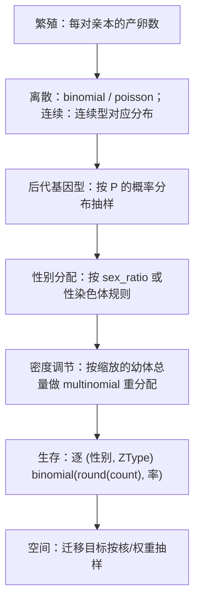

# 随机采样与可复现性

前面几章里的数字大多是期望值（12.5、0.25）。真实运行里它们要经过抽样变成整数个个体。这一章说明抽样发生在哪里、用什么分布、随机流归谁所有，以及"可复现"到底承诺了什么。

## 三类计算

| 模式 | 开关 | 行为 |
| --- | --- | --- |
| 确定性 | `stochastic=False` | 直接使用期望值，可以出现小数 |
| 离散随机 | `stochastic=True`，`continuous_sampling=False` | 先把数量四舍五入为整数，再按二项/多项/泊松抽样 |
| 连续采样 | `stochastic=True`，`continuous_sampling=True` | 保留小数质量，用连续型二项/多项抽样 |

核验：离散随机模式下历史里记录到的每个数量都是整数；确定性模式下同一个模型给出 12.5 这类小数。两者不是"同一个结果的两种写法"，而是不同的模型声明。

## 抽样点在哪里

顺序值得注意：**密度调节的重抽样在生存之前**，因此"缩放后的整数总量"才是生存抽样的输入。空间迁移的抽样见[空间执行与迁移](spatial.md)。

边界上的跳过规则同样重要：幼体总量为 0 时不抽样、直接清零；某类型的可抽样个体数为 0 时不进入二项抽样（避免 `n = 0` 的退化调用），而不是抽出一个必然为 0 的数。

## 随机流归谁

- 会话持有一条 `SessionRng`（xoshiro256++ 形态，`seed_from_u64` 用 SplitMix64 展开种子）。多次 `run()` 持续推进同一条流，不是每次运行重新播种。
- 空间模型中，deme `d` 的随机流按 `seed ^ deme_id` 派生；该 deme 的生命周期与迁移共用这条流。
- Hook 内的 `ctx.rng` 是当前事件受控的采样器：重复访问返回同一个采样器，连续取样推进随机流，回调返回后失效。
- 会话的种子在初始化时给出（默认 0）：`pop._initialize_session(seed=...)`。`reset()` 会用同一个种子重新开始，因此"重置后再跑"会重放同一条轨迹。恢复检查点会恢复当时记录的 RNG 状态。

## 可复现承诺的范围

| 声明 | 承诺 | 核验 |
| --- | --- | --- |
| 确定性模型 | 轨迹逐位可复现 | 同一输入的两次运行完全一致 |
| 随机模型 + 同一种子 | 轨迹逐位可复现 | 种子 11 的两次运行逐位相同；换成 12 不同 |
| 随机模型 + `reset()` | 重放同一条轨迹 | 重置后重跑与首次一致 |
| 随机模型 + 不同种子 | 同分布、不同实现 | 60 个种子的成体总量均值 102.0，期望值 100.0 |

最后一行是"统计等价"的检验方式：**不要用一次随机运行去核对确定性结果**，也不要因为两次随机运行不同就判定实现有错。要么切到确定性模式核对期望，要么比较分布或均值（如上面的 60 次），并给出容差依据。

## 边界与错误

| 情形 | 行为 |
| --- | --- |
| 抽样的期望值小于 0 | 规划期已排除；概率向量的归一化保证非负 |
| 概率向量和接近 0 | 按退化分支处理（清零或跳过），不做 0 除 |
| `ctx.rng` 在回调返回后继续使用 | 采样器已失效；应在本事件内完成取样 |
| 用不同种子比较两次"确定性"结果 | 确定性模型不消耗随机流，与种子无关 |

## 改动会影响谁

| agent 的建议 | 判断依据 |
| --- | --- |
| 用一次随机运行验证确定性期望 | 应比较分布或切到确定性模式 |
| 每次 `run()` 重新播种 | 会破坏连续轨迹；种子属于会话初始化 |
| 在 Hook 外保存 `ctx.rng` 稍后使用 | 采样器在事件结束后失效 |
| 认为"同种子 + 同参数"必然同结果 | 还需要相同的 Hook 组合与调用顺序：随机流被谁先消耗是可观察的 |
| 用连续采样模式核对整数计数 | 连续模式保留小数，不该出现整数断言 |

## 实现定位与核验依据

| 实现入口 | 本章对应职责 |
| --- | --- |
| [kernels/rng.rs](https://github.com/jyzhu-pointless/natal-core/blob/main/rust/src/kernels/rng.rs) | `SessionRng`、`stream_seed()`、二项/泊松/多项及其连续版本 |
| [kernels/discrete_generation.rs](https://github.com/jyzhu-pointless/natal-core/blob/main/rust/src/kernels/discrete_generation.rs) | 生命周期各阶段的抽样调用 |
| [hooks/tick_context.py](https://github.com/jyzhu-pointless/natal-core/blob/main/src/natal/frontend/hooks/tick_context.py)：`ctx.rng` | 回调内的受控采样器 |
| [population/discrete_generation.py](https://github.com/jyzhu-pointless/natal-core/blob/main/src/natal/frontend/population/discrete_generation.py)：`reset()` | 重播种与轨迹重放 |

本章的同种子一致性、换种子差异、重置重放、整数性与 60 次统计均值均由同一组输入核验。既有测试中，[test_session_state_ownership.py](https://github.com/jyzhu-pointless/natal-core/blob/main/tests/test_session_state_ownership.py) 与 [test_spatial_session_ownership.py](https://github.com/jyzhu-pointless/natal-core/blob/main/tests/test_spatial_session_ownership.py) 保护会话状态、种子与分段运行的既有行为。

下一步阅读[融合 Wright–Fisher 执行路径](wright_fisher.md)。
