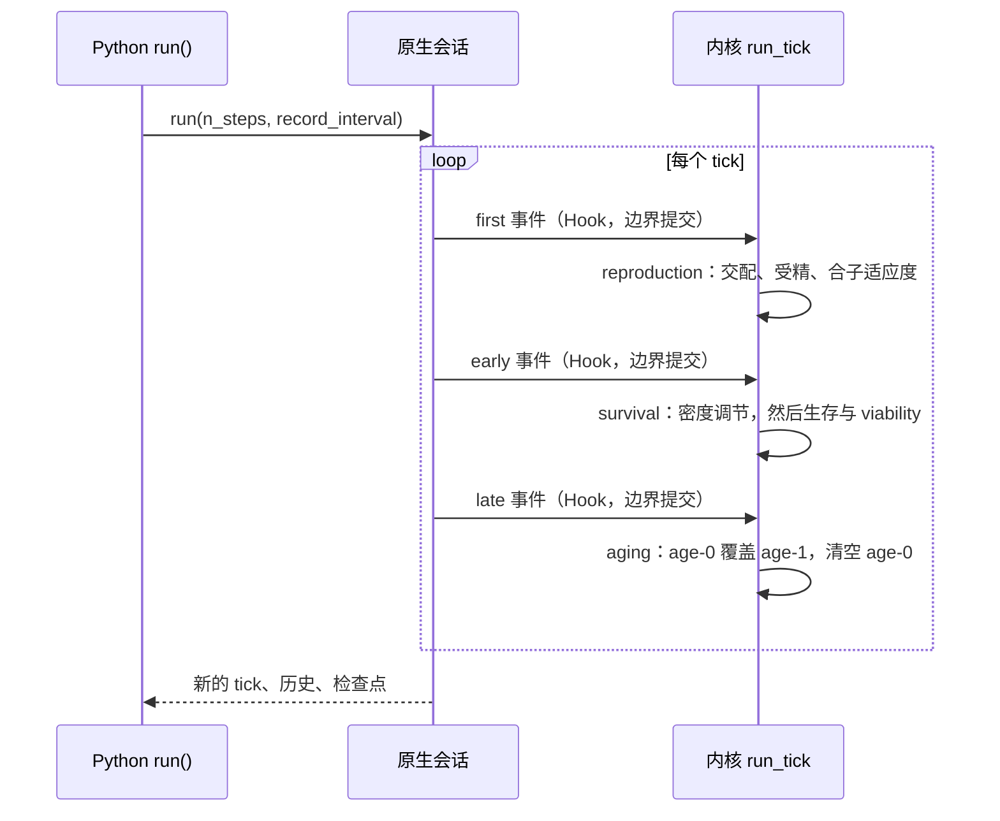
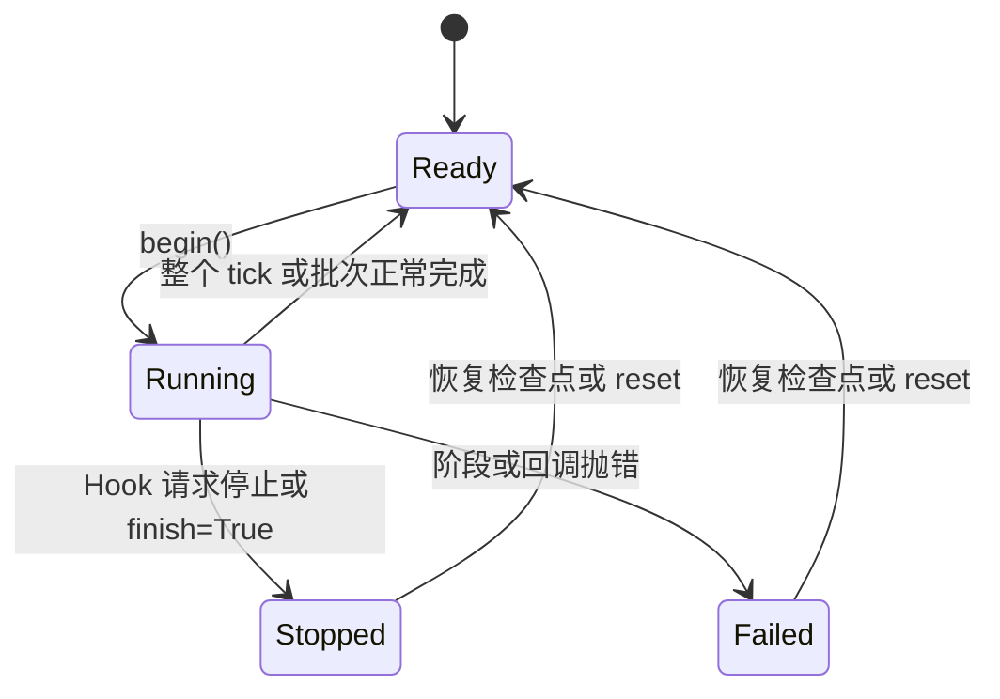

# 会话如何推进一次模拟

[上一章](contracts.md)把数据交给了原生会话。这一章说明会话如何用它推进时间：一次 tick 里有哪些阶段、时钟什么时候前进、状态如何变化，以及停止和失败分别留下什么。

本章追踪普通离散世代路径；年龄结构与融合路径的差异在后续章节单独说明。

## 四层与各自的职责

| 层 | 代表 | 职责 |
| --- | --- | --- |
| 种群对象 | `DiscreteGenerationPopulation` | 入口检查、记录间隔解析、查询接口 |
| 后端适配 | `RustDiscreteLifecycleBackend` | 合同物化、会话创建、调用适配 |
| 原生会话 | `DiscreteGenerationSession` | 持有状态、tick、RNG、执行状态与参数 |
| 内核 | `run_tick()` 及各阶段函数 | 单步计算 |

[DiscreteGenerationPopulation.run()](https://github.com/jyzhu-pointless/natal-core/blob/main/src/natal/frontend/population/discrete_generation.py) 按顺序检查三个守卫（重入、失败、已完成），解析记录间隔，然后进入后端；`run_tick()` 就是"步数为 1 的 run"，并使用种群配置的记录间隔。批量运行在 Rust 内部循环，**不会在每个阶段把完整状态送回 Python**。

## 一次 tick 的阶段

| 边界 | 此刻的每性别数量（`[age-0, age-1]`） |
| --- | --- |
| 构建结束 / `first` | `[0, 100]` |
| `early`（繁殖之后） | `[100, 100]` |
| `late`（生存之后） | `[50, 100]` |
| aging 之后 | `[0, 50]` |

第一行和最后一行说明了两件事：`early` 时新旧两代同时存在（每性别合计 200），因此"求和得到的总数"不是下一代的数量；aging 之后旧成体被替换，age-0 归零。

Hook 在同一边界按优先级混合排序执行，且**边界处提交的生态参数写入对同一 tick 的后续阶段可见**——这是同一 tick 内的可见性，不是下一 tick 才生效。

## 时钟与批量

- 只有整个 tick 正常完成后，会话才推进 `state_tick`。停止或失败都停在边界上，时钟不动。
- `run(n)` 在 Rust 内部循环；`record_every` 决定每个 tick 是否写入历史行，`0` 表示完全不记录（时钟仍前进），`None` 表示用种群默认值。
- 核验：跑 3 步后 tick 为 3，历史行为 `(0, 1, 2, 3)`；`record_every=0` 时历史为空而 tick 为 2。

## 执行状态

原生状态只有四个：[ExecutionStatus](https://github.com/jyzhu-pointless/natal-core/blob/main/rust/src/sessions/status.rs) 的 `Ready`、`Running`、`Stopped`、`Failed`。`begin()` 只在 Ready 时允许进入 Running，被拒绝时**不修改状态**，以便调用方检查。

核验过的迁移（`execution_state()` 返回 `(状态名, 阶段游标)`）：

| 操作 | 结果 |
| --- | --- |
| 构建结束 | `("Ready", 0)` |
| 正常跑 2 步 | `("Ready", 0)`，tick 为 2 |
| 在 early 停止 | `("Stopped", 2)`，tick 仍为 0，`is_finished` 为真 |
| `run(1, finish=True)` | `("Stopped", 0)`，tick 为 1 |
| 回调抛错 | `("Failed", 2)`，tick 仍为 0，`is_failed` 为真 |

第二列里的阶段游标说明"停在哪里"，这是只读数量快照给不出的信息。

## 停止、失败与部分状态

停止不会撤销已经完成的阶段。核验过的三种停止位置（每性别 `[age-0, age-1]`）：

| 停止位置 | 停止后的状态 | 含义 |
| --- | --- | --- |
| `first` | `[0, 100]` | 什么都没发生 |
| `early` | `[100, 100]` | 后代已经产生，亲本仍在 |
| `late` | `[50, 100]` | 后代已经过生存，尚未替换亲本 |

因此"停止"更像"暂停在边界"，而不是"回到 tick 开头"。失败同理：回调抛错后，该 tick 已经完成的阶段保留，会话标记为 `Failed`，后续 `run()` 会被拒绝并提示恢复检查点或重置。

## 守卫与它们的消息

| 情形 | 结果 |
| --- | --- |
| 回调内再次 `run()` | `RuntimeError: Nested run is forbidden` |
| 已 `finish=True` 后再 `run()` | `RuntimeError: Population '...' has finished. Cannot run() again after finish=True.` |
| `Failed` 后再 `run()` | `RuntimeError: Population has failed; restore a checkpoint or reset before run` |
| 连续多次正常 `run()` | 允许；守卫针对的是嵌套与终止，不是调用次数 |

Hook 只在构建期声明：种群对象上没有注册入口，构建后不能再加回调。这解释了为什么"运行一半再挂一个观察 Hook"不可行——需要重新构建。

## 改动会影响谁

| agent 的建议 | 判断依据 |
| --- | --- |
| 在 Hook 里直接调用 `pop.run()` | 会被拒绝；需要的是在同一阶段内完成计算 |
| 用 `early` 的总数当作下一代数量 | 此刻新旧两代并存；应看 aging 之后的边界 |
| 停止后从任意位置续跑 | 停止会把会话标成 Stopped，续跑前要恢复或重置 |
| 每步都重建会话以"刷新"参数 | 会丢失时间线、RNG 与历史；用参数通道 |
| 把 `record_every=0` 当作"不推进" | 它只关闭记录，时钟照常前进 |

## 实现定位与核验依据

| 实现入口 | 本章对应职责 |
| --- | --- |
| [population/discrete_generation.py](https://github.com/jyzhu-pointless/natal-core/blob/main/src/natal/frontend/population/discrete_generation.py)：`run()`、`run_tick()` | 守卫、记录间隔、批量入口 |
| [backends/rust/rust_backend.py](https://github.com/jyzhu-pointless/natal-core/blob/main/src/natal/backends/rust/rust_backend.py)：`RustDiscreteLifecycleBackend` | 会话创建与调用适配 |
| [sessions/discrete_generation.rs](https://github.com/jyzhu-pointless/natal-core/blob/main/rust/src/sessions/discrete_generation.rs)：`run_inner()`、`execution_state()` | 批量循环、状态迁移、阶段游标 |
| [kernels/discrete_generation.rs](https://github.com/jyzhu-pointless/natal-core/blob/main/rust/src/kernels/discrete_generation.rs)：`run_tick()` | 阶段顺序与边界提交 |
| [sessions/status.rs](https://github.com/jyzhu-pointless/natal-core/blob/main/rust/src/sessions/status.rs) | 四态与 `begin()` 守卫 |

本章的阶段数量、时钟行为、五种状态迁移、三种停止位置、守卫消息与记录间隔均由同一组输入核验。既有测试中，[test_rust_discrete_lifecycle.py](https://github.com/jyzhu-pointless/natal-core/blob/main/tests/test_rust_discrete_lifecycle.py) 与 [test_run_state_and_recording_lifecycle.py](https://github.com/jyzhu-pointless/natal-core/blob/main/tests/test_run_state_and_recording_lifecycle.py) 保护离散生命周期与运行状态。

下一步阅读[生存与世代更替如何计算](survival.md)，展开 `early` 到 `late` 之间发生的事。
