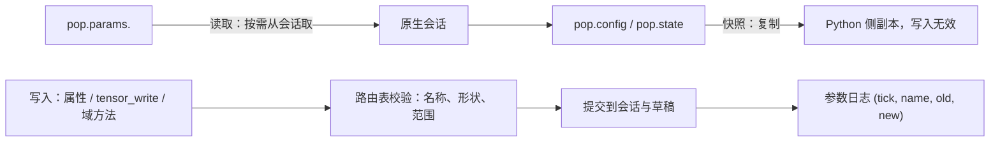

# 运行参数如何读取和更新

模型构建完成后，参数并不是冻结的：承载量、产卵数、性别比、fitness、自定义字段都可以在运行期改，而不需要重建会话。这一章说明查询与写入走的是哪条路、什么时候生效，以及哪些改动超出了"改参数"的范围，需要重构模型。

## 三种写入场景

| 场景 | 入口 | 用途 |
| --- | --- | --- |
| 两次运行之间 | `pop.update().<域方法>(...)` 或 `pop.params.<name> = value` | 参数扫描、运行前微调 |
| 回调内 | `ctx.params.<name> = value` 或声明式 `Op.set_param` | 事件驱动的干预 |
| 空间模型 | `pop.params.tensor_write(...)` 与 per-deme 的 ecology 写入 | 只影响单个 deme |

三者的共同点是都经过**参数路由表的校验**，然后提交到同一个原生会话。差别在于生效时机与事务边界：两次运行之间的写入立即生效，回调内的写入随事件边界提交（见[回调事务](transactions.md)）。

## 查询与写入不是同一条路

- `pop.config`、`pop.state` 是**快照**：它们复制当前值，改它们不会影响会话。
- `pop.params.<name>` 是**活的读取面**：读一次取一次当前值。
- 写入必须走通道：`pop.params.<name> = value`（标量）、`pop.params.tensor_write(...)`（张量）、`pop.update()`（构建期同款域方法）。

核验过的行为：写入 `eggs_per_female = 4` 后立即读到 4；随后写张量、再运行，标量写入仍然有效——两者共享同一份会话状态。构造快照之后再写参数，快照值不变（4），会话值是新值（7）。

## 提交与生效时机

| 时机 | 谁可见 |
| --- | --- |
| 两次运行之间写入 | 下一次 `run()` 的整个 tick |
| `first` 事件内写入 | 同一 tick 的 reproduction 及之后阶段 |
| `early` 事件内写入 | 同一 tick 的 survival 与 aging |
| `late` 事件内写入 | 同一 tick 的 aging |

也就是说：**回调内的写入不需要等到下一个 tick**，它在本次 tick 的后续阶段就可读。这与"先提交再执行下一阶段"的边界提交设计有关，演示见[会话如何推进一次模拟](runtime.md) 的时序图。

每次实际发生变化的写入都会追加一行 `(tick, name, old, new)` 到 `pop.params_log`，因此"哪一步改了什么"可以事后核对，而不必依赖运行脚本。

## 校验与拒绝

| 输入 | 结果 |
| --- | --- |
| 未知参数名 | `AttributeError`，消息点名该字段 |
| 张量形状不符 | `ValueError: '...': expected 12 elements, got 8` 之类 |
| 概率类参数越界 | 按各参数声明的范围拒绝 |
| 迁移率列 | 走专用列通道，作为普通张量写入会被拒绝 |

校验发生在提交之前，因此失败的写入不会留下半个状态。名称与形状错误都带具体字段名，便于定位。

## 什么时候"改参数"不够

有些改动会改变**派生结构**，必须重编译而不是写值：

| 改动 | 为什么需要重编译 |
| --- | --- |
| 遗传转换规则（预设、手动修饰器） | 它改变 M、F，进而改变 P；旧 P 与新映射不再一致 |
| 类型数量或标签 | 改变数组轴长度，属于布局变更 |
| 年龄槽数量 | 同上 |
| 运行布局是否闭合 | 新规则可能产生布局外的类型，需要闭合检查 |

`RuntimeUpdater` 的预设与遗传更新入口在**隔离候选**上重编译，成功后再提交；失败则保持原状。这与"直接改一张映射表"有本质差别：后者会留下与 P 不一致的映射。

## 改动会影响谁

| agent 的建议 | 判断依据 |
| --- | --- |
| 改 `pop.config` 里的数组来调参 | 那是快照；要用 `pop.params` 或 `pop.update()` |
| 在回调外保存 `pop.params` 再稍后写入 | 回调内的参数句柄随事件失效；两次运行之间请用 `pop.update()` |
| 直接改 M 表实现新规则 | 需要重编译并重建 P，走遗传更新入口 |
| 认为写入只在下一个 tick 生效 | 同一 tick 的后续阶段就能看到 |
| 用参数日志当审计依据 | 它是追加式的实际变更记录，但只在值真正变化时写入 |

## 实现定位与核验依据

| 实现入口 | 本章对应职责 |
| --- | --- |
| [population/_params_view.py](https://github.com/jyzhu-pointless/natal-core/blob/main/src/natal/frontend/population/_params_view.py) | 参数读取面、属性写入与张量通道 |
| [builder/_runtime.py](https://github.com/jyzhu-pointless/natal-core/blob/main/src/natal/frontend/builder/_runtime.py)：`RuntimeUpdater` | 域方法入口、候选验证、遗传重编译与提交 |
| [fitness/_writer.py](https://github.com/jyzhu-pointless/natal-core/blob/main/src/natal/frontend/fitness/_writer.py) | fitness 写入的选择器解析与写入路径 |
| [contracts/materialize.py](https://github.com/jyzhu-pointless/natal-core/blob/main/src/natal/contracts/materialize.py)：`contract_field_source()` | 只取被请求字段的刷新通道 |

本章的快照隔离、标量与张量共享状态、域方法写入、custom 往返、参数日志与各类拒绝均由同一组输入核验。既有测试中，[test_runtime_updater_contracts.py](https://github.com/jyzhu-pointless/natal-core/blob/main/tests/test_runtime_updater_contracts.py) 与 [test_conversion_refresh_contracts.py](https://github.com/jyzhu-pointless/natal-core/blob/main/tests/test_conversion_refresh_contracts.py) 保护运行期更新的既有行为。

下一步阅读[Hook 如何编译和调度](hooks.md)。
