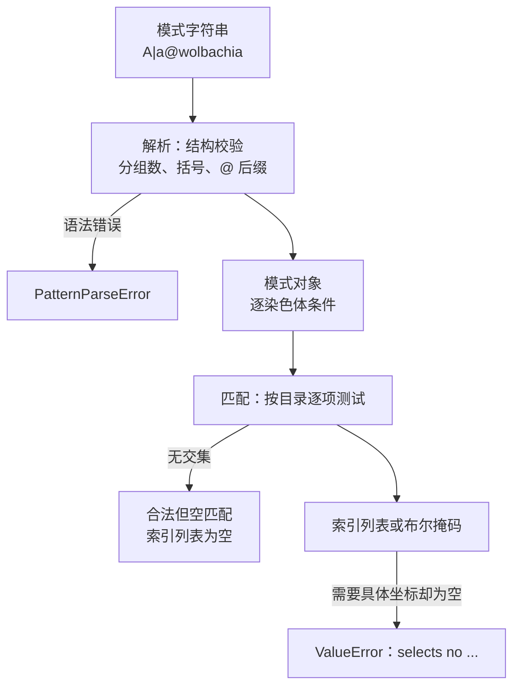

# 模式与选择器如何定位数据

声明阶段用名字描述要影响谁——"所有 X 杂合体"、"雌性成体"、"带 wolbachia 标签的类型"；数组只认下标。选择器就是把人类条件翻译成坐标的那一层。它同时决定三件事：**改哪些格子、改多少、什么时候绑定到索引**。

本章沿用样章物种（`chr1` 上 A、a、X），补充两类案例：带标签的物种与有序物种。

## 一段模式字符串经过什么



三类结果必须分开理解，它们的含义完全不同：

| 结果 | 何时出现 | 含义 |
| --- | --- | --- |
| `PatternParseError` | 语法或结构不合法：`A|a@`、`A|a@x@y`、`(A|a`、`A|a|b` | 这段文字不是模式，无法解释 |
| 合法但匹配为空 | 名字拼写不存在（`A|Q`）或条件与目录无交集 | 是一个有效查询，答案就是"没有" |
| `ValueError`（空掩码） | 把空结果用于必须落地的选择器（`IndividualSelector.compile()`） | 调用方要求至少选中一个坐标，无法满足 |

核验过的例子：`ZygoteTypePattern.parse("A|Q")` 解析成功、匹配 `[]`；而把同一个字符串交给精确解析器 `Species.get_genotype_from_str("A|Q")` 会抛 `ValueError: Cannot parse haplotype segment string 'Q'`。模式语言容忍未知名字（因为通配与集合本来就可能包含不存在的项），精确字符串不行。

## 语法

| 写法 | 含义 | 本例结果（完整目录） |
| --- | --- | --- |
| `A|a` | 母方 A、父方 a | 索引 1 |
| `A::a` | 无序对，等价于 `A|a` 或 `a|A` | 索引 1 |
| `a|A` | 有序对，母方 a、父方 A | 无序物种中为空；见下节 |
| `{A,a}|*` | 集合与通配 | 索引 0、1、2、3、4 |
| `!X|*` | 取反 | 索引 0、1、2、3、4 |
| `*@wolbachia` | 标签条件（两个标签的物种） | 该标签的全部六个类型 |

多基因座与多染色体沿用同一套分隔符：`/` 分位点、`;` 分染色体、`@` 接标签。省略的染色体等于不设约束。

### 同一个字符串，两个入口的语义不同

`a|A` 是本章最值得记住的陷阱：

```text
ZygoteTypePattern.parse("a|A")            → 解析成功，匹配空集
resolve_zygote_type("a|A", species, reg)  → 索引 1
```

原因是无序物种的基因型对象本身就是规范化的（见[遗传对象](genetic_objects.md)），目录里只存在"母方较小"的那一种写法。公开选择入口（`resolve_zygote_type`、观察组、fitness 写入、Hook 声明）在无序物种上把 `|` 提升为 `::`，所以 `a|A` 仍然命中；直接使用 `ZygoteTypePattern.parse` 则保持严格。有序物种（`unordered=False`）下 `A|a` 与 `a|A` 是两个不同基因型，`.parse("A|a")` → 索引 1、`.parse("a|A")` → 索引 3。

结论：**判断一段选择器是否会命中，必须先确认它走的是哪个入口，以及物种是否无序**。只看字符串本身无法判断。

## 从模式到坐标：`IndividualSelector`

`[IndividualSelector](https://github.com/jyzhu-pointless/natal-core/blob/main/src/natal/frontend/patterns/individual_selector.py)` 把三个轴的条件组合成一个不可变、可哈希的选择器：

- 一个选择器内部，**字段之间是 AND**（基因型与雌性同时成立）；
- 一个字段的多个取值之间是 **OR**（`{A,a}` 或 `sex=["female","male"]`）；
- 两个选择器用 `|` 或 `+` 合并时，是**原子之间的 OR**；
- `compile(registry, n_sexes=2, n_ages=2)` 返回形状 `(n_sexes, n_ages, n_ztypes)` 的布尔掩码。

核验过的组合行为：`IndividualSelector(ztype="A|A", sex="female", age=1)` 在压缩后的模型上得到 1 个坐标（雌性成体 A|A）；与 `IndividualSelector(ztype="a|a", sex="male")` 合并后得到 3 个（后者的年龄轴未指定，两个年龄槽都选中）；`age=5` 超出年龄轴时抛 `ValueError: ... selects no (ZType, sex, age) coordinates in this population schema.`，而不是静默返回空掩码。

不可变与可哈希是有意设计：它让同一个选择器可以安全地作为字典键和指纹（fingerprint）来源，因此观测组的缓存与去重可以直接比较选择器，而不必比较字符串。

## 谁在使用选择结果

| 使用方 | 入口 | 绑定时机 |
| --- | --- | --- |
| 初始数量 | `initial_state(individual_count={"female": {"A|a": 100}})` | 构建期，写入完整轴草稿 |
| fitness | `fitness(viability={"A|a": 0.9})` | 声明期记录、编译期写数组 |
| Hook 声明 | `hooks(Op.scale(..., event="early"))` | **发布后**按最终索引编译 |
| 观测组 | `with_observation(groups={...})` | **发布后**编译成掩码 |
| 运行期参数写入 | `pop.params` 的按名写入 | 运行期，按最终索引解析 |
| 遗传规则 | 预设与修饰器的 `genotype` 条件 | 编译期，作用于完整目录 |

关键区别是"什么时候绑定索引"。构建期写入使用的是完整目录上的坐标；Hook、观测与运行期写入必须使用**发布后**的最终目录。两者在本例中不同：完整索引 2 是 `A|X`，运行时索引 2 是 `a|a`。选择器写错绑定时机，得到的不是报错，而是一个看起来能跑、但指向另一类个体的掩码。

## 转换目标：保留还是替换

转换目标复用 pattern 语法，但描述的是如何修改来源，不是要匹配一组目的地。`GenotypePatternParser.parse_conversion_target()` 保留原始写法和解析结构；`compile_conversion_target()` 在检查来源是否可达前拒绝不允许的目标写法；`ConversionTarget.apply_zygote()` 或 `.apply_gamete()` 再根据每个来源补齐保留部分。

| 目标中的部分 | 含义 |
| --- | --- |
| 省略的染色体组或 `*` | 保留对应来源部分 |
| 明确的等位基因或标签 | 替换对应部分 |
| `C|*` 等有序局部通配符 | 替换左侧，保留来源右侧 |
| 集合、否定或 `C::*` 等无序局部表达 | 拒绝有歧义的目标 |

`*@infected` 保留每个来源的基因型，只改标签。对于两个染色体组的物种，`A|A@*` 替换指定的第一组，保留第二组和标签。位点级局部修改要求能与来源位点明确对应。完整的具体目标继续按既有的基因名称规则识别染色体，包括明确调换染色体片段书写顺序的写法。

modifier 的完整类型转换规则仍要求显式写出 `@label`；保留标签时写 `@*`。Op 的目标可以省略标签，也可以省略年龄或性别，均表示保留来源值。每个来源必须得到一个合法目标，且目标在当前 registry 中存在。多个来源可以分别得到不同目标，这不表示将概率分配给多个目的地。

前述普通 pattern 匹配规则保持不变：来源中省略的组表示不限。执行顺序和精子存储处理见 [Hook 转换](../2_hooks.md)。


## 边界与错误

| 情形 | 结果 |
| --- | --- |
| 未知等位基因名 | 模式解析成功，匹配为空 |
| 未知标签名 | 同上；`@` 后缀只做匹配，不在解析期校验 |
| 标签后缀为空或多于一个 | `PatternParseError` |
| 括号不配对 | `PatternParseError: Unbalanced parentheses` |
| 选择器编译后为空 | `ValueError`（消息说明没有任何坐标被选中） |
| 为有序物种写 `a|A` | 命中索引 3，与 `A|a` 不同 |

## 改动会影响谁

| agent 的建议 | 判断依据 |
| --- | --- |
| 用 `a|A` 选择杂合体 | 在无序物种里能否命中取决于入口；公开入口会提升 `|`，直接解析不会 |
| 用 `*` 选择"所有个体" | 通配会跟随目录；压缩后目录变小，选择结果随之变小 |
| 在选择器里写完整索引 | 索引随压缩改变，应写名字或模式 |
| 认为"匹配为空"等于"写错了" | 空匹配是合法答案；只有需要落地的路径才升级为错误 |
| 在 Hook 里复用构建期的索引 | Hook 在最终目录上编译，必须使用运行时索引或名字 |

## 实现定位与核验依据

| 实现入口 | 本章对应职责 |
| --- | --- |
| [patterns/parser.py](https://github.com/jyzhu-pointless/natal-core/blob/main/src/natal/frontend/patterns/parser.py) | 模式语法与解析缓存 |
| [patterns/elements/](https://github.com/jyzhu-pointless/natal-core/tree/main/src/natal/frontend/patterns/elements) | 原子、染色体对与二倍体/单倍体模式元素 |
| [patterns/individual_selector.py](https://github.com/jyzhu-pointless/natal-core/blob/main/src/natal/frontend/patterns/individual_selector.py) | 三轴组合、掩码编译与空掩码报错 |
| [patterns/selector.py](https://github.com/jyzhu-pointless/natal-core/blob/main/src/natal/frontend/patterns/selector.py)：`resolve_zygote_type()` | 无序物种的 `|` 提升与索引解析 |
| [registry/index.py](https://github.com/jyzhu-pointless/natal-core/blob/main/src/natal/frontend/registry/index.py)：`resolve_ztype_indices()` | 模式到索引的落地 |
| [output/observation.py](https://github.com/jyzhu-pointless/natal-core/blob/main/src/natal/frontend/output/observation.py)：`build_mask_from_selectors()` | 观测组如何变成掩码 |

本章的语法行为、三类错误、无序入口差异、选择器组合与空掩码报错均由同一组输入核验。既有测试中，[test_genetic_patterns.py](https://github.com/jyzhu-pointless/natal-core/blob/main/tests/test_genetic_patterns.py) 保护模式语法的既有行为；本章新增的是入口差异与错误分类的对照案例。

下一步阅读[从声明到编译产物](model.md)，看这些选择结果如何被组织成一次可复现的编译。
