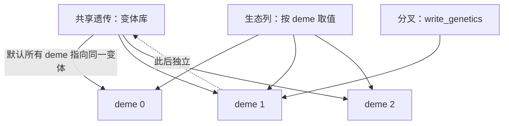

# 空间模型如何构建和共享数据

空间模型把同一套遗传结构与生命周期复制到多个 deme 上，只让生态条件与迁移路径不同。这一章说明数据怎么组织、谁共享谁分叉、执行权归谁；迁移算法本身在[下一章](migration.md)。

## 模型条件与入口

```python
SpatialPopulationBuilder(species, n_demes=3).setup(stochastic=False) \
    .age_structure(n_ages=3, new_adult_age=1) \
    .initial_state(...) .reproduction(...) .survival(...) \
    .competition(juvenile_growth_mode="no_competition", age_1_carrying_capacity=1_000_000) \
    .migration(adjacency=chain, migration_rate=0.2)
```

链式域方法与单体模型同名同义；差别在于**每个域方法都能接受 `batch_setting(...)`**，为不同 deme 声明不同取值（异构配置），以及多一个 `migration()`。

## 三种数据的所有权



| 数据 | 组织方式 | 写入效果 |
| --- | --- | --- |
| 遗传张量（M、F、P、fitness） | 变体库；初始化时 deme 之间共享 | 写入会分叉该 deme 的变体，不影响其他 deme |
| 生态参数（承载量、速率等） | 按 deme 取值的列 | 只改该 deme 的列 |
| 个体数量与精子存储 | 堆叠数组 | 每个 deme 独立，迁移是唯一的跨 deme 通道 |
| 索引注册表 | 一个共同注册表 | 所有 deme 的类型身份一致 |

核验：`deme.write_ecology("carrying_capacity", 12345)` 之后，只有该 deme 读到 12345，其余仍是原值；`deme.write_genetics("viability_fitness", ...)` 分叉该 deme 的遗传变体，未写入的 deme 仍然读到共享的 1.0。

**共享不等于可写**：两个 deme 初始指向同一张遗传表，是因为它们内容相同；一旦某个 deme 写入，它拿到自己的副本。把共享理解成"写入会同时影响所有 deme"是错的。

## 堆叠布局

| 数组 | 轴顺序 |
| --- | --- |
| 个体数量 | `(deme, sex, age, ZType)` |
| 精子存储 | `(deme, age, 雌性 ZType, 雄性 ZType)` |
| 迁移率列 | `(deme, sex, age)` |

核验：3 个 deme 的堆叠数量形状是 `(3, 2, 3, 3)`；每个 deme 的索引、轴语义与单体模型完全一致，因此同一段读取代码可以复用。

压缩在空间层面只做一次，产生**所有 deme 共用的统一注册表**——这正是跨 deme 迁移能够按类型身份搬运个体的前提。

## 执行权在容器

| 操作 | 归属 |
| --- | --- |
| `run()`、`run_tick()`、`reset()` | `SpatialPopulation`（容器） |
| `pop.demes[i].state` / `.params` / `.update()` | 局部读取与局部提交 |
| `pop.demes[i].write_ecology()` / `write_genetics()` | 局部写入 |
| 历史、观测、检查点 | 容器 |

核验：`pop.demes[0]` 上不存在 `run`——deme 切片只暴露对齐的读取面与局部写入面，没有独立的生命周期控制。想推进时间只能通过容器，这样"共同时间线"才是可推理的。

## 改动会影响谁

| agent 的建议 | 判断依据 |
| --- | --- |
| 逐个 deme 调用 run 来"并行推进" | deme 没有 run；容器统一调度 |
| 改共享遗传表来影响所有 deme | 写入会分叉该 deme；要全局改需重建或逐个写入 |
| 用不同 deme 各自的类型索引 | 注册表是共同的，索引必须一致 |
| 在 deme 上直接改 `state` 数组 | 那是快照；用 `update()` 或 `write_ecology` |
| 让 deme 各自记历史 | 历史属于容器，按 deme 轴区分 |

## 实现定位与核验依据

| 实现入口 | 本章对应职责 |
| --- | --- |
| [spatial/builder.py](https://github.com/jyzhu-pointless/natal-core/blob/main/src/natal/frontend/spatial/builder.py) | 链式声明、`batch_setting` 异构配置与构建 |
| [spatial/population.py](https://github.com/jyzhu-pointless/natal-core/blob/main/src/natal/frontend/spatial/population.py)：`DemeSlice` | deme 切片的对齐读取面与局部写入面 |
| [rust_backend.py](https://github.com/jyzhu-pointless/natal-core/blob/main/src/natal/backends/rust/rust_backend.py)：`ecology_columns_from_drafts()`、`genetics_variant_bank()` | 生态列与遗传变体的组织 |
| [sessions/spatial.rs](https://github.com/jyzhu-pointless/natal-core/blob/main/rust/src/sessions/spatial.rs) | 堆叠会话与调度 |

本章的堆叠形状、逐 deme 生态写入、遗传分叉、deme 无 `run`、以及零迁移下同构 deme 的对称演化均由同一组输入核验。既有测试中，[test_spatial_publication.py](https://github.com/jyzhu-pointless/natal-core/blob/main/tests/test_spatial_publication.py) 与 [test_hook_transaction_contract.py](https://github.com/jyzhu-pointless/natal-core/blob/main/tests/test_hook_transaction_contract.py) 保护共同发布、变体关系与 deme 执行限制。

下一步阅读[空间生命周期与迁移算法](migration.md)。
