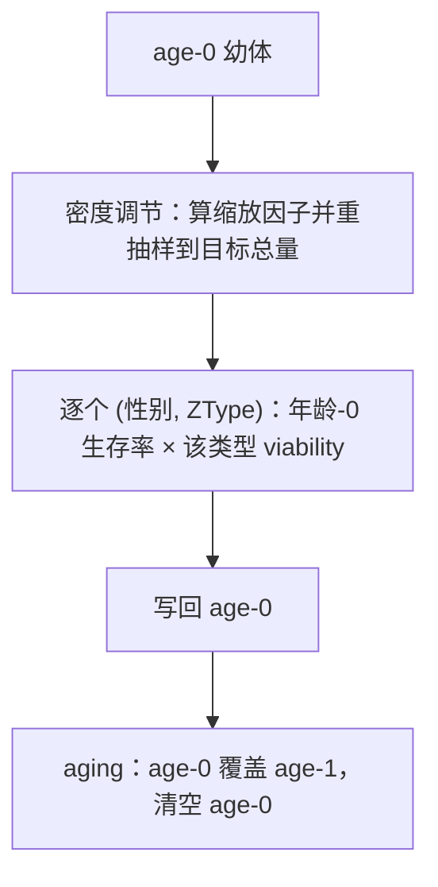

# 生存与世代更替如何计算

[上一章](runtime.md)里，`early` 到 `late` 之间数量从每性别 100 个幼体变成 50 个，随后 aging 让这些幼体成为下一代成体。这一章展开这两步：生存阶段先做什么、后做什么，以及"世代不重叠"在实现上意味着什么。

## 一个具体的输入输出

沿用样章模型（100 雌 + 100 雄 A|a 成体、每雌 2 卵、幼体基础生存率 0.5）：

| 边界 | 每性别 `[age-0, age-1]` | 说明 |
| --- | --- | --- |
| `early` | `[100, 100]` | 200 个后代按性别各半；亲本仍在 |
| `late` | `[50, 100]` | 幼体经过密度调节与生存 |
| aging 之后 | `[0, 50]` | 幼体成为成体，旧成体被丢弃 |

生存阶段只读 age-0、只写 age-0：它不会碰 age-1。把 age-1 当作"可以调整的存活群体"，是这一阶段最常见的误解。

## 阶段内部顺序

三步的具体行为：

1. **密度调节**：先算本次的竞争强度（离散模型里就是 age-0 的总数，两性合并），按生长模式得到缩放因子，再把 age-0 重抽样到"目标总量"。核验：`fixed` 模式、K=100、200 个幼体 → `late` 边界总量 100，再乘基础生存率 0.5 得到 50。
2. **生存与 viability**：逐 (性别, ZType) 计算 `生存率 × viability`。基础生存率来自 `(sex, age)` 数组的 age-0 格；viability 来自 `(sex, age, ZType)` 张量的 **age-0 切片**——离散模型下 age-1 的 viability 不参与这一阶段。
3. **aging**：age-0 写入 age-1，age-0 清零。旧成体被直接覆盖，而不是"存活下来再加入"。

核验过的 viability 例子（把雌性 A|A 的 age-0 viability 设为 0.5，其余格为 1）：

| 性别 | 无额外 viability 的 `late` | 本例的 `late` |
| --- | --- | --- |
| 雌 | `[12.5, 25, 12.5]` | `[6.25, 25, 12.5]` |
| 雄 | `[12.5, 25, 12.5]` | `[12.5, 25, 12.5]` |

只有被改的那一格折半，其他格不动。虽然写入的张量在 age-1 上也带了 0.5，离散阶段只读 age-0 切片，所以成年数量不受影响。

## 确定性、离散随机与连续采样

同一个阶段有三种计算方式，由 blueprint 上的两个开关决定：

| 模式 | 幼体数量 | 说明 |
| --- | --- | --- |
| 确定性 | `count × 生存率` | 期望值，可以出现小数 |
| 离散随机 | `binomial(round(count), 生存率)` | 先把数量四舍五入为整数，再抽样 |
| 连续采样 | `continuous_binomial(count, 生存率)` | 保留小数质量，按连续二项分布抽样 |

密度调节的抽样方式与之一致：确定性按比例缩放，随机模式用多项分布把幼体总量分配到各 (性别, ZType)。核验：随机模式下 `early` 边界的每类型数量是整数（离散抽样），而确定性模式下会出现 12.5 这样的小数。

因此"同一个模型换个模式结果一样"是不成立的：确定性给出期望，随机给出一次实现。判断实现是否正确时，应当比较分布或改用确定性路径核对期望，而不是逐位比较。

## 边界与错误

| 情形 | 结果 |
| --- | --- |
| 幼体总数为 0 | 直接清零 age-0 并返回，不做任何抽样 |
| 缩放因子使目标总量为 0 | 清零 age-0（例如高竞争下的线性模式） |
| 写入 age-1 期望改变本代存活 | age-1 在 aging 阶段被覆盖，写入无意义 |
| 把 age-1 的 survival 设成 1 期望跨代存活 | 离散模型的世代更替规则不受该格影响 |

## 改动会影响谁

| agent 的建议 | 判断依据 |
| --- | --- |
| 想改变本代幼体的存活比例 | 用 age-0 生存率或该类型的 viability；两者相乘 |
| 想让部分成体存活到下一代 | 离散模型不支持；这属于年龄结构模型的能力 |
| 把密度调节改成"在生存之后" | 顺序变了，同一组参数会给出不同结果；核验用 `fixed` + K 就能区分 |
| 用一次随机运行核对确定性结果 | 随机路径抽样整数，确定性给出期望；应比较分布或切换模式 |
| 认为 `late` 的总数就是下一代规模 | 还要经过 aging；`late` 时亲本仍在，但会被覆盖 |

## 实现定位与核验依据

| 实现入口 | 本章对应职责 |
| --- | --- |
| [kernels/discrete_generation.rs](https://github.com/jyzhu-pointless/natal-core/blob/main/rust/src/kernels/discrete_generation.rs)：`survival()`、`aging()` | 阶段顺序、age-0 乘算与世代替换 |
| 同上：`scaling_factor()`、`recruit_juveniles()` | 密度缩放与重抽样 |
| [kernels/density_regulation.rs](https://github.com/jyzhu-pointless/natal-core/blob/main/rust/src/kernels/density_regulation.rs) | 各生长模式的曲线 |
| [population/discrete_generation.py](https://github.com/jyzhu-pointless/natal-core/blob/main/src/natal/frontend/population/discrete_generation.py)：`survival()` 声明入口 | 用户侧参数（年龄-0 生存率等） |
| [kernels/rng.rs](https://github.com/jyzhu-pointless/natal-core/blob/main/rust/src/kernels/rng.rs) | 二项与多项抽样 |

本章的 `early`/`late`/aging 三个边界数量、viability 乘法、密度调节顺序（200 → 100 → 50）与随机路径的整数性均由同一组输入核验。既有测试中，[test_rust_discrete_lifecycle.py](https://github.com/jyzhu-pointless/natal-core/blob/main/tests/test_rust_discrete_lifecycle.py) 、[test_discrete_population.py](https://github.com/jyzhu-pointless/natal-core/blob/main/tests/test_discrete_population.py) 与 [test_frozen_lifecycle_rules.py](https://github.com/jyzhu-pointless/natal-core/blob/main/tests/test_frozen_lifecycle_rules.py) 保护离散阶段的既有行为。

下一步阅读后续的《年龄结构与长期精子存储》一章，看四年龄槽的模型如何把"世代重叠"表达出来。
