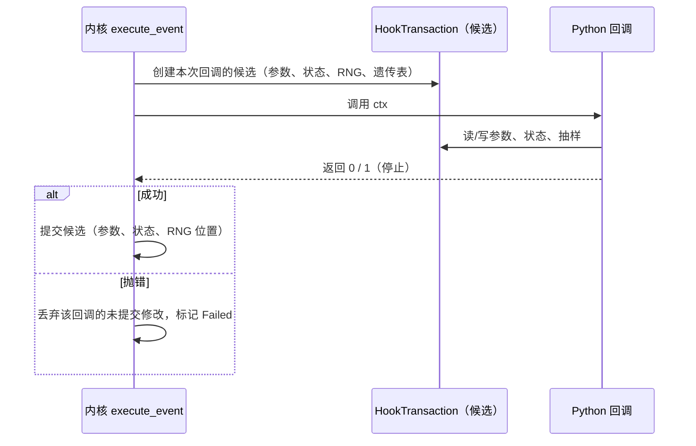

# 回调事务、失败与停止边界

[上一章](hooks.md)说明了声明式 Hook 与回调如何进入同一调度。这一章只讲回调：它在什么数据上工作、什么时候提交、失败时留下什么，以及哪些句柄在回调返回后立即失效。

## 回调不直接碰会话

关键点是**每个回调一份候选**：Python 从不借用实时会话或它的随机流。候选里包含参数、状态数组、RNG 位置与遗传表；成功时一起提交，失败时整份丢弃。

状态数组按需物化：只写标量的回调不会为此拉取完整个体数量数组；只读参数的路径走轻量字段源（见[Python 与 Rust 如何交换模型数据](contracts.md)）。

## 三个不同的边界

| 边界 | 撤销范围 |
| --- | --- |
| 一个回调的候选 | 该回调未提交的修改全部丢弃 |
| 同一事件中多个回调 | 先前回调**已提交**的修改保留；后续回调失败不回滚它们 |
| 整个 tick 的阶段 | 已完成的阶段不回滚；停止/失败停在边界上 |

核验（A 写 `carrying_capacity = 777` 后成功，B 写 999 后抛错）：运行被中断并标记 `Failed`，会话里保留的是 **A 的 777**，B 的 999 没有泄漏。这条合同由既有测试 `test_prior_callback_commit_survives_later_failure` 保护。

因此"失败等于整个 tick 回滚"是错的；正确的说法是"未提交的写入被丢弃，已提交的保留，执行停在边界"。

## 句柄的有效期

回调里拿到的句柄随事件失效：

| 句柄 | 回调返回后 |
| --- | --- |
| `ctx.params` | 写入被拒绝（事务已结束） |
| `ctx.rng` | 抽样被拒绝；同一事件内重复访问返回同一个采样器 |
| `ctx.state` | 视图失效；应在事件内完成读写 |

核验：把三个句柄保存到回调外，回调返回后再用，写入与抽样都会被拒绝；同一事件内 `ctx.rng` 两次访问返回同一对象。

这条规则保护的是"随机流位置"和"状态一致性"：如果句柄在事件外仍可写，两次运行之间的写入与事务提交就会交错，参数日志和 RNG 位置都不再可信。

## 停止

`ctx.stop()`（或声明式 `Op.stop_if_*`）请求在本边界结束本次 tick：

- 后续槽位与后续阶段不再执行；
- 已经提交的修改保留；
- 时钟不前进，会话状态为 `Stopped`，`is_finished` 为真；
- 恢复检查点或 `reset()` 才能继续。

回调也可以返回 `1`（停止）或继续（`0`），与 `ctx.stop()` 等价。

## 失败

回调抛出的异常会：

1. 原样传播给调用方（异常类型与消息保持不变）；
2. 让会话进入 `Failed`；
3. 保留此前已提交的回调与阶段结果；
4. 使后续 `run()` 被拒绝，直到恢复检查点或重置。

## 改动会影响谁

| agent 的建议 | 判断依据 |
| --- | --- |
| 在回调里保存 `ctx.rng` 到下次事件使用 | 采样器已失效；正确做法是在事件内取完随机数 |
| 假设回调失败会回滚整步 | 只有未提交的修改被丢弃；前面提交的保留 |
| 在回调里调用 `pop.run()` | 重入被拒绝（`Nested run is forbidden`） |
| 用回调直接改 `pop.state` 数组 | 那是快照；要用 `ctx.state` 或参数通道 |
| 依赖"回调执行顺序等于声明顺序" | 同事件内按 priority 混合排序，见[上一章](hooks.md) |

## 实现定位与核验依据

| 实现入口 | 本章对应职责 |
| --- | --- |
| [rust/src/hooks/transaction.rs](https://github.com/jyzhu-pointless/natal-core/blob/main/rust/src/hooks/transaction.rs) | HookTransaction：候选、`active` 生命周期、提交 |
| [hooks/_transaction.py](https://github.com/jyzhu-pointless/natal-core/blob/main/src/natal/frontend/hooks/_transaction.py) | `EventTransaction` 协议与 `HookRng` 的有效期检查 |
| [hooks/tick_context.py](https://github.com/jyzhu-pointless/natal-core/blob/main/src/natal/frontend/hooks/tick_context.py) | `ctx.state` / `ctx.params` / `ctx.rng` / `ctx.stop()` |
| [kernels/age_structured.rs](https://github.com/jyzhu-pointless/natal-core/blob/main/rust/src/kernels/age_structured.rs)：`EcoCtx::commit()` | 边界提交与参数日志 |

本章的先前提交保留、句柄失效、采样器同一性、失败传播与停止边界均由同一组输入核验。既有测试中，[test_hook_transaction_contract.py](https://github.com/jyzhu-pointless/natal-core/blob/main/tests/test_hook_transaction_contract.py) 与 [test_manual_event_failure_contract.py](https://github.com/jyzhu-pointless/natal-core/blob/main/tests/test_manual_event_failure_contract.py) 保护事务边界。

下一步阅读[空间模型如何构建和共享数据](spatial.md)。
