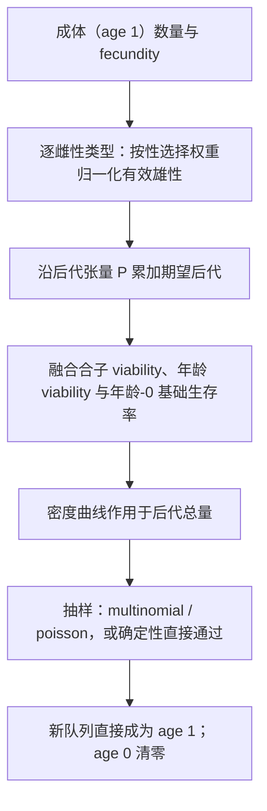

# 融合 Wright–Fisher 执行路径

前面几章描述的都是分阶段路径：繁殖、生存、衰老依次执行，Hook 插在阶段之间。项目还有第二条离散执行路径：把一步之内的全部更新合成一次抽样。这一章说明它什么时候可用、算出来的东西与分阶段路径哪里不同，以及如何判断"更快"是否等于"等价"。

## 模型条件

融合路径由 `extreme_speed_mode` 选择：

| 取值 | 含义 |
| --- | --- |
| 0 | 关闭（默认），走分阶段路径 |
| 1 | multinomial：一次多项分布抽样 |
| 2 | poisson：逐类型泊松抽样 |
| 3 | multinomial + poisson 组合 |

取值超出 0–3 会在**声明期**报错，消息列出合法取值，不存在"未知模式静默回退"。选择非 0 会同时打开融合执行路径。

## 一步算什么

与分阶段路径的差异集中在三点：

1. **只运行 `first` 事件**。核验：同一份声明在融合模式下 `first` 触发 1 次，`early` 与 `late` 从不触发；分阶段模式下两者各触发 1 次。
2. **没有阶段边界**。没有"繁殖后、生存前"的状态可观察，也没有跨阶段的同 tick 参数可见性窗口。
3. **世代直接替换**。新队列写入 age 1 并清零 age 0，不经过 aging 阶段。

## 什么时候等价，什么时候不等价

| 比较 | 结果 |
| --- | --- |
| `stochastic=False`，融合 vs 分阶段 | 核验：三种模式给出与分阶段路径**逐位相同**的结果 |
| `stochastic=True` | 抽样位置不同（一次多项/泊松 vs 逐步二项），得到不同实现、相同分布 |
| 依赖 `early`/`late` 的 Hook | 融合路径不会运行它们；行为不同 |
| 需要阶段间观察的模型 | 融合路径不提供这些边界 |

因此"融合路径更快"不是它唯一的性质：它对**模型条件**有要求。声明只在 `first` 运行的观察 Hook 时，两条路径可以互换；声明了 `early` 干预的模型换成融合路径会静默少跑那些干预。

## 适用性判断

适合融合路径的情形：

- 关心等位基因频率轨迹与有效种群大小，而不是每一代的配对过程；
- 不需要在繁殖与生存之间插入干预；
- 可以在确定性模式下与分阶段路径交叉核对。

不适合的情形：

- 需要 `early`/`late` 的 Hook（例如按性别选择、按类型致死）；
- 需要年龄结构或长期精子存储（融合路径只读 age 1 与 age-0 生存率）；
- 需要观察同一 tick 内"繁殖后但未生存"的数量。

## 改动会影响谁

| agent 的建议 | 判断依据 |
| --- | --- |
| 打开融合模式来加速 | 先确认没有依赖 `early`/`late` 的声明；否则行为会静默改变 |
| 用融合结果替换分阶段结果 | 确定性模式下可以逐位核对；随机模式下应比较分布 |
| 在融合模式下挂观察 Hook | 只有 `first` 会运行；其余事件不会触发 |
| 把融合模式当成"更快的分阶段" | 它同时改变了可用的 Hook 与状态边界，属于不同的执行路径 |
| 传入 0–3 之外的模式 | 声明期即被拒绝并列出合法值 |

## 实现定位与核验依据

| 实现入口 | 本章对应职责 |
| --- | --- |
| [kernels/discrete_generation.rs](https://github.com/jyzhu-pointless/natal-core/blob/main/rust/src/kernels/discrete_generation.rs)：`run_wf_tick()` | 融合一步：期望后代、可行性、抽样与写回 |
| [sessions/discrete_generation.rs](https://github.com/jyzhu-pointless/natal-core/blob/main/rust/src/sessions/discrete_generation.rs) | `wf` 开关在批量循环中的分派 |
| [builder/_base.py](https://github.com/jyzhu-pointless/natal-core/blob/main/src/natal/frontend/builder/_base.py)：`setup(extreme_speed_mode=...)` | 模式声明与取值校验 |
| [kernels/equilibrium.rs](https://github.com/jyzhu-pointless/natal-core/blob/main/rust/src/kernels/equilibrium.rs) | 融合路径共用的平衡量推导 |

本章的三种模式与分阶段路径逐位一致、`first`/`early`/`late` 的触发计数对照、以及非法模式的声明期报错均由同一组输入核验。既有测试中，[test_wf_fallback_independent_contract.py](https://github.com/jyzhu-pointless/natal-core/blob/main/tests/test_wf_fallback_independent_contract.py) 与 [test_publication.py](https://github.com/jyzhu-pointless/natal-core/blob/main/tests/test_publication.py) 保护融合路径与发布合同的既有行为。

下一步阅读后续的《运行参数如何读取和更新》一章。
